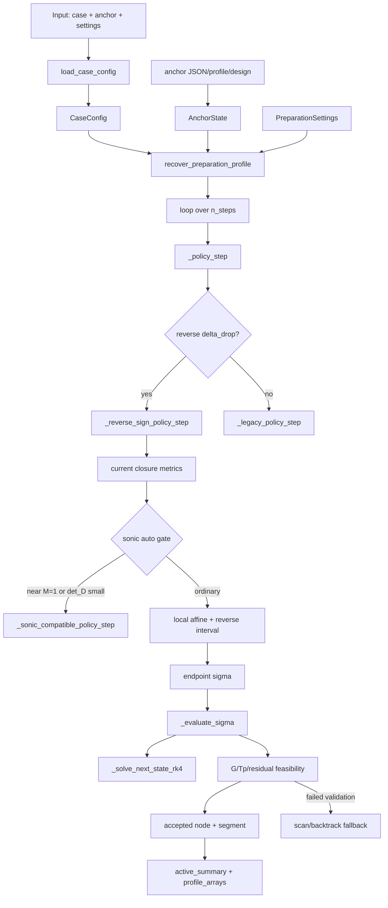
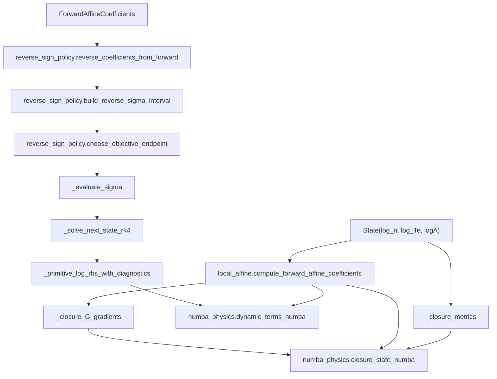

# Active-Boundary Dependency Code Map

Generated: 2026-06-16

Workspace: `/Users/yiruxiao/Desktop/MHD Generator/MHD_generator_solver_v6`

Branch observed during generation: `codex/active-boundary-sign-aware-20260602`

## Scope

This map covers the active-boundary code currently present in the workspace.

- Main route: `v6_active_boundary_reduced/`
- Separate prototype: `v6_active_boundary_factorable/`
- Shared upstream stacks: `v6_firedrake_reduced/`, `v6_maingo_casadi/`, and selected `v6_casadi/` helpers
- Generated outputs, `__pycache__/`, and large `outputs/` artifacts are intentionally excluded.

Workspace note: this map reflects the functionality-oriented layout with
`core/`, `diagnostics/`, `runners/`, `outer_solvers/`, and `validation/`.

## Executive Summary

`v6_active_boundary_reduced` is the main active-boundary implementation. Its public reverse-preparation API is
`recover_preparation_profile(...)` in `v6_active_boundary_reduced/core/policy.py`.

The central state is:

```text
State = (log_n, log_Te, logA)
AnchorState = (State, optional sigma_logA, x, source, source_index)
control = sigma_logA = d(log A)/dx
reverse update = logA_next = logA_current - dx * sigma_logA
```

The main reduced workflow is:

```text
CLI or optimizer
  -> CaseConfig / DesignVector from v6_firedrake_reduced.design
  -> AnchorState
  -> PreparationSettings or PolicySettings
  -> policy.recover_preparation_profile(...) or policy.rollout_policy_from_anchor(...)
  -> nodes / segments / profile_arrays
  -> JSON / CSV / NPZ / diagnostic plots
```

The core policy is local and admissibility-gated. It is not an extraction-first global solver:

```text
local constraints: G_next >= g_floor, T_p_next >= tp_floor_K
geometry constraints: sigma bounds, logA bounds, optional |sigma_i - sigma_{i-1}| bound
main reverse objective: delta_drop, where Delta = Te/Tp - 1
optional objective: power_next
```

## Top-Level Runtime Graph

```mermaid
flowchart TD
  prep_cli["run_preparation_recovery.py"] --> recover["policy.recover_preparation_profile"]
  short_cli["run_short_channel_reachability.py"] --> recover
  objective_eval["objective.evaluate_preparation_design"] --> recover
  scan_cli["run_anchor_scan.py"] --> objective_eval
  opt_cli["run_anchor_optimize.py"] --> objective_eval
  lbfgsb_cli["outer_solvers/lbfgsb.py"] --> prescreen["outer_solvers/prescreen.py"]
  prescreen --> objective_eval
  lbfgsb_cli --> reward["outer_solvers/reward.py"]
  yamasaki_cli["run_yamasaki_power_benchmark.py"] --> anchor_rollout["policy.rollout_policy_from_anchor"]
  forward_cli["run_forward_phi_greedy.py"] --> affine_fn["local_affine.compute_forward_affine_coefficients"]
  forward_cli --> eval_sigma["policy._evaluate_sigma"]
  sonic_cli["run_sonic_delta_profile.py"] --> sonic_build["sonic_delta_profile.build_sonic_delta_profile"]
  policy_mod["policy.py"] --> affine_mod["local_affine.py"]
  policy_mod --> reverse_mod["reverse_sign_policy.py"]
  policy_mod --> numba_mod["numba_physics.py"]
  affine_mod --> numba_mod
  sonic_mod["sonic_delta_profile.py"] --> numba_mod
  plot_prep["plot_preparation_recovery.py"] --> fd_forward["v6_firedrake_reduced.forward"]
  policy_mod --> fd_design["v6_firedrake_reduced.design"]
  policy_mod --> fd_geometry["v6_firedrake_reduced.geometry"]
  policy_mod --> fd_legacy["v6_firedrake_reduced.legacy_physics"]
  policy_mod --> fd_transport["v6_firedrake_reduced.transport"]
  numba_mod --> maingo_constants["v6_maingo_casadi.constants"]
```



## Main Reverse-Preparation Flow



## Core Step Dependency Graph



## Package Roles

| Path | Role | Primary consumers |
| --- | --- | --- |
| `v6_active_boundary_reduced/core/policy.py` | Main policy engine, state dataclasses, reverse rollout, local step solvers, closure metrics, node/segment summaries. | Almost every CLI and optimizer. |
| `v6_active_boundary_reduced/core/numba_physics.py` | Hot closure and primitive dynamic terms compiled with Numba. | `policy.py`, `local_affine.py`, `sonic_delta_profile.py`. |
| `v6_active_boundary_reduced/core/local_affine.py` | Computes local physical-forward affine coefficients for Delta and G response to area slope. | `policy.py`, `run_forward_phi_greedy.py`, benchmark script. |
| `v6_active_boundary_reduced/core/reverse_sign_policy.py` | Pure sign-aware reverse interval algebra and endpoint classification. | `policy.py`, validation tests. |
| `v6_active_boundary_reduced/core/objective.py` | Design override handling, design anchor construction, rollout scoring, CSV flattening. | `run_anchor_scan.py`, `run_anchor_optimize.py`, `outer_solvers/`. |
| `v6_active_boundary_reduced/core/scoring.py` | Shared scalar scoring helpers with no policy or optimizer ownership. | `objective.py`, `outer_solvers/reward.py`. |
| `v6_active_boundary_reduced/outer_solvers/` | Low-dimensional prescreen + robust L-BFGS-B outer optimization. | CLI `python -m v6_active_boundary_reduced.outer_solvers.lbfgsb`. |
| `v6_active_boundary_reduced/core/sonic_delta_profile.py` | Local profile through M=1 using primitive left-null compatibility. | `run_sonic_delta_profile.py`, validation tests, conceptual source for sonic branch in `policy.py`. |
| `v6_active_boundary_reduced/runners/common.py` | Shared JSON/CSV/NPZ IO, anchor conversion, profile loading. | Reachability CLIs and benchmark script. |
| `v6_active_boundary_reduced/diagnostics/preparation_recovery.py` | Diagnostic plots and H/L residual postprocessing. | `run_preparation_recovery.py`, `run_anchor_optimize.py`, short-channel runs. |
| `v6_active_boundary_factorable/soft_greedy_rk.py` | Separate MAiNGO-style factorable soft-greedy prototype. | Its own validation test only. |

## Source File Inventory

Source files in `v6_active_boundary_reduced/`:

```text
README.md
SIGN_AWARE_REVERSE_ACTIVE_BOUNDARY_REWRITE.md
__init__.py
core/__init__.py
core/finite_step.py
core/local_affine.py
core/numba_physics.py
core/objective.py
core/physics_constants.py
core/policy.py
core/policy_types.py
core/reverse_sign_policy.py
core/scoring.py
core/sigma_interval.py
core/sonic.py
core/sonic_delta_profile.py
diagnostics/__init__.py
diagnostics/plot_reachability_profiles.py
diagnostics/preparation_recovery.py
diagnostics/summary.py
outer_solvers/__init__.py
outer_solvers/lbfgsb.py
outer_solvers/prescreen.py
outer_solvers/reward.py
runners/__init__.py
runners/common.py
runners/select_profile_anchor.py
runners/run_anchor_optimize.py
runners/run_anchor_scan.py
runners/run_forward_phi_greedy.py
runners/run_ipopt_endpoint_reachability.py
runners/run_preparation_recovery.py
runners/run_short_channel_reachability.py
runners/run_sonic_delta_profile.py
runners/run_yamasaki_power_benchmark.py
validation/__init__.py
validation/test_freidberg_sign_aware_smoke.py
validation/test_outer_solver.py
validation/test_policy_behavior_guards.py
validation/test_sonic_delta_profile.py
```

Source files in `v6_active_boundary_factorable/`:

```text
README.md
__init__.py
soft_greedy_rk.py
validation/__init__.py
validation/test_soft_greedy_rk.py
```

## Main Module Map

### `v6_active_boundary_reduced/core/policy.py`

Purpose:

- Owns public active-boundary rollout APIs.
- Encodes the local admissibility policy.
- Chooses between reverse sign-aware, legacy scan, sonic-compatible, and RK4 finite-step paths.
- Produces `nodes`, `segments`, `profile_arrays`, and `active_summary`.

Important dataclasses:

- `PolicySettings`: generic forward/reverse rollout settings.
- `PreparationSettings`: reverse preparation settings with `dx`.
- `State`: `(log_n, log_Te, logA)`.
- `AnchorState`: target/source state plus optional `sigma_logA` record and provenance.
- `PhysicsParams`: cached physical constants extracted from `CaseConfig`.

Public or near-public entrypoints:

- `anchor_from_dict(...)`
- `anchor_from_profile(...)`
- `recover_preparation_profile(...)`
- `rollout_policy_from_anchor(...)`

Key internal gates:

- `_policy_step(...)`: routes reverse `delta_drop` to sign-aware path, otherwise legacy path.
- `_reverse_sign_policy_step(...)`: main reverse-active-boundary step.
- `_primitive_sonic_compatibility(...)`: computes left-null sonic sigma diagnostics.
- `_should_use_sonic_branch(...)`: `sonic_mode=auto` switches near `M=1` or small `det_D`.
- `_sonic_compatible_policy_step(...)`: uses explicit sonic-compatible sigma.
- `_evaluate_sigma(...)`: evaluates one candidate sigma through the RK4 finite-step path.
- `_solve_next_state_rk4(...)`: explicit RK4 path with optional stage diagnostics/gates.
- `_active_summary(...)`: support counts, G/Tp margins, area range, Mach range, power integral.

External dependencies:

- `v6_firedrake_reduced.design.CaseConfig`
- `v6_firedrake_reduced.geometry.LogAreaSplineControl`
- `v6_firedrake_reduced.legacy_physics.inlet_design_generic`, `ops_for_numeric`
- `v6_firedrake_reduced.transport.working_fluid_for_config`
- `scipy.optimize.brentq`, `scipy.optimize.least_squares` for sonic-compatible finite steps
- `numpy`

### `v6_active_boundary_reduced/core/numba_physics.py`

Purpose:

- Provides compiled scalar closure and primitive dynamic terms.
- Keeps the hot path independent of Firedrake/CasADi objects.

Functions:

- `saha_terms_numba(...)`: seed/electron density terms.
- `closure_state_numba(...)`: returns closure tuple including `T_p`, `mach`, `G`, `J_x`, `J_y`, `E_x`.
- `dynamic_terms_numba(...)`: returns primitive matrix/RHS terms and closure diagnostics.

External dependencies:

- `numba.njit`
- constants from `v6_maingo_casadi.constants`

### `v6_active_boundary_reduced/core/local_affine.py`

Purpose:

- Computes local physical-forward affine coefficients:

```text
D * [n_p', T_e'] = f0 + A_prime * f1
A_prime = A * sigma
Delta' = a0 + A * sigma * a1
G' = b0 + A * sigma * b1
```

Returned dataclass:

- `ForwardAffineCoefficients`

Key dependencies:

- `numba_physics.dynamic_terms_numba(...)`
- `numba_physics.closure_state_numba(...)`
- `_closure_G_gradients(...)` using finite differences in log-space.

### `v6_active_boundary_reduced/core/reverse_sign_policy.py`

Purpose:

- Pure algebraic reverse-policy helper with no repo-external imports except NumPy.

Main objects:

- `ReverseCoefficients(p0, p1, q0, q1)`
- `ReverseInterval(...)`
- `EndpointDecision(...)`

Main functions:

- `reverse_coefficients_from_forward(...)`
- `build_reverse_sigma_interval(...)`
- `choose_objective_endpoint(...)`
- `classify_endpoint_support(...)`
- `interval_diagnostics(...)`

Interpretation:

- Geometry bounds, area bounds, curvature bounds, and the affine reverse `G` bound are intersected into one sigma interval.
- The endpoint is selected from the sign of `p1` for the requested local objective.
- Support classification distinguishes `G_limited_reverse`, geometry/area/curvature limited, and flat/singular cases.

### `v6_active_boundary_reduced/core/objective.py`

Purpose:

- Connects outer design variables to the reverse active-boundary rollout.
- Scores the rollout.
- Flattens result payloads for CSV/JSONL output.

Search-variable rule:

```text
AREA_DESIGN_VARIABLE_NAMES = (a1, a2, a3)
SEARCH_DESIGN_VARIABLE_NAMES = DESIGN_VARIABLE_NAMES excluding a1/a2/a3
```

Important functions:

- `load_base_config(...)`
- `design_from_overrides(...)`
- `config_with_design(...)`
- `anchor_from_design(...)`
- `evaluate_preparation_design(...)`
- `flatten_result_for_csv(...)`

Important scoring fields:

- `delta_improvement`
- `mhd_output_power_MW`
- `raw_enthalpy_extraction_percent`
- `target_g_margin`
- `target_tp_margin`
- `target_ok`
- `support_counts`
- `failure_diagnostics`

### `v6_active_boundary_reduced/outer_solvers/`

Purpose:

- Performs robust low-dimensional outer optimization around active-boundary rollout.

Files:

- `prescreen.py`: samples normalized candidates, runs active-boundary rollout, keeps candidates with acceptable anchor `G`, low `Te/Tp`, and positive local ratio gradient.
- `reward.py`: soft-penalty score for outer optimization.
- `lbfgsb.py`: prescreen, neighborhood certification, SciPy L-BFGS-B, best-result export.

Control variables:

```text
log_n_p_in
T_e_in
Z_in
I_0
log_seed_fraction
```

`B_T` is fixed by default in this route. Bounds can be explicit or read from `CaseConfig.bounds`.

Important dependency chain:

```text
lbfgsb.run_outer_lbfgsb
  -> prescreen.prescreen_candidates
  -> objective.evaluate_preparation_design
  -> policy.recover_preparation_profile
  -> reward.score_outer_result
  -> neighborhood certification
  -> scipy.optimize.minimize(method=L-BFGS-B)
```

Important outputs:

- `prescreen.jsonl`
- `evaluations.jsonl`
- `optimization_summary.json`
- `best_result.json`
- `best_nodes.csv`
- `best_segments.csv`
- `best_profile.npz`

### `v6_active_boundary_reduced/core/sonic_delta_profile.py`

Purpose:

- Builds a local profile through `M=1` without dividing through a singular primitive matrix.
- Uses a left-null compatibility condition at the sonic node:

```text
ell^T (f0 + A * sigma * f1) = 0
sigma_sonic = - ell^T f0 / (A * ell^T f1)
```

Dependencies:

- `v6_firedrake_reduced.sonic_compatibility.solve_local_sonic_match`
- `numba_physics.dynamic_terms_numba`
- `policy.State`, `policy._closure_metrics`, `policy._physics_params`
- `scipy.optimize.least_squares`

Primary CLI:

- `run_sonic_delta_profile.py`

### `v6_active_boundary_reduced/runners/common.py`

Purpose:

- Shared IO and anchor/profile conversion helpers.

Functions:

- `json_default(...)`
- `write_json(...)`
- `write_csv(...)`
- `load_profile(...)`
- `anchor_payload(...)`
- `anchor_from_node_payload(...)`
- `load_anchor_json(...)`
- `load_profile_anchor(...)`
- `node_payload_to_state(...)`
- `profile_arrays_from_nodes(...)`
- `save_profile_npz(...)`

### `v6_active_boundary_reduced/diagnostics/preparation_recovery.py`

Purpose:

- Postprocesses a recovery summary into diagnostic plots and CSV/JSON assets.
- Computes H/L-style diagnostics using finite differences and Firedrake reduced helper terms.

Important outputs:

- `diagnostic_plots/overview.png`
- `diagnostic_plots/closure_quantities.png`
- `diagnostic_plots/geometry_active_set.png`
- `diagnostic_plots/hl_residuals.png`
- `diagnostic_plots/node_closure_diagnostics.csv`
- `diagnostic_plots/node_closure_diagnostics.json`
- `diagnostic_plots/hl_residual_summary.json`
- `diagnostic_plots/diagnostic_manifest.json`

Dependencies:

- `v6_firedrake_reduced.forward._freidberg_balance_terms`
- `v6_firedrake_reduced.legacy_physics.closure_state`, `inlet_design_generic`, `ops_for_numeric`
- `v6_firedrake_reduced.transport.working_fluid_for_config`
- `matplotlib`, `numpy`

### Auxiliary Modules

`v6_active_boundary_reduced/core/policy_types.py`

- Defines `PhysicsParamsLike`, a `typing.Protocol` used by `local_affine.py` to avoid importing the concrete `PhysicsParams` class.

`v6_active_boundary_reduced/core/scoring.py`

- Defines shared scalar helpers for finite-float conversion, soft-square penalties, profile statistics, and area ratio extraction.
- Depends only on `numpy`; does not own policy, objective, or optimizer semantics.

`v6_active_boundary_reduced/runners/select_profile_anchor.py`

- Converts profile/node payloads into reusable anchor JSON files.
- Depends on `runners/common.py` and `v6_firedrake_reduced.design.load_case_config`.

`v6_active_boundary_reduced/diagnostics/plot_reachability_profiles.py`

- Loads baseline/IPOPT/profile cases and plots reachability profile comparisons.
- Depends on `matplotlib` and `numpy`; it does not call the main policy engine.

`v6_active_boundary_reduced/outer_solvers/__init__.py`

- Provides lazy access to outer-solver submodules through `__getattr__`.

## CLI Entrypoint Map

| Entrypoint | Main call | Inputs | Outputs |
| --- | --- | --- | --- |
| `python -m v6_active_boundary_reduced.runners.run_preparation_recovery` | `policy.recover_preparation_profile` | case, anchor JSON or profile index, `PreparationSettings` | `preparation_recovery_summary.json`, `nodes.csv`, `segments.csv`, `profile.npz`, diagnostics |
| `python -m v6_active_boundary_reduced.runners.run_anchor_scan` | `objective.evaluate_preparation_design` | design ranges or JSONL, rollout settings, weights | `scan_results.jsonl/csv`, optional `refined_results.jsonl/csv`, `scan_summary.json` |
| `python -m v6_active_boundary_reduced.runners.run_anchor_optimize` | `objective.evaluate_preparation_design` via differential evolution | bounds/fixed design vars, rollout settings, weights | `evaluations.jsonl/csv`, `optimization_summary.json`, best profile outputs |
| `python -m v6_active_boundary_reduced.outer_solvers.lbfgsb` | `outer_solvers.lbfgsb.run_outer_lbfgsb` | normalized control bounds, prescreen/certification settings | prescreen/evaluation logs, robust `best_*` outputs |
| `python -m v6_active_boundary_reduced.runners.run_short_channel_reachability` | `policy.recover_preparation_profile` | target anchor and channel lengths | per-length recovery outputs plus `reachability_baseline_summary.csv/json` |
| `python -m v6_active_boundary_reduced.runners.run_sonic_delta_profile` | `sonic_delta_profile.build_sonic_delta_profile` | case, sonic-local settings | sonic profile summary, nodes/segments/profile, plot |
| `python -m v6_active_boundary_reduced.runners.run_forward_phi_greedy` | `local_affine` + `policy._evaluate_sigma` | source anchor, length, forward settings | forward greedy profile and diagnostics |
| `python -m v6_active_boundary_reduced.runners.run_ipopt_endpoint_reachability` | CasADi endpoint reachability model | source/target anchors, length, warm start | IPOPT/CasADi reachability outputs, not the main reduced-policy rollout |
| `python -m v6_active_boundary_reduced.runners.run_yamasaki_power_benchmark` | `policy.rollout_policy_from_anchor` | Yamasaki case/transport/objective settings | Yamasaki benchmark rows, policy summaries, nodes/segments/profile |

## Static Import Adjacency

This section is intentionally text-like for simple downstream parsing.

```text
v6_active_boundary_reduced/__init__.py
  -> v6_active_boundary_reduced.core.objective
  -> v6_active_boundary_reduced.core.policy

v6_active_boundary_reduced/core/policy.py
  -> v6_active_boundary_reduced.core.local_affine
  -> v6_active_boundary_reduced.core.numba_physics
  -> v6_active_boundary_reduced.core.reverse_sign_policy
  -> v6_firedrake_reduced.design
  -> v6_firedrake_reduced.geometry
  -> v6_firedrake_reduced.legacy_physics
  -> v6_firedrake_reduced.transport
  -> scipy.optimize
  -> numpy

v6_active_boundary_reduced/core/numba_physics.py
  -> v6_maingo_casadi.constants
  -> numba
  -> math

v6_active_boundary_reduced/core/local_affine.py
  -> v6_active_boundary_reduced.core.numba_physics
  -> v6_active_boundary_reduced.core.policy_types
  -> numpy

v6_active_boundary_reduced/core/reverse_sign_policy.py
  -> numpy

v6_active_boundary_reduced/core/policy_types.py
  -> typing.Protocol

v6_active_boundary_reduced/core/objective.py
  -> v6_active_boundary_reduced.core.policy
  -> v6_active_boundary_reduced.core.scoring
  -> v6_firedrake_reduced.cases.freidberg_reference
  -> v6_firedrake_reduced.design
  -> v6_firedrake_reduced.objective
  -> numpy

v6_active_boundary_reduced/core/scoring.py
  -> numpy

v6_active_boundary_reduced/runners/select_profile_anchor.py
  -> v6_active_boundary_reduced.runners.common
  -> v6_firedrake_reduced.design

v6_active_boundary_reduced/outer_solvers/lbfgsb.py
  -> v6_active_boundary_reduced.core.objective
  -> v6_active_boundary_reduced.core.policy
  -> v6_active_boundary_reduced.outer_solvers.prescreen
  -> v6_active_boundary_reduced.outer_solvers.reward
  -> scipy.optimize.minimize
  -> numpy

v6_active_boundary_reduced/outer_solvers/__init__.py
  -> typing.Any

v6_active_boundary_reduced/outer_solvers/prescreen.py
  -> v6_active_boundary_reduced.core.objective
  -> v6_active_boundary_reduced.core.policy
  -> v6_active_boundary_reduced.outer_solvers.reward
  -> v6_firedrake_reduced.design
  -> numpy

v6_active_boundary_reduced/outer_solvers/reward.py
  -> v6_active_boundary_reduced.core.scoring
  -> numpy

v6_active_boundary_reduced/runners/common.py
  -> v6_active_boundary_reduced.core.policy
  -> v6_firedrake_reduced.cases.freidberg_reference
  -> v6_firedrake_reduced.design
  -> numpy

v6_active_boundary_reduced/core/sonic_delta_profile.py
  -> v6_active_boundary_reduced.core.numba_physics
  -> v6_active_boundary_reduced.core.policy
  -> v6_firedrake_reduced.design
  -> v6_firedrake_reduced.sonic_compatibility
  -> scipy.optimize.least_squares
  -> numpy

v6_active_boundary_reduced/diagnostics/preparation_recovery.py
  -> v6_firedrake_reduced.design
  -> v6_firedrake_reduced.forward
  -> v6_firedrake_reduced.legacy_physics
  -> v6_firedrake_reduced.transport
  -> matplotlib
  -> numpy

v6_active_boundary_reduced/diagnostics/plot_reachability_profiles.py
  -> matplotlib
  -> numpy

v6_active_boundary_reduced/runners/run_preparation_recovery.py
  -> v6_active_boundary_reduced.core.policy
  -> v6_active_boundary_reduced.diagnostics.preparation_recovery
  -> v6_firedrake_reduced.cases.freidberg_reference
  -> v6_firedrake_reduced.design

v6_active_boundary_reduced/runners/run_anchor_scan.py
  -> v6_active_boundary_reduced.core.objective
  -> v6_active_boundary_reduced.core.policy
  -> concurrent.futures.ProcessPoolExecutor

v6_active_boundary_reduced/runners/run_anchor_optimize.py
  -> v6_active_boundary_reduced.core.objective
  -> v6_active_boundary_reduced.core.policy
  -> v6_active_boundary_reduced.diagnostics.preparation_recovery
  -> scipy.optimize.differential_evolution

v6_active_boundary_reduced/runners/run_short_channel_reachability.py
  -> v6_active_boundary_reduced.core.policy
  -> v6_active_boundary_reduced.runners.common
  -> v6_active_boundary_reduced.diagnostics.preparation_recovery
  -> v6_firedrake_reduced.design

v6_active_boundary_reduced/runners/run_sonic_delta_profile.py
  -> v6_active_boundary_reduced.core.sonic_delta_profile
  -> v6_firedrake_reduced.design
  -> matplotlib

v6_active_boundary_reduced/runners/run_forward_phi_greedy.py
  -> v6_active_boundary_reduced.core.local_affine
  -> v6_active_boundary_reduced.core.policy
  -> v6_active_boundary_reduced.runners.common
  -> v6_firedrake_reduced.design
  -> v6_firedrake_reduced.geometry

v6_active_boundary_reduced/runners/run_ipopt_endpoint_reachability.py
  -> v6_active_boundary_reduced.core.policy
  -> v6_active_boundary_reduced.runners.common
  -> v6_casadi.optimize_area_profile_casadi_v6
  -> v6_firedrake_reduced.design
  -> v6_firedrake_reduced.geometry
  -> casadi

v6_active_boundary_reduced/runners/run_yamasaki_power_benchmark.py
  -> v6_active_boundary_reduced.core.policy
  -> v6_active_boundary_reduced.runners.common
  -> v6_firedrake_reduced.cases.yamasaki2004
  -> v6_firedrake_reduced.design
  -> v6_firedrake_reduced.legacy_physics
  -> v6_firedrake_reduced.objective
  -> v6_firedrake_reduced.transport
```

## External Dependency Boundaries

### `v6_firedrake_reduced`

Used for case definitions, design vectors, geometry bounds, working-fluid data, profile metrics, and diagnostics.

Important imported APIs:

- `v6_firedrake_reduced.design.CaseConfig`
- `v6_firedrake_reduced.design.DesignVector`
- `v6_firedrake_reduced.design.DESIGN_VARIABLE_NAMES`
- `v6_firedrake_reduced.design.load_case_config`
- `v6_firedrake_reduced.geometry.LogAreaSplineControl`
- `v6_firedrake_reduced.legacy_physics.inlet_design_generic`
- `v6_firedrake_reduced.legacy_physics.ops_for_numeric`
- `v6_firedrake_reduced.transport.working_fluid_for_config`
- `v6_firedrake_reduced.objective.evaluate_profile_metrics`
- `v6_firedrake_reduced.cases.freidberg_reference.load_reference_profile`
- `v6_firedrake_reduced.cases.yamasaki2004.YAMASAKI2004`
- `v6_firedrake_reduced.sonic_compatibility.solve_local_sonic_match`

### `v6_maingo_casadi`

Used by the reduced hot closure for constants, and by the separate factorable prototype for factorable numeric operators and physics terms.

Important imported APIs:

- `v6_maingo_casadi.constants`
- `v6_maingo_casadi.numerics`
- `v6_maingo_casadi.physics`
- `v6_maingo_casadi.profiles.WorkingFluidProfile`

### `v6_casadi`

Used only by `run_ipopt_endpoint_reachability.py` for a CasADi/IPOPT endpoint reachability comparison path.

Important imported APIs:

- `v6_casadi.optimize_area_profile_casadi_v6.FeasibilityThresholds`
- `v6_casadi.optimize_area_profile_casadi_v6.InletConstants`
- `v6_casadi.optimize_area_profile_casadi_v6._make_stage_function`
- `v6_casadi.optimize_area_profile_casadi_v6._compute_feasibility_diagnostics`
- `v6_casadi.optimize_area_profile_casadi_v6._evaluate_profile_numeric`

### Third-party libraries

| Library | Where used | Role |
| --- | --- | --- |
| `numpy` | almost all modules | arrays, linear algebra, scoring, serialization conversions |
| `scipy.optimize.least_squares` | `policy.py`, `sonic_delta_profile.py` | sonic-local finite-step solves |
| `scipy.optimize.brentq` | `policy.py` | G-boundary refinement/fallback |
| `scipy.optimize.differential_evolution` | `run_anchor_optimize.py` | early outer design optimization |
| `scipy.optimize.minimize` | `outer_solvers/lbfgsb.py` | robust L-BFGS-B outer optimization |
| `numba.njit` | `core/numba_physics.py` | cached hot physics kernels |
| `matplotlib` | plotting CLIs | diagnostic plots |
| `casadi` | `run_ipopt_endpoint_reachability.py` | endpoint reachability comparison |

## Artifact Map

Common active-boundary profile payload:

```text
payload = {
  ok: bool,
  mode/settings/case_config/anchor/window,
  active_summary: dict,
  nodes: list[dict],
  segments: list[dict],
  profile_arrays: {
    x,
    n_p,
    T_e,
    A,
    sigma_logA
  }
}
```

Common node fields:

```text
k
x
seed_index
n_p
T_e
A
logA
sigma_logA
T_p
Delta
mach
G
beta
Z
J_x
J_y
E_x
power_density_W_per_m
```

Common segment fields include:

```text
k
ok
sigma
support_type
affine_support_type
bound_sources
constraint_margins
boundary_blockers
solver_method
max_abs_scaled_residual
rk4_* diagnostics when enabled
sonic_* diagnostics when sonic branch is used
```

Common files:

```text
preparation_recovery_summary.json
policy_rollout_summary.json
nodes.csv
segments.csv
profile.npz
scan_results.jsonl
scan_results.csv
refined_results.jsonl
refined_results.csv
optimization_summary.json
evaluations.jsonl
evaluations.csv
best_result.json
best_profile.npz
best_nodes.csv
best_segments.csv
diagnostic_plots/*
```

## Validation Map

Focused tests currently present:

```text
v6_active_boundary_reduced/validation/test_freidberg_sign_aware_smoke.py
  -> local_affine.compute_forward_affine_coefficients
  -> reverse_sign_policy.reverse_coefficients_from_forward
  -> policy.recover_preparation_profile

v6_active_boundary_reduced/validation/test_sonic_delta_profile.py
  -> sonic_delta_profile.build_sonic_delta_profile
  -> sonic_delta_profile.primitive_sonic_compatibility
  -> main policy explicit sonic branch behavior

v6_active_boundary_reduced/validation/test_outer_solvers.py
  -> outer_solvers.reward.score_outer_result
  -> outer_solvers.prescreen normalization and metrics

v6_active_boundary_factorable/validation/test_soft_greedy_rk.py
  -> factorable soft-greedy prototype
  -> reduced sonic_delta_profile reference helpers
```

Known working interpreter convention for this code family:

```bash
./.venv_jit/bin/python -m compileall -q v6_active_boundary_reduced v6_active_boundary_factorable
```

Some validation files are package-oriented and may need `PYTHONPATH=.` or direct function calls if plain file execution cannot import the package.

## Factorable Prototype Map

`v6_active_boundary_factorable/` is separate from the main reduced route.

Purpose:

- Tests whether active-boundary logic can be written as a fixed factorable expression for a MAiNGO-like workflow.
- Uses soft endpoint selection and RK/Euler-style updates.
- Not wired into the production MAiNGO workflow.

Static import adjacency:

```text
v6_active_boundary_factorable/__init__.py
  -> v6_active_boundary_factorable.soft_greedy_rk

v6_active_boundary_factorable/soft_greedy_rk.py
  -> v6_firedrake_reduced.design
  -> v6_firedrake_reduced.geometry
  -> v6_firedrake_reduced.transport
  -> v6_maingo_casadi.constants
  -> v6_maingo_casadi.numerics
  -> v6_maingo_casadi.physics
  -> v6_maingo_casadi.profiles
  -> numpy

v6_active_boundary_factorable/validation/test_soft_greedy_rk.py
  -> v6_active_boundary_factorable.soft_greedy_rk
  -> v6_active_boundary_reduced.core.policy
  -> v6_active_boundary_reduced.core.sonic_delta_profile
  -> v6_firedrake_reduced.design
  -> v6_maingo_casadi.numerics
```

Main objects/functions:

- `FactorableState`
- `FactorableParams`
- `SoftGreedySettings`
- `factorable_params_from_config(...)`
- `initial_state_from_design(...)`
- `sigma_interval(...)`
- `sonic_sigma_chart(...)`
- `soft_greedy_step(...)`
- `rollout_soft_greedy(...)`

Known limitations from its README:

- Soft surrogate, not exact hard greedy policy.
- `G` is diagnosed after the step, not currently an active sigma-bound source.
- Sonic blending is only exactly compatible when the gate is close to one.
- Regularized inverse avoids determinant blow-up but can bias RHS near choking.

## Boundary Notes And Caveats

- `policy.py` exposes several underscored helpers that are imported by scripts. Treat them as semi-internal, not stable public API.
- `run_ipopt_endpoint_reachability.py` is a comparison/reachability route using CasADi/IPOPT helpers; it is not the direct active-boundary reduced rollout.
- `run_yamasaki_power_benchmark.py` was present in the working tree but untracked during map generation.
- `outputs/` contains many generated profiles and diagnostics. They are data artifacts, not source dependencies.
- `__pycache__/` contains compiled Python and Numba cache files. These are runtime artifacts and should not be used as dependency sources.
