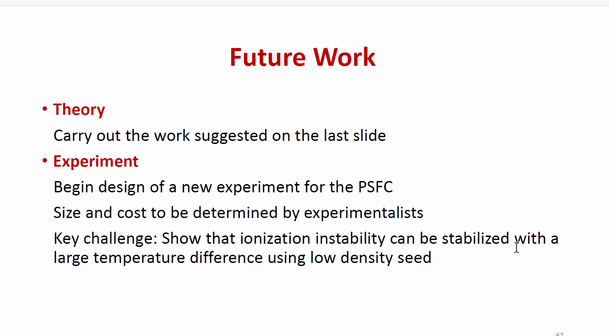
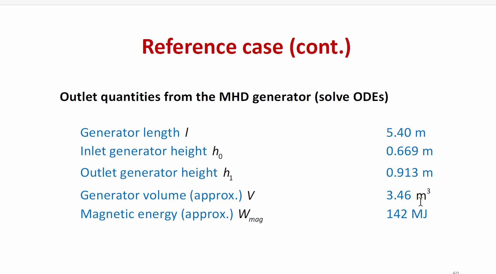

# Jeff Freidberg Lecture Transcript and Slide OCR

- Source video: `/Users/yiruxiao/Desktop/MHD Generator/references/Jeff_Freidberg_04-30-24.mp4`
- Duration: `01:21:48`
- Whisper model: `unknown`
- Detected language: `en`
- Detected slides: `62`
- OCR post-processing: `reference-paper formula/terminology correction enabled`

## Slide-Synchronized Notes

### Slide 1 | 00:00:00 to 00:00:30 | Slide 1


**OCR Text (post-processed against reference papers)**

```text
[OCR returned empty text]
```

**Narration Transcript**

- `00:00:00` `00:00:12` I assume by milquetoast plasma you mean a wimpy little plasma.
- `00:00:12` `00:00:17` But where is the thingy to it?
- `00:00:17` `00:00:20` Is it there?
- `00:00:20` `00:00:22` No, but isn't there a...
- `00:00:22` `00:00:24` I looked for it the other day for some.
- `00:00:24` `00:00:27` It's gone. I know we have one.
- `00:00:27` `00:00:30` All right.

### Slide 2 | 00:00:30 to 00:11:00 | Revisiting MHD Energy Conversion


**OCR Text (post-processed against reference papers)**

```text
Revisiting MHD Energy Conversion
Application of a Caspar Milquetoast Plasma
Jeff Freidberg
Dennis Whyte, Matthew Clingerman, Sam Frank
4/30/2024 r
Mh 1 |PSFC
```

**Narration Transcript**

- `00:00:30` `00:00:33` It's just space.
- `00:00:33` `00:00:36` Space power.
- `00:00:36` `00:00:39` Hey Bob.
- `00:00:39` `00:00:42` The presenter is missing so you're going to...
- `00:00:42` `00:00:43` The presenter is missing?
- `00:00:43` `00:00:47` The presenter is missing the remote so can you be here to advance the slides?
- `00:00:47` `00:00:48` Wait, wait, wait.
- `00:00:48` `00:00:49` Just move here.
- `00:00:49` `00:00:51` Just be here and advance the slides.
- `00:00:51` `00:00:52` Stand here I guess.
- `00:00:52` `00:00:53` I know but...
- `00:00:53` `00:00:54` Take the arrow with it.
- `00:00:54` `00:00:55` Or your hose.
- `00:00:55` `00:00:56` Or your hose could do it.
- `00:00:56` `00:00:57` It's up to you guys.
- `00:00:57` `00:00:58` I'd like you to sign.
- `00:00:58` `00:00:59` You didn't want me to do that.
- `00:00:59` `00:01:00` Okay fine I'll do that.
- `00:01:00` `00:01:01` I could do that.
- `00:01:01` `00:01:02` I could do that.
- `00:01:02` `00:01:03` I'm just running if there's like a remote.
- `00:01:03` `00:01:04` Can you hear me?
- `00:01:04` `00:01:05` This is Jessica.
- `00:01:05` `00:01:06` This doesn't do it.
- `00:01:06` `00:01:09` This doesn't do it. I did try it.
- `00:01:09` `00:01:12` Like this on the other button too.
- `00:01:14` `00:01:16` You have to turn it on and...
- `00:01:16` `00:01:19` I don't know what... but it points to me.
- `00:01:20` `00:01:22` Is it a million?
- `00:01:22` `00:01:23` Yeah.
- `00:01:23` `00:01:24` Okay, that's not it.
- `00:01:24` `00:01:25` You are.
- `00:01:25` `00:01:26` Nice.
- `00:01:26` `00:01:27` So kind of...
- `00:01:27` `00:01:28` Yeah.
- `00:01:28` `00:01:30` What are you doing?
- `00:01:30` `00:01:31` Oh, I'm going to...
- `00:01:31` `00:01:33` You can tell if you can hear us.
- `00:01:33` `00:01:37` I'll turn the, uh, I'll sit there.
- `00:01:37` `00:01:40` Hi Jim, this is Jessica, the controller. Can you hear me?
- `00:01:40` `00:01:42` Oh, sorry, in the conference room?
- `00:01:49` `00:01:51` By the way, I just went to FEMA itself.
- `00:01:51` `00:01:53` Do you have a microphone?
- `00:01:53` `00:01:55` Have they switched for that?
- `00:01:55` `00:01:56` No.
- `00:01:56` `00:01:57` No.
- `00:01:57` `00:01:59` Because it's, we're using...
- `00:01:59` `00:02:03` When they're cutting off the floor is very important.
- `00:02:03` `00:02:05` Oh, yeah.
- `00:02:05` `00:02:07` I just don't know how much time.
- `00:02:07` `00:02:11` So, I thought it would be over here.
- `00:02:11` `00:02:13` It's using the wrap.
- `00:02:13` `00:02:15` I don't know.
- `00:02:15` `00:02:19` If anybody's here to hear me, I'm going to have food.
- `00:02:19` `00:02:21` I'll have food.
- `00:02:21` `00:02:23` Yeah, I'll have some.
- `00:02:23` `00:02:25` I'm fine.
- `00:02:25` `00:02:27` You're all right.
- `00:02:27` `00:02:29` We're coming.
- `00:02:29` `00:02:31` No, no.
- `00:02:31` `00:02:33` Good bye.
- `00:02:33` `00:02:35` Yes.
- `00:02:35` `00:02:37` This is Darren.
- `00:02:37` `00:02:39` Hi again.
- `00:02:39` `00:02:43` This is Jessica in the conference room.
- `00:02:43` `00:02:47` For our offsite conference room, can you hear me?
- `00:02:47` `00:02:49` Yes.
- `00:02:49` `00:02:51` Yep.
- `00:02:51` `00:02:58` Oh yeah, that's good.
- `00:02:58` `00:03:06` Oh wait, the same 50 able to hear them.
- `00:03:06` `00:03:11` The mic's picking up.
- `00:03:11` `00:03:17` The mic's picking up.
- `00:03:17` `00:03:19` I'm going to get an idea.
- `00:03:19` `00:03:21` I'm going to get an idea.
- `00:03:21` `00:03:23` I'm going to get an idea.
- `00:03:23` `00:03:25` I'm going to get an idea.
- `00:03:25` `00:03:27` I'm going to get an idea.
- `00:03:27` `00:03:29` I'm going to get an idea.
- `00:03:29` `00:03:31` I'm going to get an idea.
- `00:03:31` `00:03:33` I'm going to get an idea.
- `00:03:33` `00:03:35` I'm going to get an idea.
- `00:03:35` `00:03:37` I'm going to get an idea.
- `00:03:37` `00:03:39` I'm going to get an idea.
- `00:03:39` `00:03:41` I'm going to get an idea.
- `00:03:41` `00:03:43` I'm going to get an idea.
- `00:03:43` `00:03:45` I'm going to get an idea.
- `00:03:45` `00:03:46` It's easier than expected.
- `00:03:46` `00:03:47` They're an app actually.
- `00:03:47` `00:03:48` Great.
- `00:03:48` `00:03:49` One second.
- `00:03:49` `00:03:50` You can do it.
- `00:03:50` `00:03:51` You can do it.
- `00:03:51` `00:03:52` You can do it.
- `00:03:52` `00:03:53` You can do it.
- `00:03:53` `00:03:54` You can do it.
- `00:03:54` `00:03:55` You can do it.
- `00:03:55` `00:03:56` You can do it.
- `00:03:56` `00:03:57` You can do it.
- `00:03:57` `00:03:58` You can do it.
- `00:03:58` `00:03:59` You can do it.
- `00:03:59` `00:04:00` You can do it.
- `00:04:00` `00:04:01` You can do it.
- `00:04:01` `00:04:02` You can do it.
- `00:04:02` `00:04:03` You can do it.
- `00:04:03` `00:04:04` You can do it.
- `00:04:04` `00:04:05` You can do it.
- `00:04:05` `00:04:06` You can do it.
- `00:04:06` `00:04:07` You can do it.
- `00:04:07` `00:04:08` You can do it.
- `00:04:08` `00:04:09` You can do it.
- `00:04:09` `00:04:10` You can do it.
- `00:04:10` `00:04:11` You can do it.
- `00:04:11` `00:04:12` You can do it.
- `00:04:12` `00:04:13` You can do it.
- `00:04:13` `00:04:14` You can do it.
- `00:04:14` `00:04:16` Sometimes you can get more or less proof.
- `00:04:16` `00:04:18` I know.
- `00:04:18` `00:04:20` Hey Josh, did you sign in?
- `00:04:20` `00:04:22` Yes.
- `00:04:29` `00:04:32` Hi, I'm Eilish. This is Jessica in the conference room. Can you hear me?
- `00:04:32` `00:04:34` I'm not.
- `00:04:34` `00:04:36` Thanks for the next suggestion, huh?
- `00:04:36` `00:04:38` Yeah.
- `00:04:38` `00:04:40` How you doing?
- `00:04:40` `00:04:47` I can hear you.
- `00:04:47` `00:04:54` I can hear you.
- `00:04:54` `00:04:56` I'm going to take you to the next room.
- `00:04:56` `00:04:58` I'm going to take you to the next room.
- `00:04:58` `00:05:00` I'm going to take you to the next room.
- `00:05:00` `00:05:02` I'm going to take you to the next room.
- `00:05:02` `00:05:04` I'm going to take you to the next room.
- `00:05:04` `00:05:06` I'm going to take you to the next room.
- `00:05:06` `00:05:08` I'm going to take you to the next room.
- `00:05:08` `00:05:10` I'm going to take you to the next room.
- `00:05:10` `00:05:12` I'm going to take you to the next room.
- `00:05:12` `00:05:14` I'm going to take you to the next room.
- `00:05:14` `00:05:16` I'm going to take you to the next room.
- `00:05:16` `00:05:18` I'm going to take you to the next room.
- `00:05:18` `00:05:20` I'm going to take you to the next room.
- `00:05:20` `00:05:22` I'm going to take you to the next room.
- `00:05:22` `00:05:24` I'm going to pretend I'm not even going to pass.
- `00:05:24` `00:05:26` I'm going to pretend I'm not even going to pass.
- `00:05:26` `00:05:28` I'm going to pretend I'm not even going to pass.
- `00:05:28` `00:05:30` I'm going to pretend I'm not even going to pass.
- `00:05:30` `00:05:32` I'm going to pretend I'm not even going to pass.
- `00:05:32` `00:05:34` I'm going to pretend I'm not even going to pass.
- `00:05:34` `00:05:36` I'm going to pretend I'm not even going to pass.
- `00:05:36` `00:05:38` I'm going to pretend I'm not even going to pass.
- `00:05:38` `00:05:40` I'm going to pretend I'm not even going to pass.
- `00:05:40` `00:05:42` I'm going to pretend I'm not even going to pass.
- `00:05:42` `00:05:44` I'm going to pretend I'm not even going to pass.
- `00:05:44` `00:05:46` I'm going to pretend I'm not even going to pass.
- `00:05:46` `00:05:48` I'm going to pretend I'm not even going to pass.
- `00:05:48` `00:05:50` I'm going to pretend I'm not even going to pass.
- `00:05:50` `00:05:52` Yeah, MIT.
- `00:05:52` `00:05:54` Give me the most expensive.
- `00:05:54` `00:05:56` I was.
- `00:05:56` `00:05:58` I was.
- `00:05:58` `00:06:00` I'm not sure.
- `00:06:00` `00:06:02` I know.
- `00:06:02` `00:06:04` That's funny.
- `00:06:04` `00:06:06` That's what I can't drink.
- `00:06:06` `00:06:08` Thanks so much.
- `00:06:08` `00:06:10` Yeah, it's not well.
- `00:06:10` `00:06:12` Can you hear me?
- `00:06:12` `00:06:14` No, I don't.
- `00:06:14` `00:06:16` If no one's gonna play, I'm gonna go.
- `00:06:16` `00:06:18` I was gonna go on a hike.
- `00:06:18` `00:06:38` I think it was very mixed in with the room last night.
- `00:06:38` `00:06:52` I'm sure your photo might too, or else.
- `00:06:52` `00:06:59` I don't believe in any of them.
- `00:06:59` `00:07:01` I don't believe in any of them.
- `00:07:01` `00:07:03` I don't believe in any of them.
- `00:07:03` `00:07:05` I don't believe in any of them.
- `00:07:05` `00:07:07` I don't believe in any of them.
- `00:07:07` `00:07:09` I don't believe in any of them.
- `00:07:09` `00:07:11` I don't believe in any of them.
- `00:07:11` `00:07:13` I don't believe in any of them.
- `00:07:13` `00:07:15` I don't believe in any of them.
- `00:07:15` `00:07:17` I don't believe in any of them.
- `00:07:17` `00:07:19` Okay, we're coming to you here.
- `00:07:19` `00:07:24` It is my honor, truly an honor,
- `00:07:24` `00:07:27` you saw today's speaker, Jeff Freiberg,
- `00:07:27` `00:07:32` and we'll say that, I'll start by saying
- `00:07:32` `00:07:36` that Jeff graduated in 1964
- `00:07:36` `00:07:39` from the Polytechnic Institute of Brooklyn,
- `00:07:39` `00:07:43` and then went to the Courant Institute in New York,
- `00:07:43` `00:07:46` and then you said to Cullum?
- `00:07:46` `00:07:47` Yeah.
- `00:07:47` `00:07:48` OK.
- `00:07:48` `00:07:51` And then to Los Alamos.
- `00:07:51` `00:07:56` So I was actually here in 1979 as a grad student
- `00:07:56` `00:08:00` when Jeff came to MIT from Los Alamos.
- `00:08:00` `00:08:05` He had just, Los Alamos, they had a theta pinch.
- `00:08:05` `00:08:07` And they wanted to try and straight theta
- `00:08:07` `00:08:12` pinch they were planning to make it into a toroidal theta
- `00:08:12` `00:08:15` pinch called SILAC.
- `00:08:15` `00:08:15` Right?
- `00:08:15` `00:08:16` SILAC.
- `00:08:16` `00:08:20` And Jeff predicted from ideal MHD
- `00:08:20` `00:08:22` that there was no truerally equilibrium.
- `00:08:22` `00:08:25` There's nothing key to the ring from expanding.
- `00:08:25` `00:08:27` Shortly thereafter, CELAC shut down.
- `00:08:27` `00:08:29` Jeff came to MIT.
- `00:08:29` `00:08:32` And I don't know whether you kicked out of there or?
- `00:08:32` `00:08:34` Very accurate theoretical prediction.
- `00:08:34` `00:08:35` Yes.
- `00:08:35` `00:08:39` And so prior to Jeff coming, we did not
- `00:08:39` `00:08:43` have any kind of formal MHD course at MIT.
- `00:08:43` `00:08:49` And so Jeff started that, and I took it that first semester.
- `00:08:49` `00:08:52` It was called the 22-615.
- `00:08:52` `00:08:56` And all the notes were Jeff's handwritten notes.
- `00:08:56` `00:08:58` And I made a lot of handwritten notes.
- `00:08:58` `00:09:05` And I actually helped a lot with what things were good
- `00:09:05` `00:09:06` and what things were not good.
- `00:09:06` `00:09:12` And that eventually became this well-known textbook.
- `00:09:12` `00:09:16` And actually, I got an acknowledgment in here
- `00:09:16` `00:09:22` for going through some of the problems or problem sets.
- `00:09:22` `00:09:29` And so Jeff is a professor here for many years.
- `00:09:29` `00:09:30` You're a professor emeritus now?
- `00:09:30` `00:09:31` Yeah.
- `00:09:31` `00:09:32` OK.
- `00:09:32` `00:09:38` And continues to work at least half time
- `00:09:38` `00:09:43` Many interesting MHD problems and we're gonna hear about one of them
- `00:09:47` `00:09:49` Myself no, it's yours. Yeah
- `00:09:52` `00:09:54` This is mine
- `00:09:54` `00:09:56` Sorry, you better run to...
- `00:09:56` `00:09:57` Yeah, I'll do that.
- `00:09:57` `00:09:58` Okay, you start there.
- `00:09:58` `00:10:00` Okay, let's see if that works.
- `00:10:00` `00:10:05` Um, well, good to see you, everybody.
- `00:10:05` `00:10:07` Welcome, glad to be here.
- `00:10:07` `00:10:09` Been a while since I've given a talk.
- `00:10:09` `00:10:11` So let's see how this goes.
- `00:10:11` `00:10:12` Here is the title.
- `00:10:12` `00:10:15` Revisiting MHD Energy Conversion
- `00:10:15` `00:10:19` Application of a Caspar Milk Toast Plasma.
- `00:10:19` `00:10:22` The older people know who Caspar Milk Toast is.
- `00:10:22` `00:10:26` How many, did anybody here have never heard of Casper Nuketos?
- `00:10:28` `00:10:31` Okay, okay, I'll tell you who he is,
- `00:10:31` `00:10:34` I'll tell you who he is in a little bit.
- `00:10:34` `00:10:39` Here's a team, myself, Dennis, graduate student Matthew,
- `00:10:39` `00:10:42` he graduated, Sam was postdoc,
- `00:10:42` `00:10:45` left for the arena pastures, okay?
- `00:10:46` `00:10:48` Okay, what's the goals today?
- `00:10:48` `00:10:51` I have a science goal, an infusion set to go.
- `00:10:51` `00:10:54` For science goal, I'm going to review MHD energy conversion
- `00:10:54` `00:10:56` for power plants.
- `00:10:56` `00:10:58` I'm going to describe some of your results.

### Slide 3 | 00:11:00 to 00:12:00 | Goals


**OCR Text (post-processed against reference papers)**

```text
Goals
- Science
- Review MHD energy conversion for power plants
- Describe new results
- ls MHD a game changer for fusion and fission power plants?
- PSFC
- Should we build a table top experiment?
- Should we build a C-Mod scale experiment? :
- Both?
```

**Narration Transcript**

- `00:10:58` `00:11:02` And here's the basic question.
- `00:11:02` `00:11:05` Then point the word for more than 10 seconds.
- `00:11:05` `00:11:10` Is MHD a game changer for fusion and fission power plants?
- `00:11:10` `00:11:12` That's the basic question.
- `00:11:12` `00:11:13` Use the rule of the point.
- `00:11:13` `00:11:16` Huh.
- `00:11:16` `00:11:16` But is this work?
- `00:11:16` `00:11:18` This is so sophisticated.
- `00:11:18` `00:11:19` Just a catered example.
- `00:11:19` `00:11:20` What a matter of example.
- `00:11:20` `00:11:20` OK.
- `00:11:20` `00:11:21` OK.
- `00:11:21` `00:11:23` OK.
- `00:11:23` `00:11:26` And then if some of the results look good,
- `00:11:26` `00:11:28` is a PFC question.
- `00:11:28` `00:11:32` Should we build a tabletop experiment?
- `00:11:32` `00:11:35` Should we build a CMOD scale experiment?
- `00:11:35` `00:11:38` Should we build both?
- `00:11:38` `00:11:39` So here's an outline.
- `00:11:39` `00:11:41` There's two parts of the talk.
- `00:11:41` `00:11:44` There's a general discussion of MHD energy conversion.
- `00:11:44` `00:11:49` This will be descriptive, no heavy lifting.
- `00:11:49` `00:11:51` I'm hoping everybody will really enjoy that.
- `00:11:51` `00:11:53` And then the next I'm going to go
- `00:11:53` `00:11:55` through a little more detail of what you have to do.
- `00:11:55` `00:11:57` The modeling, the analysis, some results.
- `00:11:57` `00:12:00` That'll be more like a standard seminar,

### Slide 4 | 00:12:00 to 00:12:30 | Outline


**OCR Text (post-processed against reference papers)**

```text
Outline
° General discussion of MHD Energy Conversion
- More detailed discussion of the physics plus results
rk
```

**Narration Transcript**

- `00:12:00` `00:12:02` fighting as hard as you can to stay awake.
- `00:12:06` `00:12:09` OK, so how can MHD energy conversion work?
- `00:12:09` `00:12:12` I'm going to tell you more about it as we go along.
- `00:12:12` `00:12:17` Well, MHD can act as a topping cycle on a power plant.
- `00:12:17` `00:12:20` And the goal is to substantially raise the overall plant
- `00:12:20` `00:12:22` efficiency.
- `00:12:22` `00:12:25` And the feeling is this should work pretty good
- `00:12:25` `00:12:26` for fossil fuels.
- `00:12:26` `00:12:30` And in particular, for coal, this would be a big help.

### Slide 5 | 00:12:30 to 00:13:00 | How can MHD Energy Conversion help?


**OCR Text (post-processed against reference papers)**

```text
How can MHD Energy Conversion help?
- MHD can act as a topping cycle in a power plant
- Purpose: substantially raise the overall plant efficiency
- Should work for fossil fuels
° Coal -a big help
- Gas - not much help since combined cycle already works
- Should work for nuclear fuels ,
- Fission - high temperature gas cooled reactors (HTGR), a big help
- Fusion - a big help
```

**Narration Transcript**

- `00:12:30` `00:12:32` But gas, not so much since we already
- `00:12:32` `00:12:34` have combined cycle gas.
- `00:12:34` `00:12:37` And that works pretty well as is.
- `00:12:37` `00:12:39` It should work for nuclear fuels, like fission,
- `00:12:39` `00:12:42` particularly for high temperature gas cool reactor.
- `00:12:42` `00:12:44` This should be a big help.
- `00:12:44` `00:12:47` And for fusion, this should also be a big help.
- `00:12:47` `00:12:48` We'll see why in a second.
- `00:12:52` `00:12:55` Here is the goal, the tactical goal.
- `00:12:55` `00:12:57` For both coal and nuclear.
- `00:12:57` `00:12:59` Right now, coal and nuclear, they both basically

### Slide 6 | 00:13:00 to 00:14:00 | The MHD Challenge


**OCR Text (post-processed against reference papers)**

```text
The MHD Challenge
- For both coal and nuclear - raise efficiency from 35% to 55%
° Coal:
- Reduce fuel costs for a given output power
- Reduce CO2 emissions
- Nuclear:
- Reduce reactor size for a given output power
- A big win because of high capital cost :
```

**Narration Transcript**

- `00:12:59` `00:13:04` produce their power using a standard steam cycle, which
- `00:13:04` `00:13:07` has an efficiency of like 35%.
- `00:13:07` `00:13:11` We want to raise the efficiency from something like 35%
- `00:13:11` `00:13:13` to 55%.
- `00:13:13` `00:13:15` One could do that.
- `00:13:15` `00:13:18` That would be a real game changer for power,
- `00:13:18` `00:13:22` because there's huge amounts of money and power involved.
- `00:13:22` `00:13:24` In coal, if you could raise the efficiency,
- `00:13:24` `00:13:27` it's pretty obvious how it would help.
- `00:13:27` `00:13:30` You would reduce fuel costs to make a given output power,
- `00:13:30` `00:13:33` and you would reduce CO2 emissions.
- `00:13:33` `00:13:37` For nuclear, you would reduce the reactor size
- `00:13:37` `00:13:40` for a given output power.
- `00:13:40` `00:13:42` This would be a big win, of course,
- `00:13:42` `00:13:45` at the high capital cost of your power plants.
- `00:13:47` `00:13:50` So I realize that even though I've worked in the region
- `00:13:50` `00:13:53` for 50 years, when it actually came to power plants,
- `00:13:53` `00:13:55` I didn't know diddly squat.
- `00:13:55` `00:13:57` So I've had to learn some of that.
- `00:13:57` `00:14:00` So I'll just take you through some of it as well.

### Slide 7 | 00:14:00 to 00:15:30 | Power Plants for Dummies - 1


**OCR Text (post-processed against reference papers)**

```text
Power Plants for Dummies - 1
° Critical figure of merit for the MHD convertor: f
° Power plant without a topping cycle
(1-n)P.,
Pin Hea Pin Thermal NP i: -
- X
° Typically 7=0.35
```

**Narration Transcript**

- `00:14:00` `00:14:03` Maybe some of you have similar backgrounds as me,
- `00:14:03` `00:14:05` or lack of backgrounds.
- `00:14:05` `00:14:09` So here it is, power plants for Dummy's first love.
- `00:14:09` `00:14:13` critical figure of merit, f,
- `00:14:13` `00:14:15` nevermind as we go through.
- `00:14:16` `00:14:17` Here's the starting point.
- `00:14:17` `00:14:19` Here's a power plant without a top anxiety.
- `00:14:21` `00:14:26` You take a furnace and it's easy to imagine nuclear or coal.
- `00:14:27` `00:14:30` You make heat, you go through a heat exchanger
- `00:14:30` `00:14:32` and then you make a water cycle,
- `00:14:32` `00:14:37` turn water to steam, drive it through a steam turbine
- `00:14:37` `00:14:39` and out comes electricity.
- `00:14:39` `00:14:43` You see, so if you put in a certain amount of power into the heat exchanger,
- `00:14:43` `00:14:48` PN, say your heat exchanger is really efficient,
- `00:14:48` `00:14:52` same power PN going into the steam cycle,
- `00:14:52` `00:14:58` and a certain amount of that input power gets converted to electricity,
- `00:14:58` `00:15:00` the efficiency, eta,
- `00:15:00` `00:15:03` the rest goes up the chimney.
- `00:15:03` `00:15:08` Typically, as I said, eta is like 0.35.
- `00:15:08` `00:15:11` Okay, now where does the topping cycle come in?
- `00:15:11` `00:15:13` So I've put this extra gizmo in here,
- `00:15:13` `00:15:16` which I've called the MHD topping cycle.
- `00:15:16` `00:15:18` And I put that in between the old heat exchanger
- `00:15:18` `00:15:20` and the thermal converter.
- `00:15:20` `00:15:22` So what happens here?
- `00:15:22` `00:15:25` The same power go in, power in from the heat exchanger.
- `00:15:25` `00:15:29` But in MHD, certain fraction of that input power

### Slide 8 | 00:15:30 to 00:16:30 | Power Plants for Dummies - 2


**OCR Text (post-processed against reference papers)**

```text
Power Plants for Dummies - 2
- Add an MHD topping cycle
(1-F)(1-n)P;,
; a
Electricity
£P ,
i
- MHD converts a fraction f of the input power into DC electricity
- No thermal conversion needed for MHD: MHD efficiency = 100%
- Remaining power converted to electricity by standard thermal cycle
```

**Narration Transcript**

- `00:15:29` `00:15:33` is converted directly to electricity.
- `00:15:33` `00:15:35` There is no thermal convertor need.
- `00:15:35` `00:15:37` So you're converting energy
- `00:15:37` `00:15:40` directly into electricity at very high efficiency.
- `00:15:40` `00:15:43` So this, and here's this factor, F,
- `00:15:43` `00:15:46` you can really like F to be as large as possible
- `00:15:46` `00:15:48` to convert as large a fraction of the input
- `00:15:48` `00:15:50` power into electricity,
- `00:15:50` `00:15:52` but it does so at very high efficiency.
- `00:15:53` `00:15:55` Remaining power, just like before,
- `00:15:55` `00:15:59` minus F times PN, multiply that by eta,
- `00:15:59` `00:16:03` that also makes electricity, and this goes up the chimney.
- `00:16:03` `00:16:11` So that's the idea. This is pretty well known actually. That's the purpose of the topping cycle.
- `00:16:11` `00:16:19` Here's a very sophisticated formula. You just look at simple power balance.
- `00:16:19` `00:16:24` We use the total efficiency of the system. Here's the NHD.
- `00:16:24` `00:16:28` It is the steam.
- `00:16:28` `00:16:30` And I plotted that.

### Slide 9 | 00:16:30 to 00:17:30 | Power Plants for Dummies - 3


**OCR Text (post-processed against reference papers)**

```text
Power Plants for Dummies - 3
° Overall plant efficiency with a topping cycle
- wa
: :
°For f=0.31 then 77,,, =0.55
```

**Narration Transcript**

- `00:16:30` `00:16:31` It is not surprising.
- `00:16:31` `00:16:33` It's a linear curve.
- `00:16:33` `00:16:36` Total efficiency versus this conversion.
- `00:16:36` `00:16:41` So when the F is zero, means no MHD, you add 35%.
- `00:16:41` `00:16:44` As you raise it, you convert a larger and larger fraction
- `00:16:44` `00:16:46` directly to electricity.
- `00:16:46` `00:16:48` The overall efficiency goes up.
- `00:16:48` `00:16:51` And I've shown you in dotted lines.
- `00:16:51` `00:16:52` It is roughly where you want to be.
- `00:16:52` `00:16:57` If you choose or can achieve F.31,
- `00:16:57` `00:17:01` convert 31% of the power into electricity,
- `00:17:01` `00:17:06` that gives you an overall efficiency of 55%.
- `00:17:06` `00:17:10` Okay, just doing some simple bookkeeping
- `00:17:10` `00:17:12` is more advanced dummies.
- `00:17:12` `00:17:16` Let's consider a power plant with 200 megawatts electric.
- `00:17:17` `00:17:19` 200 megawatts electric.
- `00:17:19` `00:17:23` But furnace starts off down here with no MHD
- `00:17:23` `00:17:28` at maybe 570 megawatts of thermal power.

### Slide 10 | 00:17:30 to 00:18:00 | Power Plants for Advanced Dummies


**OCR Text (post-processed against reference papers)**

```text
Power Plants for Advanced Dummies
- Consider a plant with total output power = 200 MW
Ne
<a : Steam
```

**Narration Transcript**

- `00:17:29` `00:17:33` It goes down to about 330 megawatts.
- `00:17:33` `00:17:35` You add 131.
- `00:17:35` `00:17:36` This is thermal power.
- `00:17:36` `00:17:38` And here's the MHD.
- `00:17:38` `00:17:41` It'll make a little over 100 megawatts electric.
- `00:17:41` `00:17:43` The steam is actually gonna make somewhat less,
- `00:17:43` `00:17:45` maybe 85 or so electric.
- `00:17:45` `00:17:50` So those are the round numbers to keep in mind.
- `00:17:50` `00:17:54` Okay, why revisit it now?
- `00:17:54` `00:17:58` Climate change is a lot more important now than in the 1990s.

### Slide 11 | 00:18:00 to 00:19:30 | Why revisit MHD now?


**OCR Text (post-processed against reference papers)**

```text
Why revisit MHD now?
- Societal reason
- Climate change more important now than in the 1990's
- MHD worked but lost out to combined cycle gas
- MHD research in USA largely terminated in 1990’s
- OK but what about the technology problems that caused MHD to lose out
to combined cycle gas?
- Science and Technology improvements
- Development of high T, high B, superconductors .
e Advanced manufacturing
- Advanced theory and computation
```

**Narration Transcript**

- `00:17:58` `00:18:03` There was a huge program in the US from the 60s to the 90s.
- `00:18:03` `00:18:06` And it was terminated.
- `00:18:06` `00:18:12` But back then, climate change was not viewed as serious as it is right now.
- `00:18:12` `00:18:19` People did a lot of experiments and we found out that it worked actually.
- `00:18:19` `00:18:23` It didn't work as well as combined gas, as combined cycle gas.
- `00:18:23` `00:18:26` So we lost that competition.
- `00:18:26` `00:18:29` And in the U.S. and largely throughout the world,
- `00:18:29` `00:18:35` MHD power plant research was terminated in the 1990s.
- `00:18:35` `00:18:38` So our heart is true and pure.
- `00:18:38` `00:18:45` We now care a lot more about CO2 emissions, et cetera, et cetera.
- `00:18:45` `00:18:48` So there's a real reason why this would be great if it weren't.
- `00:18:48` `00:18:49` OK?
- `00:18:49` `00:18:50` That's all nice.
- `00:18:50` `00:18:55` But there were technology problems that caused the Toulouse out to combine cyclogas.
- `00:18:55` `00:18:59` Why do we think it might work better now than it did then?
- `00:18:59` `00:19:01` Well, there have been some improvements.
- `00:19:01` `00:19:04` Important ones are technology.
- `00:19:04` `00:19:11` Probably the main one is a development of high temperature, high magnetic field superconductors.
- `00:19:11` `00:19:14` And we'll see what some of those numbers are a little later.
- `00:19:14` `00:19:20` There's also advanced manufacturing technique, and you'll see where that comes in.
- `00:19:20` `00:19:27` And we have some advanced theory and computation to help understand what's going on a little bit there.
- `00:19:27` `00:19:30` Here's just some simple pictures.

### Slide 12 | 00:19:30 to 00:20:30 | Technology improvements - Big reason for


**OCR Text (post-processed against reference papers)**

```text
Technology improvements - Big reason for
hope
”" : ~s \ See q i " j- BM |. ii
a; ON ~~ Q y
; - n /<
Magnets Computation
```

**Narration Transcript**

- `00:19:30` `00:19:32` This will be familiar to most people here.
- `00:19:32` `00:19:37` Sort of a pride and joy of fusion center slash CFS.
- `00:19:37` `00:19:38` There's a real new high field math.
- `00:19:38` `00:19:40` We can make those.
- `00:19:40` `00:19:43` Here's additive manufacturing.
- `00:19:43` `00:19:44` I certainly know what it is.
- `00:19:44` `00:19:47` I have no idea what this is doing here.
- `00:19:47` `00:19:48` Really, really good.
- `00:19:48` `00:19:54` OK, from making these complicated 3D shapes.
- `00:19:54` `00:19:56` And of course, there's modern theory of computation.
- `00:19:56` `00:19:58` We've learned an astounding amount of fusion research
- `00:19:58` `00:20:01` and our computers are a lot better right now.
- `00:20:03` `00:20:06` Okay, let me just tell you about some general properties
- `00:20:06` `00:20:07` of an MHD generator.
- `00:20:08` `00:20:10` It's basically a device, you see,
- `00:20:10` `00:20:11` it's going to convert kinetic energy
- `00:20:11` `00:20:12` of a gas to electricity.
- `00:20:13` `00:20:17` So there's probes that direct conversion,
- `00:20:17` `00:20:20` told you about, don't have any carnal limitation.
- `00:20:20` `00:20:23` There's no thermodynamic thing causing you to lose energy.
- `00:20:23` `00:20:26` That is very high conversion efficiency.
- `00:20:26` `00:20:31` Also, when you look at the pictures, there's no moving parts.

### Slide 13 | 00:20:30 to 00:21:30 | General properties of an MHD generator


**OCR Text (post-processed against reference papers)**

```text
General properties of an MHD generator
- A device that converts kinetic energy of a gas to electricity
« Pros: Cons:
Direct conversion Requires high field magnets
No Carnot - limitation Requires “good” plasma behavior
High conversion efficiency Hard to make an MHD plasma
No moving mechanical parts Coal easier than nuclear ‘
```

**Narration Transcript**

- `00:20:31` `00:20:35` So anybody, even as a theorist, I know I don't like things with moving parts,
- `00:20:35` `00:20:38` because moving parts break.
- `00:20:38` `00:20:41` This doesn't have very many moving parts.
- `00:20:41` `00:20:45` Cons, requires high field magnets.
- `00:20:45` `00:20:49` We know how to do that, but it better take out your wallet,
- `00:20:49` `00:20:51` because you have to pay for them.
- `00:20:51` `00:20:54` It requires good plasma behavior.
- `00:20:54` `00:20:56` plasma behavior.
- `00:20:56` `00:20:58` We'll see about that.
- `00:20:58` `00:21:01` We'll find out it's not so easy to make it in MHD plasma.
- `00:21:01` `00:21:03` It's pretty hard, actually.
- `00:21:03` `00:21:05` Turns out to be easier for coal than it is for nuclear.
- `00:21:08` `00:21:09` OK.
- `00:21:09` `00:21:12` Let me just, here's this general background,
- `00:21:12` `00:21:15` tell you about types of MHD generators.
- `00:21:15` `00:21:16` There's two types.
- `00:21:16` `00:21:18` Here's the first type is a linear channel,
- `00:21:18` `00:21:21` and that has two subcategories.
- `00:21:21` `00:21:23` First is a Faraday generator.
- `00:21:23` `00:21:25` Here's how it works.
- `00:21:25` `00:21:27` Suppose I have a hot conducting gas
- `00:21:27` `00:21:30` flowing along the channel.

### Slide 14 | 00:21:30 to 00:23:00 | - Linear channel


**OCR Text (post-processed against reference papers)**

```text
e
- Linear channel
A Segmented Faraday generator yee
IS
Faraday and Hall wl () | insaitstor
electric fields . wall
Faraday generator ae maar eea
Pate Be Vy v
side |e Ay | v Ad electrodes
2A 1000 electrodes
a sive
B Hall generator
force and current Faraday current '
ingas 2 Mee h
Hall generator tS --=
SLE Z ZY
Seay YY Zo
hot ges WZ ALe
flow aaa
40°
```

**Narration Transcript**

- `00:21:30` `00:21:35` Then I apply a magnetic field up and down the channel.
- `00:21:35` `00:21:39` As you well know, E plus V cross B equals zero.
- `00:21:39` `00:21:42` That induces a voltage from here to there
- `00:21:42` `00:21:45` across these electrodes.
- `00:21:45` `00:21:50` So you have to have a bunch of segment and electrodes
- `00:21:50` `00:21:52` to make this thing work.
- `00:21:52` `00:21:54` There's a voltage across each pair of electrons,
- `00:21:54` `00:21:57` and you put a load across each one.
- `00:21:57` `00:22:00` This is, I would call this a difarity voltage.
- `00:22:00` `00:22:04` I call it a faraday generator.
- `00:22:04` `00:22:08` Now, another way to talk about the pros and cons in a second.
- `00:22:08` `00:22:10` There's also a Hall generator.
- `00:22:10` `00:22:14` Depending on your parameters, not only will your plasma
- `00:22:14` `00:22:18` have resistivity, there will also be a Hall effect.
- `00:22:18` `00:22:21` And Hall effect, so in addition to a voltage appearing this way,
- `00:22:21` `00:22:25` There's also a voltage appears along the length.
- `00:22:25` `00:22:29` So you could be really tricky and connect a single load
- `00:22:29` `00:22:33` from here to here, inlet to outlet,
- `00:22:33` `00:22:36` and short circuit for the faraday electrodes.
- `00:22:36` `00:22:38` That's called a Hall generator.
- `00:22:38` `00:22:40` This is a nice diagram.
- `00:22:40` `00:22:42` Looks kind of, hey, I could do that, yeah.
- `00:22:42` `00:22:44` We can actually go and calculate,
- `00:22:44` `00:22:46` how many electrodes do I need in a power,
- `00:22:47` `00:22:49` a real power generator?
- `00:22:49` `00:22:52` like 1,000 electrodes.
- `00:22:52` `00:22:55` That's going to take a lot of graduate students
- `00:22:55` `00:22:57` maintain all those electrodes.

### Slide 15 | 00:23:00 to 00:24:30 | Some obvious problems


**OCR Text (post-processed against reference papers)**

```text
Some obvious problems
- Faraday (Hall J = 0)
- Lots of electrodes - maintenance pain in the neck
- Separate load across each pair of electrodes
- Leads to good performance even at modest B fields
- Hall (Faraday E = 0)
- Lots of electrodes - maintenance pain in the neck
- Only one load connected across end electrodes :
- Good performance at high B fields (large Hall E field)
```

**Narration Transcript**

- `00:23:00` `00:23:03` So let's look at some obvious problems.
- `00:23:03` `00:23:06` An in-variate generator, OK?
- `00:23:06` `00:23:09` So an in-variate generator is defined by the whole current.
- `00:23:09` `00:23:11` Whole current is the current flowing along
- `00:23:11` `00:23:14` the directional flow region.
- `00:23:14` `00:23:16` There's nothing connected across the ends.
- `00:23:16` `00:23:18` There's lots of electrodes, so it's
- `00:23:18` `00:23:23` maintenance pain in the neck. There's a separate load across each pair of electrodes. That's
- `00:23:23` `00:23:28` another pain in the neck. On the other hand, if you could do that, it actually works pretty
- `00:23:28` `00:23:33` well even at modest B fields. So if you didn't have access to high fields, that wouldn't
- `00:23:33` `00:23:40` be a bad thing to do. The hole generator, defined by the faraday electric field being
- `00:23:40` `00:23:46` shorted out, still has a lot of electrodes. There was still the maintenance pain in the
- `00:23:46` `00:23:52` neck, but at least now you only have one electrode connected across the device.
- `00:23:52` `00:23:57` So you've sort of solved that problem but you still have this one. On the other
- `00:23:57` `00:24:02` hand if you want the whole area to work well you need a high magnetic field
- `00:24:02` `00:24:11` but you need a large Hall effect. Here is a clever geometric improvement. I didn't
- `00:24:11` `00:24:16` I wish I thought of this, but this was invented in the 1980s, I think.
- `00:24:17` `00:24:23` This is a cylindrical generator, and it's called a disc generator, cylindrical disc generator.
- `00:24:24` `00:24:31` Let's just look at it. Here is a magnet. So the magnetic field goes vertically across here.

### Slide 16 | 00:24:30 to 00:25:30 | A clever geometric improvement


**OCR Text (post-processed against reference papers)**

```text
A clever geometric improvement
- Cylindrical channel
D disk generator we
Cylindrical Disk generator ng mm” | 2 electrodes
h
```

**Narration Transcript**

- `00:24:32` `00:24:38` Now you shoot your hot plasma, your hot ionized gas down here, and it spreads out radially.
- `00:24:38` `00:24:44` And if you have a high enough field, you get a Hall voltage.
- `00:24:44` `00:24:50` And if you remember, the Hall voltage appears across the same direction as the flow.
- `00:24:50` `00:24:53` So you get a Hall voltage from the inside to the outside.
- `00:24:53` `00:24:59` Okay, okay. I'll put an electrode around the inside, an electrode around the outside,
- `00:24:59` `00:25:02` and I'll connect up my load across there.
- `00:25:02` `00:25:10` Now I've basically got those hole generator, but I've only got two electrodes.
- `00:25:10` `00:25:13` So this has some advantages.
- `00:25:13` `00:25:15` How do you make the magnetic field?
- `00:25:15` `00:25:18` I mean, as a theorist, it's real easy.
- `00:25:18` `00:25:20` P equals B0.
- `00:25:20` `00:25:23` Done, okay?
- `00:25:23` `00:25:26` Computer experimentalists, you have to build something.
- `00:25:26` `00:25:30` These are what the magnets look like for a linear generator.

### Slide 17 | 00:25:30 to 00:26:00 | Simpler Magnets


**OCR Text (post-processed against reference papers)**

```text
o
Simpler Magnets
i |
: OF Kee
a ~. a ==
- | ~~ e * ~ ;
Linear Disk
```

**Narration Transcript**

- `00:25:30` `00:25:34` And it's more a simple circular magnet for the disk generator.
- `00:25:34` `00:25:39` This has some obvious advantages.
- `00:25:39` `00:25:45` First, because of the cylindrical symmetry, the linear generator,
- `00:25:45` `00:25:48` where you have to short out the electrodes physically with a connection,
- `00:25:48` `00:25:52` is automatically shorted out by the geometry.
- `00:25:52` `00:25:57` So this generator is, as I said, it's actually a cylindrical hole generator.
- `00:25:57` `00:26:00` Only one load is needed.

### Slide 18 | 00:26:00 to 00:26:30 | Some obvious advantages


**OCR Text (post-processed against reference papers)**

```text
Some obvious advantages
- Disk generator (Azimuthal E = 0 automatically)
- Actually a cylindrical Hall generator
- Only one load needed
- Only 2 electrodes - big maintenance advantage
- But needs high field for good performance
- Geometry more complicated - not a big deal (theoretically) i
- This is our first choice for a power topping cycle and experiment at
PSFC
```

**Narration Transcript**

- `00:26:00` `00:26:04` There's two electrodes, which is a huge maintenance advantage.
- `00:26:04` `00:26:07` You need high field for good performance.
- `00:26:07` `00:26:12` On the other hand, the geometry is more complicated.
- `00:26:12` `00:26:13` I don't think this is a big deal.
- `00:26:13` `00:26:15` I know it's not a big deal, theoretically.
- `00:26:15` `00:26:17` I don't know what my experimental colleagues
- `00:26:17` `00:26:19` would tell me, but I mean, they built these,
- `00:26:19` `00:26:21` so I think it's OK.
- `00:26:21` `00:26:23` And overall, I would say this is going
- `00:26:23` `00:26:26` to be our first choice for a popping cycle
- `00:26:26` `00:26:27` on an experiment at the fusion center.

### Slide 19 | 00:26:30 to 00:28:00 | Two types of MHD cycles


**OCR Text (post-processed against reference papers)**

```text
Two types of MHD cycles
° Open
- Furnace coolant gas flows directly into MHD generator
- Best option for coal
- Closed
- Furnace coolant first flows through a heat exchanger
- Then flows into MHD generator
- Best option for nuclear :
```

**Narration Transcript**

- `00:26:30` `00:26:32` Now one other thing to keep in mind
- `00:26:32` `00:26:35` is two types of MHD cycles, open and close.
- `00:26:36` `00:26:40` The open cycle, which is the best option for coal,
- `00:26:41` `00:26:44` basically you take the gas, hot gas coming out
- `00:26:44` `00:26:47` of the coal furnace and flow it directly
- `00:26:47` `00:26:49` into the MHD generator.
- `00:26:49` `00:26:53` So this is sort of like CO, CO2,
- `00:26:53` `00:26:58` in nitrogen, whatever it is, as you know,
- `00:26:58` `00:27:01` other stuff that makes slag.
- `00:27:01` `00:27:03` I mean, you have to keep a picture in mind
- `00:27:03` `00:27:04` what's coming out of the cold,
- `00:27:04` `00:27:07` you're gonna rate out a quite appropriate,
- `00:27:07` `00:27:09` it's like a little poop.
- `00:27:09` `00:27:12` I mean, it's just filled with everything.
- `00:27:12` `00:27:14` But you put it right down the channel,
- `00:27:14` `00:27:16` and it works if it's an open cycle.
- `00:27:18` `00:27:21` Low cycle, you don't do that.
- `00:27:21` `00:27:24` you take the F, which is going to be best for nuclear.
- `00:27:24` `00:27:25` Say you're cooling with helium,
- `00:27:25` `00:27:28` you put the helium through a heat exchanger,
- `00:27:28` `00:27:32` and you have to pretty well have to use argon as the coolant.
- `00:27:32` `00:27:37` And this coolant comes out of the heat exchanger.
- `00:27:37` `00:27:41` This then flows into the MHD generator.
- `00:27:41` `00:27:43` We'll see, this is going to be the best option
- `00:27:43` `00:27:45` for a nuclear system, fission or fusion.
- `00:27:47` `00:27:48` Let's look at this again at the high level.
- `00:27:48` `00:27:50` MHD for coal.
- `00:27:50` `00:27:54` MHDZ is easier for coal, which is an open cycle.
- `00:27:54` `00:27:58` If you can get a higher cooling temperature, like 2,000 degrees,
- `00:27:58` `00:27:59` that's even higher.

### Slide 20 | 00:28:00 to 00:29:30 | MHD for Coal


**OCR Text (post-processed against reference papers)**

```text
MHD for Coal
- MHD is easier for coal - open cycle, higher coolant T > 2000 K
- Not too difficult to make an MHD plasma - add seed gas (e.g.
Potassium)
- But, not too much world excitement for improving coal
- Actually might be very good for retro-fitting existing plants
- But, it should not be so good that we build new coal plants ‘
- Retro-fitting would add substantial capital costs
- We have studied coal-MHD but this is not our main interest
```

**Narration Transcript**

- `00:27:59` `00:28:01` That's not unusual.
- `00:28:01` `00:28:05` And at that temperature, it's not too difficult to make it plasma.
- `00:28:05` `00:28:09` 2,000 degrees, though, if you did carbon dioxide, monoxide, any of your stuff,
- `00:28:09` `00:28:11` you wouldn't ionize anything.
- `00:28:11` `00:28:18` So you have to add in a seed gas, like potassium or cesium,
- `00:28:18` `00:28:20` It has a very low ionization potential,
- `00:28:20` `00:28:23` which makes it easier to generate a plasma.
- `00:28:23` `00:28:25` You don't have to add in much, but you have to add in some.
- `00:28:28` `00:28:31` Well, it's not too hard to make a plasma on you.
- `00:28:31` `00:28:34` And I would probably say,
- `00:28:34` `00:28:35` there's not too much world excitement
- `00:28:35` `00:28:37` for improving coal right now.
- `00:28:41` `00:28:42` Actually, it might be a very good idea
- `00:28:42` `00:28:45` for retrofitting existing plants, not in the US.
- `00:28:45` `00:28:48` I mean, you can't even say the word coal.
- `00:28:48` `00:28:51` It's stamp, shh, for a villain.
- `00:28:51` `00:28:54` There's a lot of coal in Asia, right, in China, in India.
- `00:28:54` `00:28:57` So we're good to retrofit those plants.
- `00:28:57` `00:28:59` You know, we don't want it to be so good, though.
- `00:28:59` `00:29:00` We start building new plants.
- `00:29:00` `00:29:03` We don't need to be that successful.
- `00:29:03` `00:29:04` Successful enough.
- `00:29:06` `00:29:09` And it would cost some substantial amount
- `00:29:09` `00:29:10` of money to do that.
- `00:29:10` `00:29:14` We've studied the coal MHD, but this is not our main interest.
- `00:29:14` `00:29:18` So, what about MHD for nuclear?
- `00:29:18` `00:29:21` MHD is tougher for nuclear than coal.
- `00:29:21` `00:29:26` It's hard to achieve high temperatures, like later in 2000 degrees.
- `00:29:26` `00:29:31` Since it's my understanding is that if you have a high temperature gas-cooled reactor,

### Slide 21 | 00:29:30 to 00:31:00 | MHD for Nuclear - 1


**OCR Text (post-processed against reference papers)**

```text
MHD for Nuclear - 1
- MHD is tougher for nuclear than coal - hard to achieve high T
- For a high 7 gas cooled reactor (HTGR) coolant 7 = 1000 K
- Much harder to make a plasma at this temperature
- Possible solution: closed cycle using Argon as the primary gas and a
small amount of Potassium as a seed gas to make the plasma
- Potassium is good - low ionization potential 4.34 eV
- Argon is good - slow energy exchange rate between K-electrong and
A-neutrals
- Note: From the Saha equation N.(2000) _ 5 4x10"
n, (1000)
```

**Narration Transcript**

- `00:29:31` `00:29:34` you may be talking about a thousand degrees.
- `00:29:34` `00:29:36` Much harder to make a plasma at this temperature.
- `00:29:36` `00:29:38` But here's the solution.
- `00:29:38` `00:29:42` You want to use as the primary gas,
- `00:29:42` `00:29:45` going into the MHD generator, argon.
- `00:29:45` `00:29:49` And again, you need to add a seed gas to make a plasma.
- `00:29:49` `00:29:51` Let's say you add potassium.
- `00:29:51` `00:29:52` Potassium is good.
- `00:29:52` `00:29:57` It's got a low ionization potential, 1.34 EV.
- `00:29:57` `00:30:00` Anybody know what that is in terms of equivalent degrees
- `00:30:00` `00:30:02` Kelvin?
- `00:30:02` `00:30:06` 50,000.
- `00:30:06` `00:30:10` which is much, much greater than 1,000.
- `00:30:10` `00:30:12` The argon is good because, we'll see,
- `00:30:12` `00:30:14` it has a slow energy exchange rate,
- `00:30:14` `00:30:18` I mean, any potassium electron you make,
- `00:30:18` `00:30:20` and any of the argon neutrals.
- `00:30:20` `00:30:22` Now, you might say, this is 1,000,
- `00:30:22` `00:30:26` Nicole was 2,000, a factor of two.
- `00:30:26` `00:30:28` That's the big deal.
- `00:30:28` `00:30:30` The electron density is determined
- `00:30:30` `00:30:33` from a well-known Saha equation.
- `00:30:33` `00:30:34` If you plug in the typical numbers,
- `00:30:34` `00:30:37` for the electron density at 2,000 degrees,
- `00:30:39` `00:30:40` this is the number of electrons,
- `00:30:40` `00:30:42` the number of electrons generated at 1,000 degrees,
- `00:30:42` `00:30:46` that ratio two times 10 to the 11.
- `00:30:46` `00:30:48` So I'm sure you'd notice that difference
- `00:30:48` `00:30:51` in your stipend or something like that.
- `00:30:51` `00:30:52` So this is astounding.
- `00:30:54` `00:30:55` Okay, I may see if it'll go through.
- `00:30:55` `00:30:57` Good news.
- `00:30:57` `00:31:01` All the heating preferentially heats the electrons.

### Slide 22 | 00:31:00 to 00:32:00 | MHD for Nuclear - 2


**OCR Text (post-processed against reference papers)**

```text
MHD for Nuclear - 2
* Good news
- Ohmic heating preferentially heats electrons
- Slow Argon energy equilibration allows large temperature difference
- 7(A-neutrals) = 500 K, 7(K-electrons)=5000 K - easy to make plasma
- Ohmic heating not wasted heating the Argon
rk
```

**Narration Transcript**

- `00:31:01` `00:31:02` That's good, and the way that works
- `00:31:02` `00:31:07` is because we use argon, slow energy equilibration time
- `00:31:07` `00:31:10` allows significant temperature difference,
- `00:31:10` `00:31:13` large temperature difference between the background gas
- `00:31:13` `00:31:14` and the electrons.
- `00:31:14` `00:31:18` So typically entering the generator,
- `00:31:18` `00:31:21` the argon might be at 500 degrees Kelvin,
- `00:31:21` `00:31:24` the electrons at 5,000 degrees.
- `00:31:24` `00:31:28` Since the Sahar equation, the electron density
- `00:31:28` `00:31:32` is determined by the electron temperature, 5,000 degrees
- `00:31:32` `00:31:35` It's not so hard to make a plasma.
- `00:31:35` `00:31:38` It's really, in a way, an ideal situation.
- `00:31:38` `00:31:40` Omic heating is not wasted heating the argon,
- `00:31:40` `00:31:42` which is already at some temperature.
- `00:31:44` `00:31:46` Yeah, it's gonna click.
- `00:31:46` `00:31:48` But there's also some bad news.
- `00:31:49` `00:31:51` You have a finite temperature difference,
- `00:31:52` `00:31:54` and it's stability.
- `00:31:54` `00:31:58` Where I said the plasma must have good behavior.
- `00:31:58` `00:32:00` Good and plasma could almost never be used

### Slide 23 | 00:32:00 to 00:33:00 | MHD for Nuclear - 3


**OCR Text (post-processed against reference papers)**

```text
MHD for Nuclear - 3
- Bad news
- Finite AT generates the ionization instability (Velikov 1962)
- Plasma breaks up into filaments - performance seriously degraded
- Believed to be a show stopper for MHD-nuclear
- Mixed news
- High capital cost of nuclear an advantage(?) r
- Extra cost of MHD relatively small - large payoff because of higher
efficiency
```

**Narration Transcript**

- `00:32:00` `00:32:01` in the same sense.
- `00:32:02` `00:32:05` This is probably not only before you were born,
- `00:32:05` `00:32:06` or your parents were born.
- `00:32:06` `00:32:08` Maybe even your grandparents were, I know.
- `00:32:09` `00:32:11` This is one of our own colleagues, Velikov.
- `00:32:11` `00:32:15` He first pointed out this instability in 1962.
- `00:32:15` `00:32:17` And it's observed experimentally
- `00:32:17` `00:32:19` that the plasma breaks up in the filaments,
- `00:32:19` `00:32:22` seriously degrading performance.
- `00:32:22` `00:32:23` For many, many, many years,
- `00:32:23` `00:32:26` this was believed to be a showstopper for MHD.
- `00:32:27` `00:32:29` The nuclear in the 80s and 90s,
- `00:32:29` `00:32:31` nobody really cared about it too much.
- `00:32:32` `00:32:33` There's also mixed news.
- `00:32:33` `00:32:35` I can't quite believe I'm saying this,
- `00:32:35` `00:32:40` but the high capital cost of nuclear won't be an advantage.
- `00:32:40` `00:32:41` How could that be?
- `00:32:42` `00:32:45` Well, the extra cost of MHC is then relatively small.
- `00:32:47` `00:32:49` And so it's a large payoff
- `00:32:49` `00:32:51` because of the higher efficiency.
- `00:32:54` `00:32:56` Now, so I said we have to overcome
- `00:32:56` `00:32:58` these technological problems.
- `00:32:58` `00:33:01` Why are we hopeful for MHD nuclear?

### Slide 24 | 00:33:00 to 00:34:30 | Why are we hopeful for MHD-Nuclear?


**OCR Text (post-processed against reference papers)**

```text
Why are we hopeful for MHD-Nuclear?
New Innovations
- High B superconductors (3 T > 15 T)
Increase performance, reduce cost
- Design the channel as a nozzle - better design optimization
Needs advanced manufacturing
- First principle theory - the ionization instability
What we need to do to avoid instability ‘
```

**Narration Transcript**

- `00:33:01` `00:33:02` Here's the new innovations.
- `00:33:04` `00:33:07` We have these high temperature superconductors.
- `00:33:07` `00:33:11` Most of the early experiments were three or four Tesla.
- `00:33:12` `00:33:14` Now we can get 15 Tesla, 20 Tesla.
- `00:33:14` `00:33:16` We've actually built the magnet.
- `00:33:16` `00:33:17` Go down.
- `00:33:18` `00:33:21` High fields, we expected to increase performance.
- `00:33:21` `00:33:23` Magneto, right?
- `00:33:23` `00:33:25` Anything with magneto, you figure about,
- `00:33:25` `00:33:26` the more magneto, the better.
- `00:33:27` `00:33:31` So that should increase performance and reduce cost.
- `00:33:31` `00:33:33` Another interesting idea is designing the channel
- `00:33:33` `00:33:35` as a nozzle.
- `00:33:35` `00:33:37` And you'll see that this really gives you
- `00:33:37` `00:33:40` a good way to optimize the design.
- `00:33:40` `00:33:42` This is going to need advanced manufacturing.
- `00:33:42` `00:33:45` The drawings sort of had an expanded channel.
- `00:33:45` `00:33:47` I'm sure they just went to the shop and said,
- `00:33:47` `00:33:50` make me three straight sides or something like that,
- `00:33:50` `00:33:52` because it was easy to do.
- `00:33:52` `00:33:56` But if you can actually shape it, you could do a lot better.
- `00:33:56` `00:33:59` Another thing, we developed a first principle's theory
- `00:33:59` `00:34:01` of this ionization instability.
- `00:34:01` `00:34:05` So now, we know what to do, theoretically,
- `00:34:05` `00:34:07` to avoid this instability.
- `00:34:07` `00:34:12` Talk more about this later, which is a critical point.
- `00:34:12` `00:34:14` MHC energy conversion.
- `00:34:14` `00:34:18` I'm a big fusion audience, so I just need to make this point.
- `00:34:18` `00:34:21` MHC energy conversion is easier than fusion.
- `00:34:21` `00:34:23` Why?
- `00:34:23` `00:34:27` It's all about the plasma, the temperature, fusion.
- `00:34:27` `00:34:31` 13,000 EV, white 1.5 EV.

### Slide 25 | 00:34:30 to 00:36:00 | MHD energy conversion is easier than fusion


**OCR Text (post-processed against reference papers)**

```text
MHD energy conversion is easier than fusion
Why?
It’s all about the plasma!
Temperature 15,000 eV 0.15 eV
Confinement Invisible magnetic lines Solid walls
Heating Invisible microwaves Furnace
Diagnostics Invisible to normal sight Easy to see
Instabilities/turbulence ~0O 1 h
Ionization 100% 0.001%
Neutral chaperones 0 100,000
```

**Narration Transcript**

- `00:34:31` `00:34:34` How do you confine a fusion plasma?
- `00:34:34` `00:34:38` Visible magnetic lines, solid walls.
- `00:34:38` `00:34:40` How do you heat it?
- `00:34:40` `00:34:43` Visible microwave.
- `00:34:43` `00:34:44` Furnace.
- `00:34:44` `00:34:46` How do you know what's going on?
- `00:34:46` `00:34:49` It's invisible to normal sight.
- `00:34:49` `00:34:50` Here's an important one.
- `00:34:50` `00:34:52` Herbulence and instability.
- `00:34:52` `00:34:53` It's an effusion plasma.
- `00:34:53` `00:34:55` How many do you have?
- `00:34:55` `00:34:57` Basically, an infinite number, give or take a few.
- `00:34:57` `00:35:00` I mean, they're huge.
- `00:35:00` `00:35:02` The MHD is?
- `00:35:02` `00:35:02` One.
- `00:35:02` `00:35:06` There's ionization instability.
- `00:35:06` `00:35:10` The ionization infusion plasma is 100%.
- `00:35:10` `00:35:15` The MHD energy conversion is typically 0.001%.
- `00:35:15` `00:35:21` That says if you have a lot of matronly neutral chaperones
- `00:35:21` `00:35:24` keeping track of their charges, none of these infusion
- `00:35:24` `00:35:32` fully ionized, you have a hundred thousand matronly chaperones trying to keep each electron in shape.
- `00:35:35` `00:35:42` It's important to remember that. It's a plasma. Fusion plasma is not your friend.
- `00:35:43` `00:35:48` I've been working in fusion for 50 years and this is held true from day one.
- `00:35:48` `00:35:52` And, uh, we were speaking to Bob before.
- `00:35:52` `00:35:54` We were talking about the Stellarator.
- `00:35:54` `00:35:55` Yeah, this is...
- `00:35:55` `00:35:59` Shortage of ways to find new instabilities.
- `00:35:59` `00:36:01` Misery is just around the corner.

### Slide 26 | 00:36:00 to 00:36:30 | An MHD generator plasma is a good pal


**OCR Text (post-processed against reference papers)**

```text
An MHD generator plasma is a good pal
```

**Narration Transcript**

- `00:36:01` `00:36:06` On the other hand, an M.H.D. generator plasma.
- `00:36:06` `00:36:08` He's a good pal.
- `00:36:08` `00:36:09` Here he is.
- `00:36:09` `00:36:12` This is Casper from the Post.
- `00:36:12` `00:36:14` Timid Soul.
- `00:36:14` `00:36:17` He was a cartoon character created by Harold Webster.
- `00:36:17` `00:36:18` sort of in the 1920s.
- `00:36:20` `00:36:21` Here's an example.
- `00:36:21` `00:36:25` Cass by Milcos wants to help.
- `00:36:25` `00:36:27` Here he is.
- `00:36:27` `00:36:29` Mr. Milcos is about to change a fuse.

### Slide 27 | 00:36:30 to 00:37:00 | Caspar Milquetoast wants to help


**OCR Text (post-processed against reference papers)**

```text
Caspar Milquetoast wants to help
Uy, LR - eS | “; 4 |
IF Wy | 7 H. T. Webster
a A 1927
RUBBER Mik F A Yj
,GLOVES, ‘i , yp
600TS = df /) Li WH,
ea Sh = YY Hf, \| {or i Wy
MR, MILQUETOAST 1S ABOUT i >}, an.
Tee ar tii el hal
°°7
```

**Narration Transcript**

- `00:36:30` `00:36:33` There's rubber boots, rubber gloves,
- `00:36:33` `00:36:36` he's on a rubber mat, he's got a fire extinguisher,
- `00:36:36` `00:36:38` he's got two buckets of water there.
- `00:36:39` `00:36:41` This is a guy who's on your team,
- `00:36:41` `00:36:43` unlike a fusion plasma.
- `00:36:43` `00:36:53` That's why I think MHD energy conversion will not take 50 years to make it work once we have this new technology.
- `00:36:55` `00:36:59` Okay, so now we're going to switch over to the science part.

### Slide 28 | 00:37:00 to 00:38:30 | Basic Science of MHD Energy Conversion


**OCR Text (post-processed against reference papers)**

```text
Basic Science of MHD Energy Conversion
* Typical parameters in an MHD energy generator
Primary gas pressure 10° Paxl atm
Seed gas pressure 10° Pa + 0.01 atm
Seed electron pressure 1 Pa x+10° atm
Seed electron density 10° m™®
Primary and seed gas temperatures 1000 K
Generator length 10 m
Generator fluid velocity 1000 m/sec h
Generator transit time scale 10 msec
Magnetic field 1
Current density 10 kA/m’
```

**Narration Transcript**

- `00:37:02` `00:37:06` Here are the typical parameters of an MHD generator.
- `00:37:06` `00:37:09` Just to give you some idea.
- `00:37:09` `00:37:15` So the primary gas pressure entering the MHD generator is like one atmosphere.
- `00:37:15` `00:37:19` The seed gas pressure is 0.01 atmosphere.
- `00:37:19` `00:37:26` The electron pressure is, corresponds to, well, this is 10 to the minus 5 atmosphere.
- `00:37:26` `00:37:31` So you see there's not very much seed compared to the background.
- `00:37:31` `00:37:34` So your electron density is 10 to the 20.
- `00:37:34` `00:37:39` The primary seed gas temperatures are 1,000 degrees,
- `00:37:39` `00:37:41` maybe 10 meters long.
- `00:37:41` `00:37:45` fluid flows at 1,000 meters a second,
- `00:37:45` `00:37:47` around 10 milliseconds to go there for the gas
- `00:37:47` `00:37:49` to flow through the generator.
- `00:37:49` `00:37:52` The field will, let's say, 10 Tesla.
- `00:37:52` `00:37:56` And the current density is 10 kilograms per meter squared.
- `00:37:56` `00:37:57` I like this.
- `00:37:57` `00:37:59` I pat myself on the back.
- `00:37:59` `00:38:01` I'm a theorist.
- `00:38:01` `00:38:04` I only work with dimensionless quantities.
- `00:38:04` `00:38:06` You only know three numbers, much less than one,
- `00:38:06` `00:38:09` much greater than one, and one.
- `00:38:09` `00:38:12` So the fear is to actually come out with all these numbers
- `00:38:12` `00:38:15` in real units, no less.
- `00:38:15` `00:38:17` I feel that's one of my big accomplishments.
- `00:38:17` `00:38:18` Oh.
- `00:38:18` `00:38:18` Oh.
- `00:38:18` `00:38:19` Oh.
- `00:38:19` `00:38:19` Oh.
- `00:38:19` `00:38:20` Oh.
- `00:38:20` `00:38:24` What's the consequence of look at those numbers?
- `00:38:24` `00:38:27` Plasma strongly collision-dominated.
- `00:38:27` `00:38:32` That means the fluid model is very accurate to each species.

### Slide 29 | 00:38:30 to 00:39:30 | Consequences


**OCR Text (post-processed against reference papers)**

```text
Consequences
- Plasma is strongly collision dominated
- Fluid model is very accurate for each species
- Multifluid description required
- One (nuclear) or more (coal) primary fluids
- Un-ionized seed gas
- Seed ions h
- Seed electrons
```

**Narration Transcript**

- `00:38:32` `00:38:35` I've often said when it comes to fusion,
- `00:38:35` `00:38:37` I don't want my fusion reactor to depend
- `00:38:37` `00:38:40` on the Blassoff equation.
- `00:38:40` `00:38:42` If the physics is that sophisticated,
- `00:38:42` `00:38:44` that's nice for the tabletop, but not
- `00:38:44` `00:38:47` for some huge power plant.
- `00:38:47` `00:38:48` This is nice.
- `00:38:48` `00:38:51` Fluid model is very accurate, and it's
- `00:38:51` `00:38:52` a whole bunch of species.
- `00:38:52` `00:38:56` So you need a multi-fluid description.
- `00:38:56` `00:38:58` And it could be primary fluids.
- `00:38:58` `00:39:01` There could be one for coal, which would be argon.
- `00:39:01` `00:39:03` Oh, for nuclear, it would be argon for coal.
- `00:39:03` `00:39:05` Or you put a letter that comes out of there.
- `00:39:05` `00:39:08` The whole quagmire, depending on how you're burning it.
- `00:39:08` `00:39:10` So you need a model for that.
- `00:39:10` `00:39:12` You need a model for the part of the seed gas.
- `00:39:12` `00:39:14` That's not ionized.
- `00:39:14` `00:39:18` For the seed ions, you need a model for the seed electrons.
- `00:39:18` `00:39:23` So here you start fighting to stay awake now.
- `00:39:23` `00:39:25` This is what's going on.
- `00:39:25` `00:39:28` So here's a strategy of what I'm going to talk about.
- `00:39:28` `00:39:31` I'm going to focus on the linear Hall generator.

### Slide 30 | 00:39:30 to 00:41:00 | Strategy of the modeling


**OCR Text (post-processed against reference papers)**

```text
Strategy of the modeling
- Focus on the linear Hall generator for mathematical simplicity
° General 3-D + time multi-fluid model
- Reduced 3-D + time 2-fluid model
° Quasi 1-D steady state model - critical to understand the physics
- Inlet conditions to the MHD generator
- Laval nozzle to create VM > 1
- Physics constraint - ionization instability h
- Engineering constraints - wall loading, electrical breakdown
- Solve and obtain results
```

**Narration Transcript**

- `00:39:31` `00:39:33` I care about the disk.
- `00:39:33` `00:39:37` The linear is simple thematically.
- `00:39:37` `00:39:38` I would leave this OK.
- `00:39:38` `00:39:40` I did the easy way out.
- `00:39:40` `00:39:43` I did the linear generator first.
- `00:39:43` `00:39:47` And it's very easy to start off with a general 3D plus time
- `00:39:47` `00:39:48` multi-fluid model.
- `00:39:48` `00:39:52` And I reduce it to a 3D plus time 2D fluid model.
- `00:39:52` `00:39:54` Causing 1D steady state model, which
- `00:39:54` `00:39:56` is critical to the understanding.
- `00:39:56` `00:39:58` That's the main goal.
- `00:39:58` `00:40:02` I have to give you some inlet conditions for the generator.
- `00:40:02` `00:40:05` And you'll see that since you're converting kinetic energy
- `00:40:05` `00:40:08` into electricity in the MHC generator,
- `00:40:08` `00:40:10` it's nice to have a high Mach number coming in.
- `00:40:10` `00:40:14` Super sonic, you want a Mach number greater than 1.
- `00:40:14` `00:40:17` That means the stuff that comes out of the heat exchange,
- `00:40:17` `00:40:20` you first pass it through a LaValle nozzle.
- `00:40:20` `00:40:22` You turn sub-sonic flow into a supersonic flow
- `00:40:22` `00:40:25` without making a shock.
- `00:40:25` `00:40:27` There's also a physics constraint.
- `00:40:27` `00:40:30` We have to take into account this organization instability.
- `00:40:30` `00:40:32` There's also engineering constraints,
- `00:40:32` `00:40:35` ball loading and electrical breakdown.
- `00:40:35` `00:40:39` So all of these things are included in a model.
- `00:40:39` `00:40:43` And they're all going to wind up being in this 1D model.
- `00:40:43` `00:40:45` They're going to solve and obtain some results.
- `00:40:47` `00:40:48` OK.
- `00:40:48` `00:40:50` So in the next slide, you're going
- `00:40:50` `00:40:51` to see a lot of equations.
- `00:40:51` `00:40:55` So I suggest don't pay attention to the equations,
- `00:40:55` `00:40:57` just count them.
- `00:40:57` `00:41:00` We'll be a little bit more request

### Slide 31 | 00:41:00 to 00:41:30 | General 3-D + time multi-fluid model


**OCR Text (post-processed against reference papers)**

```text
General 3-D + time multi-fluid model
- DON’T PAY ATTENTION TO THE EQUATIONS - JUST COUNT THEM
- Conservation of mass
On.
-£+V-(nv.)=0
ot ye
On, . _ ss
me. (n.v,,)=-(n, -Nn,)
En enc r
ot
SE aw oan,
ot
```

**Narration Transcript**

- `00:41:00` `00:41:05` that we don't pay attention to the equation, just count them.
- `00:41:05` `00:41:09` I order you not to pay attention to the equations.
- `00:41:09` `00:41:12` Just count them and see how complicated they are.
- `00:41:12` `00:41:16` So this is a 3D plus time multi-fluid model.
- `00:41:16` `00:41:17` So I've written them all down.
- `00:41:17` `00:41:18` So we'll go through them here.
- `00:41:18` `00:41:29` you have a concentration of mass, concentration of momentum,
- `00:41:29` `00:41:30` concentration of energy.

### Slide 32 | 00:41:30 to 00:42:00 | General 3-D + time multi-fluid model (cont.)


**OCR Text (post-processed against reference papers)**

```text
General 3-D + time multi-fluid model (cont.)
* Conservation of momentum
<(mny,)+V-(mnyyy, +p1+TL)=R,
<(m,ny,)+V (m,n,v,V, +P, 1 +IL, )=R,
<(mpny, )+V-(m.ny,v, +p, +11 )-en,(E+ v, xB)=R, x
<(mgnv,)+V-(mny, +p.1 +E, )+en,(€+v, xB)=R,
```

**Narration Transcript**

- `00:41:33` `00:41:36` Next, natural equations.
- `00:41:36` `00:41:39` So you can see, it takes a few slides to write them down.
- `00:41:39` `00:41:40` There's a lot.
- `00:41:40` `00:41:45` OK, now, I'm going to take this 3D plus time model
- `00:41:45` `00:41:48` and reduce it with all the fluids
- `00:41:48` `00:41:50` and reduce it to a two fluid model.
- `00:41:50` `00:41:52` See, just a word here.
- `00:41:52` `00:41:54` I was talking to my wife Karen about it.
- `00:41:54` `00:41:56` She actually came across this slide
- `00:41:56` `00:41:58` and she said in a tackle way, Jeff,

### Slide 33 | 00:42:00 to 00:43:00 | Reduced 3-D + time 2-fluid model


**OCR Text (post-processed against reference papers)**

```text
Reduced 3-D + time 2-fluid model
A magnificent asymptotic expansion
- CONTINUE TO NOT PAY ATTENTION TO THE EQUATIONS
- 3-D + time multifluid equations are exact but not useful
- More unknowns than equations
- Exploit the high collisionality, low ionization, small electron mass
ratio, assumptions
- Model reduces to a 3-D + time 2-fluid model
rk
```

**Narration Transcript**

- `00:41:59` `00:42:03` we've been listening to too many politicians on television.
- `00:42:03` `00:42:06` We're always bragging about the great things that they do
- `00:42:06` `00:42:08` and how great they are.
- `00:42:08` `00:42:10` And you're gonna go to sophisticated,
- `00:42:10` `00:42:13` professional, scientific audience.
- `00:42:13` `00:42:14` They're not gonna like all these adjectives.
- `00:42:14` `00:42:18` So don't pay attention, I've crossed it out.
- `00:42:18` `00:42:22` I did an asymptotic expansion, and I reduced the model.
- `00:42:22` `00:42:27` And I just did not pay attention to the equations.
- `00:42:27` `00:42:31` Just high level, the equations I started with,
- `00:42:31` `00:42:34` the multi-till equations are exact, they're not useful.
- `00:42:34` `00:42:36` There's more unknowns in equations.
- `00:42:36` `00:42:39` But then it can exploit high collisionality,
- `00:42:39` `00:42:41` low ionization, small electron mass,
- `00:42:41` `00:42:44` the things viewers love to do.
- `00:42:44` `00:42:46` in your fiddle and diddle.
- `00:42:46` `00:42:49` Outcomes, 3D model, 3D plus time model,
- `00:42:49` `00:42:51` with only two fluids.
- `00:42:51` `00:42:53` So that's a help.
- `00:42:53` `00:42:55` Do not pay attention.
- `00:42:55` `00:42:56` Next slide.
- `00:42:56` `00:43:00` It releases less equations, less momentum.

### Slide 34 | 00:43:00 to 00:43:30 | Reduced 3-D + time 2-fluid model (cont.)


**OCR Text (post-processed against reference papers)**

```text
Reduced 3-D + time 2-fluid model (cont.)
° Conservation of momentum
<(n,v,)+¥-(0,v,¥,) =JxB,-Vp, Primary gas (Argon)
JxB mv
E+v, xB, =7J+--- n= --* Electrons (Ohm's law)
en, e°n, :
```

**Narration Transcript**

- `00:43:00` `00:43:03` Not so bad.
- `00:43:03` `00:43:08` Energy, it looks getting simpler, and a simpler Maxwell
- `00:43:08` `00:43:09` equation.
- `00:43:09` `00:43:17` Okay. So now I looked at that. Now you can start to pay attention.
- `00:43:17` `00:43:28` Okay. It's sort of a nice piece of 1D analysis reducing 3D 2-fluid model into a 1D 2-fluid model.

### Slide 35 | 00:43:30 to 00:44:00 | Quasi 1-D Steady state model


**OCR Text (post-processed against reference papers)**

```text
Quasi 1-D Steady state model
A brittiant piece of analysis
- Now you can start to pay attention
- Reduced 3-D + time model still complicated
- Introduce the slow axial variation approximation
LL, = 8,
- Assume steady state
- Model reduces to a set of 2 coupled 1-D ODEs :
```

**Narration Transcript**

- `00:43:28` `00:43:35` And the basic idea is to introduce what I would call the slow axial variation approximation.
- `00:43:35` `00:43:39` I'm going to assume that L sub x greater than 0.
- `00:43:39` `00:43:42` The thing is much longer than it is in cross-section.
- `00:43:42` `00:43:45` It's not such a bad approximation.
- `00:43:45` `00:43:48` And I'm going to assume steady state.
- `00:43:48` `00:43:52` The model is going to use to a set of two coupled one
- `00:43:52` `00:43:54` dimensional ODEs.
- `00:43:54` `00:43:58` That's really a nice model.
- `00:43:58` `00:43:59` Here's the whole model.

### Slide 36 | 00:44:00 to 00:47:00 | Quasi 1-D Steady state model (cont.)


**OCR Text (post-processed against reference papers)**

```text
Quasi 1-D Steady state model (cont.)
New contribution to MHD physics
- The 1-D steady state model is given by
2 3/2
SN,V,, = SoM yM 0 =n) =[ ono
pp pO- p n.-n, e h? | kT,
Ov Op
m,n,v,-- = 4B, -- E,=n,+ BJ) vB, =-n(J, - PJ,)
Ox Ox
3 0 p, o 3
Rae rp = 2 4 _ = 2 h
ae (sp,v,)+ ~ Ox (sv, )=7J 5 MeVe (KT. kT, )=nJ
sJ_= S.J. B=0,,/V,, Hall parameter
```

**Narration Transcript**

- `00:43:59` `00:44:01` Started off at about four or five slides.
- `00:44:01` `00:44:04` Now I've got everything on one slide.
- `00:44:04` `00:44:07` And we can look at this a little bit.
- `00:44:07` `00:44:10` This is where all the answers are based on.
- `00:44:10` `00:44:12` You could just sort of see pretty obviously
- `00:44:12` `00:44:13` first consummation of mass.
- `00:44:13` `00:44:15` I'm in steady state.
- `00:44:15` `00:44:17` It says that you don't gain all these particles
- `00:44:17` `00:44:19` as it flows down the channel.
- `00:44:19` `00:44:22` Anything is a function of x length along the channel.
- `00:44:22` `00:44:26` And so to expand the channel is something we all love.
- `00:44:26` `00:44:30` This is just old-fashioned MHD inertia,
- `00:44:30` `00:44:32` magnetic force pressure gradient.
- `00:44:34` `00:44:40` Here's the energy equation and the heat actually that they put into it is a to j squared.
- `00:44:40` `00:44:42` Not so bad.
- `00:44:42` `00:44:47` And in terms of Maxwell's equations for a hole generator, which is what I'm focusing on now,
- `00:44:47` `00:44:53` the only thing you need for Maxwell's equation is to know that the current density Jx times the process of area,
- `00:44:53` `00:44:58` the conscious conservation of current going down the chart.
- `00:44:58` `00:45:03` So those, this is the equations for the primary fluid, that's Maxwell's.
- `00:45:03` `00:45:06` Here's the equation for the electron fluid.
- `00:45:06` `00:45:08` And in the continuity equation, all
- `00:45:08` `00:45:10` that's left from the continuity equation
- `00:45:10` `00:45:12` is the right-hand side, which turns out
- `00:45:12` `00:45:15` to be Sahar equation, sort of written here.
- `00:45:15` `00:45:20` Tells you the electron density, N sub S is the seed density
- `00:45:20` `00:45:22` before any ionization.
- `00:45:22` `00:45:24` Gives you the electron density as a function
- `00:45:24` `00:45:26` of electron temperature.
- `00:45:26` `00:45:29` So it's complicated, but it has a very, very strong
- `00:45:29` `00:45:31` exponential tendency.
- `00:45:33` `00:45:36` This is like e to the minus 40 over the temperature.
- `00:45:36` `00:45:41` That's a strong dependence.
- `00:45:41` `00:45:45` The momentum equation actually is the Ohm's law. It's a standard Ohm's law.
- `00:45:45` `00:45:49` e plus v equals b equals a to j plus g equals b over the n.
- `00:45:49` `00:45:53` And for a Hall generator, you don't have e y.
- `00:45:53` `00:45:56` The y is zero. There's a parameter here, beta.
- `00:45:56` `00:46:00` Now you might have thought, there's a symbol I love from MHD fusion.
- `00:46:00` `00:46:03` But beta means something different in MHD.
- `00:46:03` `00:46:07` Standard notation, beta is the ratio of the cyclotron frequency,
- `00:46:08` `00:46:11` the electron primary gas collision frequency.
- `00:46:11` `00:46:13` This is typically greater than 1.
- `00:46:15` `00:46:19` So if you want a lot of hole voltage, you need a high value of this hole parameter.
- `00:46:20` `00:46:21` Those are the standard equations.
- `00:46:22` `00:46:25` And this is the heat equation now.
- `00:46:26` `00:46:29` So you get a temperature difference depending upon the ohmic heating
- `00:46:29` `00:46:33` and how big the NHE collabration is.
- `00:46:33` `00:46:36` Okay, a few comments.
- `00:46:36` `00:46:41` So, as I said, this is a set of two coupled one-dimensional ODEs as promised.
- `00:46:41` `00:46:46` The ODEs are from the primary momentum and energy equations.
- `00:46:46` `00:46:53` The basic unknowns are velocity and the pressure of the primary gas.
- `00:46:53` `00:46:56` Subscript zero refers to the inlet.
- `00:46:56` `00:46:59` that we looked at those, I don't think I mentioned it.

### Slide 37 | 00:47:00 to 00:47:30 | A few comments


**OCR Text (post-processed against reference papers)**

```text
A few comments
- A set of 2 coupled 1-D ODEs as promised
- As of now the basic unknowns are v,(x), /,(X)
- Subscript “O” corresponds to inlet
° s(x) is the cross sectional area of the channel
- Not obvious how to choose s(x)
- Need inlet conditions
- Need constraints .
- Would be nice to uncouple the ODE’s
```

**Narration Transcript**

- `00:46:59` `00:47:02` All of those quantities, a bunch of them
- `00:47:02` `00:47:06` have this quantity S multiplying them or dividing by them.
- `00:47:06` `00:47:10` S is the local cross-sectional area of the channel.
- `00:47:10` `00:47:12` So it's not obvious how to choose it,
- `00:47:12` `00:47:15` but whatever the shape is, that's
- `00:47:15` `00:47:18` what this function S is, and it comes in there.
- `00:47:18` `00:47:20` And we need inlet conditions and constraints.
- `00:47:20` `00:47:23` So it would be nice to uncouple the ODEs.
- `00:47:26` `00:47:29` Okay, what's our strategy?

### Slide 38 | 00:47:30 to 00:49:00 | A geniustevelstrategy


**OCR Text (post-processed against reference papers)**

```text
A geniustevelstrategy
- In principle s(x) is a free experimental choice
- But we do not know how to make this choice
- So, assume s(x) becomes an unknown
- Assume instead that 7,(x) will be the specified free choice
° This specification will follow from the ionization stability analysis
- To uncouple the ODE’s consider the well known Laval nozzle
equations .
- We need a Laval nozzle just before the inlet to create V > 1
```

**Narration Transcript**

- `00:47:29` `00:47:34` In principle, f of x is a free experimental choice.
- `00:47:34` `00:47:36` I don't know how to do it.
- `00:47:36` `00:47:39` So we're going to turn it around a little bit.
- `00:47:39` `00:47:43` I'm going to assume that the shape of the channel,
- `00:47:43` `00:47:47` which is a free choice, I'm going to assume it's one of the unknowns in the problem.
- `00:47:47` `00:47:51` And instead of specifying s of x, which I don't know how to do,
- `00:47:51` `00:47:55` I'm instead going to place that specifying TE of X
- `00:47:55` `00:47:56` as a free choice.
- `00:47:57` `00:48:00` Okay, I don't know how would I do that?
- `00:48:00` `00:48:04` We'll see that you can specify TE of X
- `00:48:04` `00:48:07` by looking at the analysis of the ionization instability.
- `00:48:07` `00:48:09` That will determine that.
- `00:48:10` `00:48:12` And then to uncouple the ODEs,
- `00:48:12` `00:48:16` I want you to consider
- `00:48:16` `00:48:19` well-known Lavelle-Mausl equations.
- `00:48:19` `00:48:21` And just to be clear again,
- `00:48:21` `00:48:24` We need a nozzle because the gas coming,
- `00:48:24` `00:48:26` argon coming right out of this heat exchanger
- `00:48:26` `00:48:29` has low velocity and a lot of pressure and density
- `00:48:29` `00:48:31` in depth of the chirp.
- `00:48:31` `00:48:33` We're going through the nozzle and a lot of that's converted
- `00:48:33` `00:48:35` into kinetic energy, which is what's ultimately
- `00:48:35` `00:48:36` going to convert it.
- `00:48:36` `00:48:37` And the other stuff goes down.
- `00:48:39` `00:48:39` Okay.
- `00:48:41` `00:48:42` Here's a little math.
- `00:48:42` `00:48:43` It's not too bad.
- `00:48:46` `00:48:50` I said that the velocity and the cross-sectional area
- `00:48:50` `00:48:52` now the unknowns.
- `00:48:52` `00:48:56` So I introduce this new quantity H and L.
- `00:48:56` `00:48:59` It'll be a little more, too much about the details.
- `00:48:59` `00:49:01` I've graphed it to the madness.

### Slide 39 | 00:49:00 to 00:49:30 | Introduce the Laval nozzle variables


**OCR Text (post-processed against reference papers)**

```text
Introduce the Laval nozzle variables
- From the theory of the Laval nozzle introduce
H,(v,,5) =e Far, omy
sxe 2
L (v 5 ee M? (v jee
p\" p (M2 +3) = p SkT, /m,
rk
```

**Narration Transcript**

- `00:49:01` `00:49:04` H is actually effectively the enthalpy.
- `00:49:04` `00:49:07` L is what I call the LaValle function.
- `00:49:07` `00:49:10` And M is the standard Mach number.
- `00:49:10` `00:49:13` And this is basically, H is essentially the velocity.
- `00:49:13` `00:49:15` And L is basically the area.
- `00:49:15` `00:49:17` And everything else is coupled through it
- `00:49:17` `00:49:18` through the other relations.
- `00:49:20` `00:49:28` Now, you do a little bit of algebra, you now line up, and you'll see there's a reading

### Slide 40 | 00:49:30 to 00:50:00 | The quasi 1-D equations become decoupled


**OCR Text (post-processed against reference papers)**

```text
The quasi 1-D equations become decoupled
- They have the following form
eS (y J,B, +nJ°) =F,(H, JL,)
Ox, p?yPo T!7 eae pep
OL ‘
Ko _ 22 __ Tp _ rp c fe eae ne =F ,L,)
Ox 5 (M°+3)p.v,\ °” 12 i
I
- The right hand side is complicated but algebraic in the unknowns
- There are no derivative terms - simple to solve numerically
```

**Narration Transcript**

- `00:49:28` `00:49:34` for this madness, and the differential equation for h, differential equation for l, and they're
- `00:49:34` `00:49:35` decoupled.
- `00:49:35` `00:49:39` On the right-hand side, you only get functions of h and l.
- `00:49:39` `00:49:45` Here they are, you know, sort of complicated functions of the currents.
- `00:49:45` `00:49:49` is a function of one, function of two.
- `00:49:49` `00:49:52` And it's complicated, but it's algebraic.
- `00:49:52` `00:49:55` There were no derivatives on the right-hand side.
- `00:49:55` `00:49:57` This is a piece of cake to solve numerically.

### Slide 41 | 00:50:00 to 00:51:30 | A flash of spectacular insight


**OCR Text (post-processed against reference papers)**

```text
A flash of spectacular insight
* When J, =J, =0 the right hand sides vanish
- The resulting solutions H,=H,,, 1, =L,, are just the well known Laval
nozzle solutions
- Hey - why not treat the MHD channel as a
generalized Laval nozzle?
- Advanced 3-D manufacturing should allow us to make any shap®&
- Use the shape to make the generator marginally stable against the
ionization instability all along its length - this is a new idea!
```

**Narration Transcript**

- `00:50:01` `00:50:04` Flash of insight.
- `00:50:04` `00:50:08` If you look at the right-hand side, the currents are zero.
- `00:50:08` `00:50:11` The right-hand side of this equation vanishes.
- `00:50:11` `00:50:14` The resulting solutions are H is a constant,
- `00:50:14` `00:50:17` and L is a constant, is equal to its limit value,
- `00:50:17` `00:50:20` these are the well-known solutions to a Laval nozzle.
- `00:50:21` `00:50:23` Once I realized this, I said,
- `00:50:23` `00:50:26` hey, why don't we treat the MHD channel
- `00:50:26` `00:50:29` as a generalized Laval nozzle?
- `00:50:29` `00:50:32` Instead of just assuming straight walls,
- `00:50:32` `00:50:33` let's assume I could shape the walls
- `00:50:33` `00:50:36` and think of it as a nozzle.
- `00:50:36` `00:50:38` If you do, you could actually,
- `00:50:38` `00:50:39` don't have to worry about it,
- `00:50:39` `00:50:42` you can transition from Mach number equal one,
- `00:50:42` `00:50:43` optimize some other performance,
- `00:50:44` `00:50:48` And it's legitimate, I would claim, to think about this now,
- `00:50:48` `00:50:51` because Advanced 3D Manufacturing will
- `00:50:51` `00:50:53` allow us to make any shape that we want.
- `00:50:56` `00:50:58` And we're going to choose the shape,
- `00:50:58` `00:51:03` be marginally stable against this ionization instability,
- `00:51:03` `00:51:05` point by point, along the left.
- `00:51:05` `00:51:07` So this, I think, is sort of a new idea.
- `00:51:07` `00:51:09` And I think it helps.
- `00:51:11` `00:51:13` OK.
- `00:51:13` `00:51:17` Let me talk a little bit more about the math, just so you see one or two sticky things,
- `00:51:17` `00:51:20` but to go to see some really interesting physics of a very simple relation.
- `00:51:20` `00:51:23` We actually do the algebra.
- `00:51:23` `00:51:26` I said the right-hand side is only a function of H and L.
- `00:51:26` `00:51:33` Also, as you're eliminating unknowns, it's also a function of primary and electron temperatures, both of these.

### Slide 42 | 00:51:30 to 00:52:30 | Status of the math:


**OCR Text (post-processed against reference papers)**

```text
Status of the math:
Leads to some interesting physics
- Actual form of the quasi 1-D equations
OH, OL,
By Ap tty Tos Te) By eles tp To Fel Primary Momentum and Energy
- All other unknowns directly expressed in terms of H,,L,,7,,7. using
remaining MHD equations except for electron energy conservation
- This is a nonlinear algebraic equation for 7, =7,(H,,L,,7.) of the form
G,(H, JL, .T,,T,) =0
- Also, one free function 7,(x) remaining - How to choose?
```

**Narration Transcript**

- `00:51:33` `00:51:38` And you could express all the other equations, all the other quantities,
- `00:51:38` `00:51:42` densities, pressures, blah, blah, blah, current densities.
- `00:51:42` `00:51:44` In terms of these four variables,
- `00:51:44` `00:51:47` using the other MHD equations,
- `00:51:47` `00:51:51` except the Metroid Energy Conservation Equation,
- `00:51:52` `00:51:53` which is a non-linear equation,
- `00:51:53` `00:51:56` I'll show it to you in a simple one.
- `00:51:56` `00:51:58` You can imagine you're using it in principle
- `00:51:58` `00:52:00` with algebraic solving for the temperature,
- `00:52:00` `00:52:03` primary temperature in terms of the others.
- `00:52:03` `00:52:05` Let's write it schematically this way.
- `00:52:05` `00:52:08` So that takes care of one of these unknowns.
- `00:52:08` `00:52:13` I still have to give you a way, I said, to choose T sub A.
- `00:52:13` `00:52:20` That's a free function, which I used to replace S as a free function.
- `00:52:20` `00:52:24` Okay, now let's look at Cole versus Delta.
- `00:52:24` `00:52:27` It's all about Delta.
- `00:52:27` `00:52:29` Let me write down this equation over here.

### Slide 43 | 00:52:30 to 00:53:30 | Choosing 7,(x)


**OCR Text (post-processed against reference papers)**

```text
Choosing 7,(x)
Coal vs. Nuclear - its all about 6
- The electron energy conservation equation
3 2 m,
G,(H,,L,,7,,7,.)=0 - 5 eve (KT -kT,)=nJ V, = 207 Ven
p
- Nuclear: For a monatomic gas such as Argon
o=1
° Coal: For a molecular combustion gas such as CO, CO2, NO, etc.,
oO ~100--1000 >1
```

**Narration Transcript**

- `00:52:29` `00:52:32` Here's that equation, verse 1.
- `00:52:32` `00:52:36` This is just energy conservation, the one I wrote before.
- `00:52:36` `00:52:38` If you look at new sub e, new sub e,
- `00:52:38` `00:52:42` this is the energy relaxation time between electrons
- `00:52:42` `00:52:45` and primary argon.
- `00:52:45` `00:52:50` It's 2 delta Me over MP times UEP.
- `00:52:50` `00:52:54` For a monotonic gas such as argon, delta is 1.
- `00:52:54` `00:52:58` That's a well-known result from fluid dynamics.
- `00:52:58` `00:53:00` There was no arguing about that.
- `00:53:00` `00:53:04` Or for a monotonic gas.
- `00:53:04` `00:53:07` That's true for a monotonic gas, which is argon.
- `00:53:07` `00:53:09` For a coal gas with all this cluging
- `00:53:09` `00:53:14` bumpers over there, delta is typically 100 to 1,000.
- `00:53:14` `00:53:18` That's because as many other ways that energy can be shared
- `00:53:18` `00:53:21` starts just shifting kinetic energy.
- `00:53:21` `00:53:23` So we'll see it has important implications.
- `00:53:26` `00:53:29` Here's what happens for coal.

### Slide 44 | 00:53:30 to 00:54:30 | Consequences for coal


**OCR Text (post-processed against reference papers)**

```text
Consequences for coal
- For coal, 6 ~ 100-1000 >1
- This implies rapid energy equilibration
- Solution to the energy equation for 0 >> 1 becomes
3 m, ,
G,(H,,,L,,7,,7.)=0 - zine 25 Ven (kT, -kT,)=nt? > T,*%T,
p
- Electrons and primary combustion products are at the same temperature
```

**Narration Transcript**

- `00:53:29` `00:53:33` Large delta is going to imply a very rapid energy
- `00:53:33` `00:53:34` equilibration.
- `00:53:34` `00:53:36` Here's the equation.
- `00:53:36` `00:53:38` Blah, blah, blah, blah.
- `00:53:38` `00:53:41` Delta is a very large number.
- `00:53:41` `00:53:43` What does that imply?
- `00:53:43` `00:53:45` Well, this is a large number that
- `00:53:45` `00:53:48` implies that the temperatures must be almost equal
- `00:53:48` `00:53:49` to satisfy the equation.
- `00:53:52` `00:53:55` And that's what happens when you use coal.
- `00:53:55` `00:53:57` The electrons and the primary combustion products
- `00:53:57` `00:53:59` all at the same temperature.
- `00:54:05` `00:54:10` Since you need to be at a high temperature to get ionized gas, that temperature that
- `00:54:11` `00:54:15` they're the same, but you better be pretty high. You have to be rated in 2,000 degrees.
- `00:54:16` `00:54:20` Here it is. The reason, as I said, is the density and the conductivity
- `00:54:21` `00:54:24` determined by TE by the Sahar equation.
- `00:54:24` `00:54:31` Caulk and achieve this temperature that nuclear cannot.

### Slide 45 | 00:54:30 to 00:55:30 | Consequences for coal (cont.)


**OCR Text (post-processed against reference papers)**

```text
Consequences for coal (cont.)
* Since 7, ~ 7, the primary gas must be at a high 7 > 2000 K
- This is required because n, and o=1/77 are determined by T,
via the Saha equation
° Coal can achieve these high temperatures, but nuclear cannot
*So,7, ~7T, but how do we determine the best value for 7, (x) ?
- Usually, the best value is determined by maximizing the electrical
conductivity - effectively set
Oo
or, 0
```

**Narration Transcript**

- `00:54:31` `00:54:34` Okay, that's all true.
- `00:54:34` `00:54:39` Okay, well how would you choose the last temperature?
- `00:54:39` `00:54:44` In the literature, usually what pro-heist do is to maximize the conductivity.
- `00:54:44` `00:54:48` When you look at the collisions, you have to worry about collisions with argon,
- `00:54:48` `00:54:52` you have to worry about collisions with unionized neutrals,
- `00:54:52` `00:54:54` neutrals, or electron, Coulomb collisions,
- `00:54:54` `00:54:56` and put it all together, you could then
- `00:54:56` `00:55:02` find the temperature which maximizes the conductivity
- `00:55:02` `00:55:04` by including all these temperature effects.
- `00:55:04` `00:55:07` And it tends to be a little high densities
- `00:55:07` `00:55:11` than was sort of used to or predicting for coal.
- `00:55:11` `00:55:12` But here it is.
- `00:55:12` `00:55:14` Here would be the other criteria.
- `00:55:14` `00:55:16` But like I said, I don't care about coal too much.
- `00:55:16` `00:55:17` I'm just telling you this.
- `00:55:17` `00:55:21` OK, what's next?
- `00:55:21` `00:55:25` So for nuclear, delta is 1.
- `00:55:25` `00:55:28` This implies slow energy equilibration.

### Slide 46 | 00:55:30 to 00:56:00 | Consequences for nuclear


**OCR Text (post-processed against reference papers)**

```text
Consequences for nuclear
° For nuclear, d=1
- This implies slow energy equilibration
- Solution to the energy equation for 6 =1 shows that
S: m, ,
G,(H,,L,,T7,,7.)=0 - a dees (kT, -kT,)=nJ° - T,>T,
p
i
- Preferential electron heating leads to a higher electron temperature
```

**Narration Transcript**

- `00:55:28` `00:55:33` As the gas is moving down the channel, electrons are being ommically heated.
- `00:55:33` `00:55:37` There's not a lot of time for it to give its energy to the argon.
- `00:55:37` `00:55:41` So it's the same equation, but now delta is equal to 1.
- `00:55:41` `00:55:47` So depending on parameter, well, you're always going to have a temperature of the electrons greater than the argon temperature.
- `00:55:47` `00:55:50` And depending on numbers, this could be substantial.
- `00:55:50` `00:55:56` So, referential electron heating leads to a higher electron temperature.
- `00:55:56` `00:56:04` So, we have the simple energy equation with one quantity delta, which is determined by the gas that you're using.

### Slide 47 | 00:56:00 to 00:57:30 | Consequences for nuclear (cont.)


**OCR Text (post-processed against reference papers)**

```text
Consequences for nuclear (cont.)
- Even though I, may be low, 1000 K, the higher 7, still generates a
good O via Saha
- Mathematically, the solution to G,(H,,L,,7,,7.)=0 is now determined
numerically - a simple task
- There is still one free function to choose 7, . How do we make this
choice?
- Unfortunately, a temperature difference can lead to a constraining
instability - the ionization instability
- Marginal stability against the ionization instability is the closure
constraint G,(H,,L,,7,,7.)=0
```

**Narration Transcript**

- `00:56:04` `00:56:14` It tells you whether you use open cycle or you use closed cycle, whether the temperatures are the same or different.
- `00:56:14` `00:56:25` Okay. Here's the point I just made. Even if the primary temperature is low, 1000 degrees,
- `00:56:25` `00:56:32` the higher electron temperature still generates good conductivity because it's high. And the
- `00:56:32` `00:56:38` solution to this equation is just simple numerical algebraic thing. It just does that numerically,
- `00:56:38` `00:56:43` not a big deal. There's the one free function to choose, as I said before, the
- `00:56:43` `00:56:49` electron temperature. How am I going to make this choice? Okay, the plasma comes
- `00:56:49` `00:57:00` in. Good plasma behavior. Stinking plasma. One thing I ask of it, they have a different
- `00:57:00` `00:57:06` temperature between the electrons and the hard line. One thing, this temperature
- `00:57:06` `00:57:11` difference leads to this ionization instability.
- `00:57:11` `00:57:13` Anyhow, there's a criteria.
- `00:57:13` `00:57:16` And that's how you close a system.
- `00:57:16` `00:57:17` There's another function here.
- `00:57:17` `00:57:22` I'll show you this in a really easy form right away.
- `00:57:22` `00:57:24` What is this ionization instability?
- `00:57:24` `00:57:27` Here's a simple physical picture.
- `00:57:27` `00:57:30` Assume I have a nice mellow, masty plasma flowing down

### Slide 48 | 00:57:30 to 00:58:30 | The Ionization Instability


**OCR Text (post-processed against reference papers)**

```text
The Ionization Instability
Physical Picture
- e Assume a local electron hot spot
* Conductivity is proportional to o <n, /V,,
- For partial seed ionization, o is dominated by n, via Saha
- A hot spot increases n, ando
- Higher o increases the Ohmic heating
- Increased Ohmic heating provides positive feedback on the original
hot spot
- This is the ionization instability
```

**Narration Transcript**

- `00:57:30` `00:57:31` the channel.
- `00:57:31` `00:57:35` And you get an electron hot spot.
- `00:57:35` `00:57:38` electron temperature on this planet.
- `00:57:38` `00:57:40` Well, the conductivity sigma is proportional
- `00:57:40` `00:57:43` to the electron density over the electron,
- `00:57:45` `00:57:50` for nuclear, it's basically electrons colliding with argon.
- `00:57:51` `00:57:53` The conductivity is related to this.
- `00:57:53` `00:57:56` And if the seed is partially ionized,
- `00:57:56` `00:57:59` the sigma is dominated by NE.
- `00:57:59` `00:58:02` This is this incredible exponential dependence
- `00:58:02` `00:58:03` in the Saar equation.
- `00:58:03` `00:58:11` So if you're not fully ionized, the hot spot increases NE and therefore sigma.
- `00:58:11` `00:58:15` Higher sigma increases the omicheting.
- `00:58:15` `00:58:21` Increased omicheting therefore provides positive feedback on the original hot spot.
- `00:58:21` `00:58:24` This is the ionization instability.
- `00:58:24` `00:58:26` Next slide.
- `00:58:26` `00:58:29` How do you stabilize this instability?

### Slide 49 | 00:58:30 to 00:59:30 | The Ionization Instability


**OCR Text (post-processed against reference papers)**

```text
The Ionization Instability
Physical Picture (cont.)
- How can we stabilize the instability?
- Assume the seed gas is essentially fully ionized
* Then, a local increase in 7, does not raise n, via Saha - no more
ionization can take place
- Now, o is dominated by 1/v,,«1/T,”
- A local hot spot reduces o and the Ohmic heating
- This provides negative feedback to the original hot spot .
* Conclusion: need to operate very close to full ionization for stability
```

**Narration Transcript**

- `00:58:29` `00:58:34` Well, if the seed gas is nearly fully ionized,
- `00:58:34` `00:58:36` and a local increase in temperature
- `00:58:36` `00:58:40` doesn't raise the density I saw, there's
- `00:58:40` `00:58:42` no more free particles to ionize.
- `00:58:42` `00:58:45` If you're fully ionized, you're fully ionized.
- `00:58:45` `00:58:48` Then the conductivity is dominated
- `00:58:48` `00:58:50` by the collision frequency, which
- `00:58:50` `00:58:53` goes like 1 over T to the 1-half.
- `00:58:53` `00:58:55` So therefore, if you have a local hot spot,
- `00:58:55` `00:58:58` it raises the temperature, the conductivity
- `00:58:58` `00:59:04` goes down, that's negative feedback, that stabilizes the load.
- `00:59:04` `00:59:08` So if you want to stabilize this ionization instability,
- `00:59:08` `00:59:14` you have to operate very close to full ionization.
- `00:59:14` `00:59:17` OK.
- `00:59:17` `00:59:19` Experimentally, during the old days,
- `00:59:19` `00:59:22` this ionization instability was observed
- `00:59:22` `00:59:26` to vanish when the gas was nearly fully ionized.
- `00:59:26` `00:59:29` I looked reasonably carefully in the literature.

### Slide 50 | 00:59:30 to 01:00:30 | New, first principles


**OCR Text (post-processed against reference papers)**

```text
New, first principles
ionization stability analysis
- Experimentally observed that ionization instability is suppressed
when seed gas is nearly fully ionized
- No clear derivation of this in the literature
- No early pioneers around to provide guidance and theoretical
information
- In fact early derivations contradict full ionization hypothesis
- We have carried out a new first principle derivation of the ionizdtion
instability
```

**Narration Transcript**

- `00:59:29` `00:59:32` I never found a derivation theoretically
- `00:59:32` `00:59:33` that explained why this was true,
- `00:59:33` `00:59:35` even though it was known to be true.
- `00:59:37` `00:59:41` And there were no pioneers around anymore
- `00:59:41` `00:59:43` to tell me what was going on.
- `00:59:43` `00:59:46` And I looked at some earlier derivations,
- `00:59:46` `00:59:51` quite discrete, specific criteria,
- `00:59:51` `00:59:55` and they didn't predict that you need full ionization.
- `00:59:55` `00:59:58` So this is one of the things we pat ourselves on the back.
- `00:59:58` `01:00:00` We've carried out a new first principle derivation
- `01:00:00` `01:00:03` of the ionization instability.
- `01:00:03` `01:00:04` We've got a simple criteria.
- `01:00:04` `01:00:06` Here it is.
- `01:00:06` `01:00:08` Here's the other constraint, G20.
- `01:00:08` `01:00:10` This is what it turns down to.
- `01:00:10` `01:00:12` Let's look at this for a second.
- `01:00:12` `01:00:14` And we'll start off easy.
- `01:00:14` `01:00:17` Everybody knows what 2 to the half is.
- `01:00:17` `01:00:18` Here's beta.
- `01:00:18` `01:00:21` Here's the whole parameter, the time frequency
- `01:00:21` `01:00:23` of a collision frequency.
- `01:00:23` `01:00:26` T is the electron temperature.
- `01:00:26` `01:00:28` EI is this equivalent temperature
- `01:00:28` `01:00:30` of the ionization potential of potassium.

### Slide 51 | 01:00:30 to 01:02:00 | New first principles criterion


**OCR Text (post-processed against reference papers)**

```text
New first principles criterion
- Lots and lots of math
- New criterion (simple high field limit)
G_2(H_p,L_p,T_p,T_e)=0  ->  \beta \leq 2^{1/2}\left(\frac{T_e}{T_I}\right)\left(\frac{1}{1-f_I}\right)
f_I = n_e / n_s   Seed fractional ionization
\beta = \omega_{ce} / \nu_{ep} \propto B_0   Hall parameter
T_I = 50,360 K   Ionization temperature of K
- Stability for nearly full ionization
```

**Narration Transcript**

- `01:00:30` `01:00:32` It's like 50,000 degrees.
- `01:00:33` `01:00:37` And here is this factor one minus F sub I.
- `01:00:37` `01:00:41` And F sub I is the fraction of C that's ionized.
- `01:00:42` `01:00:45` For a hole generator, you want beta to be big.
- `01:00:47` `01:00:49` On the other hand, this first factor,
- `01:00:49` `01:00:51` TE over TI is small, it's like a tenth.
- `01:00:51` `01:00:56` So how do you make, how do you get high beta to satisfy this?
- `01:00:56` `01:01:00` You have to make f divide very, very close to 1.
- `01:01:00` `01:01:03` And you have to be real divided.
- `01:01:03` `01:01:10` And in practice, you look at a point, oh, oh, oh, something like that.
- `01:01:10` `01:01:13` You have an actual number.
- `01:01:13` `01:01:14` And here's the curve.
- `01:01:14` `01:01:15` There we go.
- `01:01:15` `01:01:19` and we can see the numbers.
- `01:01:19` `01:01:20` They're small fractions.
- `01:01:23` `01:01:25` Not only does this predict it, but it gives you
- `01:01:25` `01:01:27` a quantitative prediction.
- `01:01:27` `01:01:29` You can backtrack out of this and say,
- `01:01:29` `01:01:32` how much density do I really need?
- `01:01:32` `01:01:33` Seed density.
- `01:01:33` `01:01:36` This gives you a specific requirement.
- `01:01:40` `01:01:42` Let me show you some results.
- `01:01:42` `01:01:44` I don't want to show you too many results.
- `01:01:44` `01:01:46` I have a kazillions of curves,
- `01:01:46` `01:01:49` cosine results will be diluted.
- `01:01:49` `01:01:52` So I'm going to just give you a couple of the key ones
- `01:01:52` `01:01:55` so that hopefully, some of them stick with you.
- `01:01:55` `01:01:57` And I've got a lot of stuff which anybody interested
- `01:01:57` `01:01:59` could browse, but let me pay attention
- `01:01:59` `01:02:00` to the stuff in blue.

### Slide 52 | 01:02:00 to 01:03:00 | Some results - a reference case


**OCR Text (post-processed against reference papers)**

```text
Some results - a reference case
Basic inputs
Total electric power out P,,, 200 MWe
HTGR Argon furnace input 7,, 1000 K
HTGR Argon furnace input p, 15 atm
MHD generator input Mach number M, 2
Efficiency of steam cycle 77, 0.35 h
MHD conversion efficiency f 0.31
```

**Narration Transcript**

- `01:02:01` `01:02:03` Here's the total electric output.
- `01:02:03` `01:02:06` Let me consider, these are inputs to the analysis.
- `01:02:06` `01:02:09` I want to have a 200 megawatt electric plant.
- `01:02:09` `01:02:11` Okay
- `01:02:12` `01:02:14` Want to have let me see conversion efficiency
- `01:02:15` `01:02:16` 21
- `01:02:16` `01:02:22` Just said you know the input like from an H TGR might be a thousand degrees 15 atmospheres
- `01:02:23` `01:02:25` after that goes through the
- `01:02:25` `01:02:28` L nozzle I want to mark number. Let's say two
- `01:02:28` `01:02:31` And here's my cycle efficiency
- `01:02:31` `01:02:39` Okay, there's two engineering constraints. There's a wall loading limit.
- `01:02:39` `01:02:44` Take to be 30 megawatts per meter squared, do your chairs.
- `01:02:44` `01:02:47` Talk about this a little bit. That was a little high.
- `01:02:47` `01:02:52` There's an electrical breakdown voltage. It's about 14,000 volts per meter.
- `01:02:52` `01:02:55` I'll tell you where they come from the second.
- `01:02:55` `01:03:02` Okay, this is the end of inputs. Now I just use the model to determine the inlet

### Slide 53 | 01:03:00 to 01:04:00 | Reference Case (cont.)


**OCR Text (post-processed against reference papers)**

```text
Reference Case (cont.)
Engineering constraint inputs
Electrode wall loading limit (Ohmic heating) P, 30 MW/m?
Electric field breakdown limit E_.. -14,000 V/m
Overall power balance (derived quantities)
Furnace thermal power P,,, 363 MW
MHD electric output power P,,, 112 MWe
Input thermal power to steam generator P,,, 250 MW x
Output electric power from steam generator P,,,, 87.6 MWe
Thermal power lost up the chimney P.,.. 163 MW
Overall plant efficiency 77,,, 0.552
```

**Narration Transcript**

- `01:03:02` `01:03:11` conditions and solve the differential equation. These are all derived
- `01:03:11` `01:03:16` quantities and here's some interesting ones. Okay, so my firm my furnace is 360
- `01:03:16` `01:03:23` feet megawatts thermal and as I was saying before the MHD produces 112
- `01:03:23` `01:03:31` megawatts electric steam generator produces 8, 87.6 megawatts electric and the overall
- `01:03:31` `01:03:40` efficiency is 0.55 to 55 percent. That was our target. A lot of stuff here just to
- `01:03:40` `01:03:45` browse but let's just look at some things. After the labell nozzle the in
- `01:03:45` `01:03:51` that argon temperature is 429 degrees the electron temperature is 44
- `01:03:51` `01:03:58` 100 degrees. So that's a factor of 10 difference in temperature. And looking at the literature,
- `01:03:58` `01:04:02` I think the early experimenters were adding themselves on the back that they could get

### Slide 54 | 01:04:00 to 01:05:00 | Reference case (cont.)


**OCR Text (post-processed against reference papers)**

```text
Reference case (cont.)
Inlet quantities to MHD generator (all derived)
Inlet Argon pressure p_p0 = 1.80 atm
Inlet Argon temperature T_p0 = 429 K
Inlet Argon density n_p0 = 3.05 x 10^25 m^-3
Inlet Argon velocity v_p0 = 771 m/sec
Inlet cross section area s_0 = 0.447 m^2
Inlet electric power density S_MHD0 = 44.9 MW/m^3
Inlet electron temperature T_e0 = 4420 K
Applied magnetic field (set by E_max) B_0 = 10.2 T
Inlet Hall parameter beta_0 = 40.6
Inlet electron density n_e0 = 2.7163 x 10^19 m^-3
Initial pre-ionization seed density n_s0 = 2.7255 x 10^19 m^-3
Inlet Hall current density J_x0 = 3204 A/m^2
Inlet Faraday current density J_y0 = -6073 A/m^2
```

**Narration Transcript**

- `01:04:02` `01:04:09` a factor of 2, temperature ratio stable. So we used to be seeing whether this could be
- `01:04:09` `01:04:14` accomplished or not, even though the formulas say that it is. Magnetic field, magnetic field
- `01:04:14` `01:04:19` is actually an output of the calculation. It's determined by this maximum allowable
- `01:04:19` `01:04:21` electric field is around 10 Tesla.
- `01:04:21` `01:04:24` When I get the following
- `01:04:24` `01:04:28` electro-unseed density, around 2.7 times 10 to the 19.
- `01:04:28` `01:04:31` It's kind of good, good whole parameter.
- `01:04:31` `01:04:33` Everything else is sort of okay.
- `01:04:33` `01:04:35` It was a nice power density.
- `01:04:35` `01:04:38` It was 40, about 25 megawatts per cubic meter.
- `01:04:38` `01:04:42` So from a fusion point of view, that's pretty beefy.
- `01:04:42` `01:04:43` Okay.
- `01:04:45` `01:04:46` Now, here it is.
- `01:04:46` `01:04:48` I solved the differential equation.
- `01:04:48` `01:04:51` All the inputs, everything looks great.
- `01:04:51` `01:04:52` I want to solve it.
- `01:04:52` `01:04:53` How long is this?
- `01:04:53` `01:04:55` How long is my, let me see, generator gonna be?
- `01:04:55` `01:04:56` It's gonna be one centimeter.
- `01:04:56` `01:04:58` That sounds ridiculous.
- `01:04:58` `01:05:00` It's gonna be one kilometer, one kilometer.

### Slide 55 | 01:05:00 to 01:06:00 | Reference case (cont.)


**OCR Text (post-processed against reference papers)**

```text
Reference case (cont.)
Outlet quantities from the MHD generator (solve ODEs)
Generator length / 5.40 m
Inlet generator height h, 0.669 m
Outlet generator height h, 0.913 m
Generator volume (approx.) V 3.46 mn
Magnetic energy (approx.) W,,,, 142 MJ
```

**Narration Transcript**

- `01:05:01` `01:05:03` Working out, hey, not so bad.
- `01:05:03` `01:05:05` 5.4 meters length.
- `01:05:05` `01:05:09` The height is about 0.67 meters at the inlet.
- `01:05:09` `01:05:11` And it's an expanding channel.
- `01:05:11` `01:05:16` It goes to like 0.913 along a very specific curve.
- `01:05:16` `01:05:18` We're just determining from that,
- `01:05:18` `01:05:21` using that organization stability criteria
- `01:05:21` `01:05:22` at every point along the length.
- `01:05:24` `01:05:27` And here's the volume below three.
- `01:05:27` `01:05:30` The mean is, the magnetic energy,
- `01:05:30` `01:05:31` at least within the channel itself,
- `01:05:31` `01:05:33` is about 140 mega joules.
- `01:05:33` `01:05:36` In fusion, often we're talking gigajoules.
- `01:05:36` `01:05:37` Okay?
- `01:05:38` `01:05:39` One more set.
- `01:05:39` `01:05:41` Well, I said, if you're cutting in for a pound,
- `01:05:41` `01:05:44` let me keep all the other parameters fixed.
- `01:05:44` `01:05:51` But let's see how things vary with F. So I want to solve those differential equations
- `01:05:51` `01:05:52` now as F varies.
- `01:05:52` `01:05:54` There's a huge number of outputs.
- `01:05:54` `01:05:57` Let me just focus on generator size and magnetic energy.
- `01:05:57` `01:05:59` Okay, look.

### Slide 56 | 01:06:00 to 01:06:30 | Length Scaling


**OCR Text (post-processed against reference papers)**

```text
es
Length Scaling
9
8
¥
6
Es
=
a)
54
; rk
2
1
0
0 0.1 0.2 0.3 0.4 0.5 0.6 0.7 0.8 0.9 1 _
```

**Narration Transcript**

- `01:05:59` `01:06:02` So here is the length.
- `01:06:02` `01:06:08` So as you would expect, the more power you generated, the mh you generated, the longer
- `01:06:08` `01:06:09` it was going to go.
- `01:06:09` `01:06:11` But it's not increasing exponentially.
- `01:06:11` `01:06:14` You know, even up here at point eight, you know, it's only nine meters long.
- `01:06:14` `01:06:18` So you might say, gee, maybe you could even hope.
- `01:06:18` `01:06:23` Instead of being over here at point three, you could be a little higher if you wanted.
- `01:06:23` `01:06:27` Next. Here's the cross section.
- `01:06:27` `01:06:29` So here's the inlet.
- `01:06:29` `01:06:30` Inlet cross section is fixed.

### Slide 57 | 01:06:30 to 01:07:00 | Height Scaling (square cross section)


**OCR Text (post-processed against reference papers)**

```text
Height Scaling (square cross section)
Es
3 Outlet
‘
Inlet
```

**Narration Transcript**

- `01:06:30` `01:06:34` You know, it does start to expand.
- `01:06:34` `01:06:36` So you might not want to make F2 large.
- `01:06:36` `01:06:40` besides being a ridiculous engineering thing,
- `01:06:40` `01:06:43` after a while the fluid might separate from the wall
- `01:06:43` `01:06:45` and that would, you know, that you would no longer
- `01:06:45` `01:06:48` have any contact with the electrodes.
- `01:06:48` `01:06:50` But you know, you might go down, you know,
- `01:06:51` `01:06:54` you go over here, you can go a little further if you want.
- `01:06:54` `01:06:58` So, here's the magnetic energy.
- `01:06:58` `01:07:00` At the end it gets to be enormous.

### Slide 58 | 01:07:00 to 01:07:30 | Magnetic Energy Scaling


**OCR Text (post-processed against reference papers)**

```text
Magnetic Energy Scaling
10 1
}
0.1 0.2 0.3 0.4 ‘ 0.6 0.7 0.8 0.9 ;
```

**Narration Transcript**

- `01:07:00` `01:07:03` So, you know, you're still gonna be down
- `01:07:03` `01:07:04` in this region over there.
- `01:07:06` `01:07:08` Next.
- `01:07:08` `01:07:11` OK, any way to close up?
- `01:07:11` `01:07:12` The bottom line of what's next?
- `01:07:12` `01:07:15` Let's say these numbers are fairly promising.
- `01:07:15` `01:07:18` They might be able to aim for F equal to 45.
- `01:07:18` `01:07:19` High field helps.
- `01:07:19` `01:07:20` We need 10 Tesla.
- `01:07:20` `01:07:24` This was not accessible to the early experimentalists.
- `01:07:24` `01:07:28` If we could use even higher fields, this would be better.
- `01:07:28` `01:07:30` The higher the field the generator

### Slide 59 | 01:07:30 to 01:08:30 | The Bottom Line and What Next?


**OCR Text (post-processed against reference papers)**

```text
The Bottom Line and What Next?
- Numbers look fairly promising
- Might even be able to aim for f=0.5
° High field helps - need 10 T
- Higher field helps even more
- Generator becomes more of a high voltage low current power supply
° This is a big help preserving the life of the electrodes
- But, maximum field is limited by electrical breakdown limit :
- Ionization analysis very helpful in predicting desired seed density
```

**Narration Transcript**

- `01:07:30` `01:07:34` becomes more of a high voltage, low current power supply.
- `01:07:34` `01:07:38` That's a big help preserving the life of the electrodes.
- `01:07:38` `01:07:41` However, there is a maximum magnetic field,
- `01:07:41` `01:07:44` which is determined by the maximum electrical breakdown,
- `01:07:44` `01:07:47` 14,000 volts per meter.
- `01:07:47` `01:07:51` The ionization analysis of the ionization stability
- `01:07:51` `01:07:55` was very helpful in actually predicting the specific seed
- `01:07:55` `01:07:59` density that you need, which was actually relatively low,
- `01:07:59` `01:08:02` I think, compared to what people were using in the old days.
- `01:08:04` `01:08:07` Where are we on shaky grounds?
- `01:08:07` `01:08:12` Well, this large temperature differential needs to be verified experimentally.
- `01:08:12` `01:08:14` No one's ever seen anything like that.
- `01:08:14` `01:08:16` That's what the theory says.
- `01:08:16` `01:08:19` It's possibly doubt the theory.
- `01:08:19` `01:08:21` It's true.
- `01:08:21` `01:08:25` Maximum electric field, I determined that from the literature.
- `01:08:25` `01:08:26` A couple places said this.
- `01:08:26` `01:08:28` I haven't derived it myself.
- `01:08:28` `01:08:31` If you wanted to make it a horizon, you could have a higher field.

### Slide 60 | 01:08:30 to 01:10:00 | Where are we on shaky ground?


**OCR Text (post-processed against reference papers)**

```text
Where are we on shaky ground?
- Large temperature differential needs to be verified experimentally
- Maximum electric field obtained from literature - need an
independent analysis
- Maximum wall loading high compared to fusion. May be OK because
the problem is simpler - need a self consistent electrode model
- Furnace and steam cycle properties simplified - need more detailed
modeling ‘
- Analysis carried out for linear generator. Analysis needs to be redone
for cylindrical disk geometry.
```

**Narration Transcript**

- `01:08:31` `01:08:33` Maybe that's possible, but I don't know.
- `01:08:33` `01:08:35` These are independent analysis.
- `01:08:37` `01:08:40` The maximum wall loading is high compared to fusion
- `01:08:40` `01:08:43` where we tend to talk about 10 megawatts per meter squared.
- `01:08:43` `01:08:45` And I'm talking about 30.
- `01:08:46` `01:08:49` This may be okay because the problem is a lot simpler.
- `01:08:49` `01:08:53` I don't have to keep the electrodes really thin
- `01:08:53` `01:08:55` for that neutrons pass through it.
- `01:08:55` `01:08:57` There are no neutrons.
- `01:08:57` `01:09:00` I wanna be able to cool the electrodes.
- `01:09:00` `01:09:02` I just make it a little bigger
- `01:09:02` `01:09:04` and I can pass more coal and throw it.
- `01:09:04` `01:09:06` I don't know if that number is realistic,
- `01:09:06` `01:09:10` this 30 megawatts per meter squared wall,
- `01:09:10` `01:09:13` that the wall of it, that's a weak point.
- `01:09:15` `01:09:18` Also, I talked about what the typical inputs
- `01:09:18` `01:09:21` and outputs are of the furnace and the steam cycle.
- `01:09:21` `01:09:24` We need to update that one level
- `01:09:24` `01:09:25` to make it more realistic.
- `01:09:25` `01:09:28` That's not hard to do, just haven't done it yet.
- `01:09:28` `01:09:30` Also, the analysis, as I said,
- `01:09:30` `01:09:34` so far has been carried out for a little new generator.
- `01:09:34` `01:09:37` This needs to be redone for the disk generator.
- `01:09:37` `01:09:40` It's not particularly hard, but you have to do it
- `01:09:40` `01:09:41` to take time and do it.
- `01:09:43` `01:09:45` Okay, future work.
- `01:09:45` `01:09:48` Carry out work, which is set on the last slide.
- `01:09:50` `01:09:52` Experimentally, not doing anything yet,
- `01:09:52` `01:09:55` one might think about beginning the design
- `01:09:55` `01:09:58` of a new experiment in the fusion center.
- `01:09:58` `01:10:00` And fortunately, I would believe the size and cost

### Slide 61 | 01:10:00 to 01:11:00 | Future Work



**OCR Text (post-processed against reference papers)**

```text
Future Work
- Theory
Carry out the work suggested on the last slide
- Experiment
Begin design of a new experiment for the PSFC
Size and cost to be determined by experimentalists
Key challenge: Show that ionization instability can be stabilized with a
large temperature difference using low density seed
```

**Narration Transcript**

- `01:10:00` `01:10:03` to be determined by experimentalists
- `01:10:03` `01:10:07` absolutely would not trust me to do this.
- `01:10:07` `01:10:08` The key challenge of this experiment
- `01:10:08` `01:10:13` is to show that the ionization instability can be stabilized
- `01:10:13` `01:10:18` with a large amplitude of this, using this low C density.
- `01:10:18` `01:10:20` I think that's where it's at.
- `01:10:20` `01:10:21` Is that the end now?
- `01:10:21` `01:10:22` Yep.
- `01:10:22` `01:10:23` So let me leave it there, and I'd
- `01:10:23` `01:10:25` be happy to take questions.
- `01:10:25` `01:10:26` Thank you.
- `01:10:26` `01:10:27` I'm very good.
- `01:10:27` `01:10:28` I'm very interested in this work.
- `01:10:28` `01:10:51` Can you go to the reference case where you showed like one of the
- `01:10:51` `01:10:56` So this is for the linear ball generator using argon.
- `01:10:58` `01:11:00` So the one that you're suggesting for nuclear reactors.

### Slide 62 | 01:11:00 to 01:21:48 | Reference case (cont.)



**OCR Text (post-processed against reference papers)**

```text
Reference case (cont.)
Outlet quantities from the MHD generator (solve ODEs)
Generator length / 5.40 m
Inlet generator height h, 0.669 m
Outlet generator height h, 0.913 m
Generator volume (approx.) V 3.46 mn
Magnetic energy (approx.) W,,,, 142 MJ
```

**Narration Transcript**

- `01:11:00` `01:11:01` Right, this is for nuclear, right.
- `01:11:01` `01:11:04` If you use the coal reactor, how would it change?
- `01:11:04` `01:11:09` Well, coal, well obviously you'd have a different answer
- `01:11:12` `01:11:13` to be at a higher temperature.
- `01:11:14` `01:11:17` The size, I was saying, what we do with coal,
- `01:11:17` `01:11:19` what would be different?
- `01:11:19` `01:11:22` I would have a higher magnetic field.
- `01:11:22` `01:11:26` And I think I could certainly keep it down in size as well.
- `01:11:26` `01:11:28` This is a pretty short device.
- `01:11:28` `01:11:33` So I don't know that the numbers for this particular case
- `01:11:33` `01:11:35` should be enormously different.
- `01:11:35` `01:11:39` But I haven't actually worked that particular case out yet.
- `01:11:39` `01:11:40` Yeah.
- `01:11:40` `01:11:42` It seems like the critical factor
- `01:11:42` `01:11:47` is the fraction of ionization of the seagas.
- `01:11:47` `01:11:50` Is that something that you could just
- `01:11:50` `01:11:53` rely on the densities in your own heating to control,
- `01:11:53` `01:11:59` or would you need to engineer that by firing
- `01:11:59` `01:12:02` some sort of heating actives, you'd guess?
- `01:12:02` `01:12:05` So I think in practice sometimes people
- `01:12:05` `01:12:08` put a little bit of RF, the input to the generator,
- `01:12:08` `01:12:11` to help the thing get started.
- `01:12:11` `01:12:13` This sort of this embarrassing transition region
- `01:12:13` `01:12:16` just before the inlet and just after the inlet.
- `01:12:16` `01:12:20` And I think this falls into the category
- `01:12:20` `01:12:22` of experimental black magic.
- `01:12:22` `01:12:25` It's not discussed too much, but it seems to work.
- `01:12:29` `01:12:32` And let's see, have I answered part of the question
- `01:12:32` `01:12:33` or any of it?
- `01:12:33` `01:12:34` Yeah.
- `01:12:38` `01:12:42` So I have a bit of a half-baked comment I'm thinking of.
- `01:12:42` `01:12:47` But in elementary fluid mechanics classes,
- `01:12:47` `01:12:51` what you learn about is, you learn about Walter Glue,
- `01:12:51` `01:12:54` which has, when you are then calculating
- `01:12:55` `01:12:57` fluid flow through a channel,
- `01:12:57` `01:13:00` it has a measurable effect on the transfers,
- `01:13:00` `01:13:02` flow profile and pressure profile.
- `01:13:02` `01:13:04` I guess you're just kind of simplifying out
- `01:13:04` `01:13:06` in your 1D case.
- `01:13:06` `01:13:10` So I was curious, but that has a,
- `01:13:10` `01:13:12` and all that's dedicated on surface roughness,
- `01:13:12` `01:13:15` So if you're a good scientist like that.
- `01:13:15` `01:13:17` And as a measurable effect on the heat transfer
- `01:13:17` `01:13:20` when you use heat exchanger, I don't know about your case.
- `01:13:20` `01:13:23` But have you looked at things like Reynolds number
- `01:13:23` `01:13:25` and the number associated with our surface roughness
- `01:13:25` `01:13:26` from some guy?
- `01:13:26` `01:13:28` I don't remember it.
- `01:13:28` `01:13:31` Are you assured that your flow is laminar,
- `01:13:31` `01:13:33` like I believe you're assuming here?
- `01:13:33` `01:13:35` No.
- `01:13:35` `01:13:38` So let me make two points first.
- `01:13:38` `01:13:40` To get to the equations where it's really,
- `01:13:40` `01:13:43` Everything is homogeneous across the cross section.
- `01:13:43` `01:13:50` That is like a rigorous result based on the asymptotic ordering
- `01:13:50` `01:13:55` scheme that I used to show what's small, medium, and large.
- `01:13:55` `01:13:59` Physically, what you need to do for these equations to be valid,
- `01:13:59` `01:14:03` it's got to be big enough so that the losses you're talking about,
- `01:14:03` `01:14:04` they're real.
- `01:14:04` `01:14:05` And even though you may say they're small,
- `01:14:05` `01:14:10` but what does it mean if they're small compared to nothing?
- `01:14:10` `01:14:14` So when one goes to do a real engineering design,
- `01:14:14` `01:14:18` those losses have to be included.
- `01:14:18` `01:14:23` So they're not in this model because they're not
- `01:14:23` `01:14:23` supposed to be.
- `01:14:23` `01:14:27` This is just supposed to be the high level overview.
- `01:14:27` `01:14:30` But as you know, if you have it too small,
- `01:14:30` `01:14:33` it's sort of a surface to volume thing.
- `01:14:33` `01:14:36` So you get a big one, then it's controllable.
- `01:14:36` `01:14:37` A millimeter?
- `01:14:37` `01:14:37` Yeah.
- `01:14:37` `01:14:38` Sure.
- `01:14:38` `01:14:38` Yeah.
- `01:14:38` `01:14:39` Thank you.
- `01:14:40` `01:14:47` Yeah, it's a fundamental question I missed a little bit, but what the deceit fraction
- `01:14:47` `01:14:49` is very, very small compared to the primary gas.
- `01:14:49` `01:14:50` Right.
- `01:14:50` `01:14:52` And what determines that number?
- `01:14:52` `01:14:56` I would have to imagine just being a plasma person that it would need to be majority ionized
- `01:14:56` `01:14:58` or work at all.
- `01:14:58` `01:15:01` So like how does it, how can it know?
- `01:15:01` `01:15:09` So, I mean, the way it kind of works is that you determine the electron density.
- `01:15:09` `01:15:12` density via the Sahar equation.
- `01:15:12` `01:15:16` And then since you're so close to full ionization,
- `01:15:16` `01:15:18` the Sahar equation actually gives you
- `01:15:18` `01:15:20` the difference between the electron density
- `01:15:20` `01:15:24` and the C density, which is very, very, they're almost equal.
- `01:15:24` `01:15:29` So in other words, it's an output of the calculation.
- `01:15:29` `01:15:30` It's a little hard to sort of see it,
- `01:15:30` `01:15:34` because I haven't shown you all the analysis.
- `01:15:34` `01:15:37` But there's sort of no lucky guess.
- `01:15:37` `01:15:40` I mean, the worrisome thing is how accurate
- `01:15:40` `01:15:44` is a saw equation when you're very near full ionization?
- `01:15:44` `01:15:46` That's another physics thing that
- `01:15:46` `01:15:49` has to be looked at in more detail.
- `01:15:49` `01:15:52` Would you remember there was a thing that was 1 over 1 minus F?
- `01:15:52` `01:15:57` And I want to get a certain beta to get a certain Hall
- `01:15:57` `01:15:58` voltage and a certain power.
- `01:15:58` `01:16:00` That determines what that F is.
- `01:16:00` `01:16:03` That F is very, very close to 1.
- `01:16:03` `01:16:05` And then the electron temperature
- `01:16:05` `01:16:09` comes out of the electron energy conservation.
- `01:16:09` `01:16:12` So the combination of electron energy conservation
- `01:16:12` `01:16:16` and the ionization criteria determines both temperatures,
- `01:16:16` `01:16:19` then in turn determines the electron density
- `01:16:19` `01:16:22` and the seed density.
- `01:16:22` `01:16:25` There's nothing up for grabs.
- `01:16:25` `01:16:30` I don't use my lucky seed fraction or anything like that.
- `01:16:30` `01:16:33` So if I got it correctly, because I
- `01:16:33` `01:16:36` on the wall from 30 mW per meter square?
- `01:16:36` `01:16:37` Yeah.
- `01:16:37` `01:16:41` Is there any strategy with Planck to use to relax and constrain?
- `01:16:46` `01:16:50` The thing is, you could make it lower, but then the thing gets bigger.
- `01:16:50` `01:16:55` So I'd like it to be 50, like in Fusion 2.
- `01:16:55` `01:16:59` You would love to have a higher allowable wall loading,
- `01:16:59` `01:17:03` And that allows you to make a smaller device.
- `01:17:03` `01:17:06` And the results depend directly on that.
- `01:17:06` `01:17:10` So as I said, that's definitely a weak point,
- `01:17:10` `01:17:14` because I haven't calculated that from first principles.
- `01:17:14` `01:17:15` But it's not particularly tough.
- `01:17:15` `01:17:20` Just looking to withstand the heat transfer calculation,
- `01:17:20` `01:17:22` typical numbers, and see how big the electrodes have
- `01:17:22` `01:17:24` to be before they melt.
- `01:17:24` `01:17:28` I mean, you can't have electrodes two meters long.
- `01:17:28` `01:17:33` So you're right.
- `01:17:33` `01:17:39` The way to relieve it is to just lower that number
- `01:17:39` `01:17:42` so that then you've satisfied the criteria more easily.
- `01:17:42` `01:17:44` But the machine gets bigger.
- `01:17:44` `01:17:46` How big is acceptable?
- `01:17:50` `01:17:52` I might have missed when you explained this,
- `01:17:52` `01:17:55` but the supersonic acceleration is possible.
- `01:17:55` `01:17:58` Does it have to be done in steady state?
- `01:17:58` `01:17:59` Yeah.
- `01:17:59` `01:18:01` It's like a standard LaValle nozzle.
- `01:18:05` `01:18:06` In any real thing, you would have
- `01:18:06` `01:18:09` to worry about the transients.
- `01:18:09` `01:18:11` The beauty of being a theorist is that somebody else
- `01:18:11` `01:18:14` will worry about that.
- `01:18:14` `01:18:18` But the LaValle nozzles work in design.
- `01:18:18` `01:18:20` I've seen all kind of pictures of them.
- `01:18:20` `01:18:22` I need Mach number of two.
- `01:18:22` `01:18:26` You may get by with a little Mach number of two.
- `01:18:26` `01:18:30` Curves coming out of my ear. I haven't fully absorbed them all myself
- `01:18:32` `01:18:38` One of the answers to an earlier question got me wondering how sensitive is the shaping
- `01:18:41` `01:18:43` Exponential factor in there, right?
- `01:18:44` `01:18:46` shape
- `01:18:46` `01:18:47` monthly speaking
- `01:18:47` `01:18:49` increases exponentially, right
- `01:18:51` `01:18:55` Doesn't look good. So that's the reason you don't make it too long
- `01:18:55` `01:19:00` The exponential isn't bad if you go for that because of the exponential.
- `01:19:00` `01:19:02` Yeah, right.
- `01:19:02` `01:19:04` Yeah.
- `01:19:04` `01:19:08` Hey, any other questions?
- `01:19:08` `01:19:14` So we were discussing a tabletop versus an Alcatur site experiment here.
- `01:19:14` `01:19:17` And this is obviously up to what I guess we're going to do here.
- `01:19:17` `01:19:24` But what would your best bet be to do the first pass by the Americans?
- `01:19:24` `01:19:29` I would say, okay, I would say both.
- `01:19:32` `01:19:34` That is, I think you could build,
- `01:19:34` `01:19:38` you know, it's to me the highest level of uncertainty here
- `01:19:38` `01:19:40` is whether you can actually stabilize
- `01:19:40` `01:19:43` this large temperature difference.
- `01:19:43` `01:19:44` So I would think you could do that
- `01:19:44` `01:19:46` on a relatively small experiment,
- `01:19:47` `01:19:50` which means you could do it quicker.
- `01:19:50` `01:19:53` But simultaneously, you know, if you really wanted to,
- `01:19:53` `01:19:55` convince somebody, hey, this could really
- `01:19:55` `01:19:57` be used in a power plant.
- `01:19:57` `01:20:01` You need something, you're not going to make 200 megawatts.
- `01:20:01` `01:20:03` Maybe you're going to make something 20 megawatts
- `01:20:03` `01:20:04` or 10 megawatts.
- `01:20:04` `01:20:08` That's a C-MART scale.
- `01:20:08` `01:20:10` The embarrassing thing that we're
- `01:20:10` `01:20:12` talking about, nuclear infusion, the energy
- `01:20:12` `01:20:16` source of the future, blah, blah, blah, pure, we're true.
- `01:20:16` `01:20:19` Because I suppose you wanted to make an experiment.
- `01:20:19` `01:20:22` Well, how do you get the hot gas in the first place?
- `01:20:22` `01:20:24` where is your source of hot gas?
- `01:20:24` `01:20:28` And Sam Frank, the postdoc who left, did some calculations.
- `01:20:28` `01:20:31` And the division you have to have,
- `01:20:31` `01:20:36` it's 3 a.m. on a rainy November evening,
- `01:20:36` `01:20:38` the coal truck pulls up to the fusion center.
- `01:20:38` `01:20:42` It dumps a load of coal, because the coal furnace
- `01:20:42` `01:20:45` was the cheapest way to make the hot gas.
- `01:20:45` `01:20:52` So I won't advertise that too much.
- `01:20:52` `01:20:58` Well, you used to react to it down the street.
- `01:20:58` `01:21:00` Yeah.
- `01:21:00` `01:21:02` To have some experiments, there's
- `01:21:02` `01:21:03` one experimental program left in Japan,
- `01:21:03` `01:21:05` and they tend to use a shock tube.
- `01:21:05` `01:21:10` So their experiments last a fraction of a second.
- `01:21:10` `01:21:12` So considering that you want this thing to be working
- `01:21:12` `01:21:17` study state. I want my experiment to go for minutes or hours or something like that to
- `01:21:17` `01:21:24` be more convincing. So how you would actually make the source is not clear to me at all.
- `01:21:27` `01:21:31` Okay. How about if we thank our speaker once again.
- `01:21:31` `01:21:48` Thank you.

## Full Transcript

- `00:00:00` `00:00:12` I assume by milquetoast plasma you mean a wimpy little plasma.
- `00:00:12` `00:00:17` But where is the thingy to it?
- `00:00:17` `00:00:20` Is it there?
- `00:00:20` `00:00:22` No, but isn't there a...
- `00:00:22` `00:00:24` I looked for it the other day for some.
- `00:00:24` `00:00:27` It's gone. I know we have one.
- `00:00:27` `00:00:30` All right.
- `00:00:30` `00:00:33` It's just space.
- `00:00:33` `00:00:36` Space power.
- `00:00:36` `00:00:39` Hey Bob.
- `00:00:39` `00:00:42` The presenter is missing so you're going to...
- `00:00:42` `00:00:43` The presenter is missing?
- `00:00:43` `00:00:47` The presenter is missing the remote so can you be here to advance the slides?
- `00:00:47` `00:00:48` Wait, wait, wait.
- `00:00:48` `00:00:49` Just move here.
- `00:00:49` `00:00:51` Just be here and advance the slides.
- `00:00:51` `00:00:52` Stand here I guess.
- `00:00:52` `00:00:53` I know but...
- `00:00:53` `00:00:54` Take the arrow with it.
- `00:00:54` `00:00:55` Or your hose.
- `00:00:55` `00:00:56` Or your hose could do it.
- `00:00:56` `00:00:57` It's up to you guys.
- `00:00:57` `00:00:58` I'd like you to sign.
- `00:00:58` `00:00:59` You didn't want me to do that.
- `00:00:59` `00:01:00` Okay fine I'll do that.
- `00:01:00` `00:01:01` I could do that.
- `00:01:01` `00:01:02` I could do that.
- `00:01:02` `00:01:03` I'm just running if there's like a remote.
- `00:01:03` `00:01:04` Can you hear me?
- `00:01:04` `00:01:05` This is Jessica.
- `00:01:05` `00:01:06` This doesn't do it.
- `00:01:06` `00:01:09` This doesn't do it. I did try it.
- `00:01:09` `00:01:12` Like this on the other button too.
- `00:01:14` `00:01:16` You have to turn it on and...
- `00:01:16` `00:01:19` I don't know what... but it points to me.
- `00:01:20` `00:01:22` Is it a million?
- `00:01:22` `00:01:23` Yeah.
- `00:01:23` `00:01:24` Okay, that's not it.
- `00:01:24` `00:01:25` You are.
- `00:01:25` `00:01:26` Nice.
- `00:01:26` `00:01:27` So kind of...
- `00:01:27` `00:01:28` Yeah.
- `00:01:28` `00:01:30` What are you doing?
- `00:01:30` `00:01:31` Oh, I'm going to...
- `00:01:31` `00:01:33` You can tell if you can hear us.
- `00:01:33` `00:01:37` I'll turn the, uh, I'll sit there.
- `00:01:37` `00:01:40` Hi Jim, this is Jessica, the controller. Can you hear me?
- `00:01:40` `00:01:42` Oh, sorry, in the conference room?
- `00:01:49` `00:01:51` By the way, I just went to FEMA itself.
- `00:01:51` `00:01:53` Do you have a microphone?
- `00:01:53` `00:01:55` Have they switched for that?
- `00:01:55` `00:01:56` No.
- `00:01:56` `00:01:57` No.
- `00:01:57` `00:01:59` Because it's, we're using...
- `00:01:59` `00:02:03` When they're cutting off the floor is very important.
- `00:02:03` `00:02:05` Oh, yeah.
- `00:02:05` `00:02:07` I just don't know how much time.
- `00:02:07` `00:02:11` So, I thought it would be over here.
- `00:02:11` `00:02:13` It's using the wrap.
- `00:02:13` `00:02:15` I don't know.
- `00:02:15` `00:02:19` If anybody's here to hear me, I'm going to have food.
- `00:02:19` `00:02:21` I'll have food.
- `00:02:21` `00:02:23` Yeah, I'll have some.
- `00:02:23` `00:02:25` I'm fine.
- `00:02:25` `00:02:27` You're all right.
- `00:02:27` `00:02:29` We're coming.
- `00:02:29` `00:02:31` No, no.
- `00:02:31` `00:02:33` Good bye.
- `00:02:33` `00:02:35` Yes.
- `00:02:35` `00:02:37` This is Darren.
- `00:02:37` `00:02:39` Hi again.
- `00:02:39` `00:02:43` This is Jessica in the conference room.
- `00:02:43` `00:02:47` For our offsite conference room, can you hear me?
- `00:02:47` `00:02:49` Yes.
- `00:02:49` `00:02:51` Yep.
- `00:02:51` `00:02:58` Oh yeah, that's good.
- `00:02:58` `00:03:06` Oh wait, the same 50 able to hear them.
- `00:03:06` `00:03:11` The mic's picking up.
- `00:03:11` `00:03:17` The mic's picking up.
- `00:03:17` `00:03:19` I'm going to get an idea.
- `00:03:19` `00:03:21` I'm going to get an idea.
- `00:03:21` `00:03:23` I'm going to get an idea.
- `00:03:23` `00:03:25` I'm going to get an idea.
- `00:03:25` `00:03:27` I'm going to get an idea.
- `00:03:27` `00:03:29` I'm going to get an idea.
- `00:03:29` `00:03:31` I'm going to get an idea.
- `00:03:31` `00:03:33` I'm going to get an idea.
- `00:03:33` `00:03:35` I'm going to get an idea.
- `00:03:35` `00:03:37` I'm going to get an idea.
- `00:03:37` `00:03:39` I'm going to get an idea.
- `00:03:39` `00:03:41` I'm going to get an idea.
- `00:03:41` `00:03:43` I'm going to get an idea.
- `00:03:43` `00:03:45` I'm going to get an idea.
- `00:03:45` `00:03:46` It's easier than expected.
- `00:03:46` `00:03:47` They're an app actually.
- `00:03:47` `00:03:48` Great.
- `00:03:48` `00:03:49` One second.
- `00:03:49` `00:03:50` You can do it.
- `00:03:50` `00:03:51` You can do it.
- `00:03:51` `00:03:52` You can do it.
- `00:03:52` `00:03:53` You can do it.
- `00:03:53` `00:03:54` You can do it.
- `00:03:54` `00:03:55` You can do it.
- `00:03:55` `00:03:56` You can do it.
- `00:03:56` `00:03:57` You can do it.
- `00:03:57` `00:03:58` You can do it.
- `00:03:58` `00:03:59` You can do it.
- `00:03:59` `00:04:00` You can do it.
- `00:04:00` `00:04:01` You can do it.
- `00:04:01` `00:04:02` You can do it.
- `00:04:02` `00:04:03` You can do it.
- `00:04:03` `00:04:04` You can do it.
- `00:04:04` `00:04:05` You can do it.
- `00:04:05` `00:04:06` You can do it.
- `00:04:06` `00:04:07` You can do it.
- `00:04:07` `00:04:08` You can do it.
- `00:04:08` `00:04:09` You can do it.
- `00:04:09` `00:04:10` You can do it.
- `00:04:10` `00:04:11` You can do it.
- `00:04:11` `00:04:12` You can do it.
- `00:04:12` `00:04:13` You can do it.
- `00:04:13` `00:04:14` You can do it.
- `00:04:14` `00:04:16` Sometimes you can get more or less proof.
- `00:04:16` `00:04:18` I know.
- `00:04:18` `00:04:20` Hey Josh, did you sign in?
- `00:04:20` `00:04:22` Yes.
- `00:04:29` `00:04:32` Hi, I'm Eilish. This is Jessica in the conference room. Can you hear me?
- `00:04:32` `00:04:34` I'm not.
- `00:04:34` `00:04:36` Thanks for the next suggestion, huh?
- `00:04:36` `00:04:38` Yeah.
- `00:04:38` `00:04:40` How you doing?
- `00:04:40` `00:04:47` I can hear you.
- `00:04:47` `00:04:54` I can hear you.
- `00:04:54` `00:04:56` I'm going to take you to the next room.
- `00:04:56` `00:04:58` I'm going to take you to the next room.
- `00:04:58` `00:05:00` I'm going to take you to the next room.
- `00:05:00` `00:05:02` I'm going to take you to the next room.
- `00:05:02` `00:05:04` I'm going to take you to the next room.
- `00:05:04` `00:05:06` I'm going to take you to the next room.
- `00:05:06` `00:05:08` I'm going to take you to the next room.
- `00:05:08` `00:05:10` I'm going to take you to the next room.
- `00:05:10` `00:05:12` I'm going to take you to the next room.
- `00:05:12` `00:05:14` I'm going to take you to the next room.
- `00:05:14` `00:05:16` I'm going to take you to the next room.
- `00:05:16` `00:05:18` I'm going to take you to the next room.
- `00:05:18` `00:05:20` I'm going to take you to the next room.
- `00:05:20` `00:05:22` I'm going to take you to the next room.
- `00:05:22` `00:05:24` I'm going to pretend I'm not even going to pass.
- `00:05:24` `00:05:26` I'm going to pretend I'm not even going to pass.
- `00:05:26` `00:05:28` I'm going to pretend I'm not even going to pass.
- `00:05:28` `00:05:30` I'm going to pretend I'm not even going to pass.
- `00:05:30` `00:05:32` I'm going to pretend I'm not even going to pass.
- `00:05:32` `00:05:34` I'm going to pretend I'm not even going to pass.
- `00:05:34` `00:05:36` I'm going to pretend I'm not even going to pass.
- `00:05:36` `00:05:38` I'm going to pretend I'm not even going to pass.
- `00:05:38` `00:05:40` I'm going to pretend I'm not even going to pass.
- `00:05:40` `00:05:42` I'm going to pretend I'm not even going to pass.
- `00:05:42` `00:05:44` I'm going to pretend I'm not even going to pass.
- `00:05:44` `00:05:46` I'm going to pretend I'm not even going to pass.
- `00:05:46` `00:05:48` I'm going to pretend I'm not even going to pass.
- `00:05:48` `00:05:50` I'm going to pretend I'm not even going to pass.
- `00:05:50` `00:05:52` Yeah, MIT.
- `00:05:52` `00:05:54` Give me the most expensive.
- `00:05:54` `00:05:56` I was.
- `00:05:56` `00:05:58` I was.
- `00:05:58` `00:06:00` I'm not sure.
- `00:06:00` `00:06:02` I know.
- `00:06:02` `00:06:04` That's funny.
- `00:06:04` `00:06:06` That's what I can't drink.
- `00:06:06` `00:06:08` Thanks so much.
- `00:06:08` `00:06:10` Yeah, it's not well.
- `00:06:10` `00:06:12` Can you hear me?
- `00:06:12` `00:06:14` No, I don't.
- `00:06:14` `00:06:16` If no one's gonna play, I'm gonna go.
- `00:06:16` `00:06:18` I was gonna go on a hike.
- `00:06:18` `00:06:38` I think it was very mixed in with the room last night.
- `00:06:38` `00:06:52` I'm sure your photo might too, or else.
- `00:06:52` `00:06:59` I don't believe in any of them.
- `00:06:59` `00:07:01` I don't believe in any of them.
- `00:07:01` `00:07:03` I don't believe in any of them.
- `00:07:03` `00:07:05` I don't believe in any of them.
- `00:07:05` `00:07:07` I don't believe in any of them.
- `00:07:07` `00:07:09` I don't believe in any of them.
- `00:07:09` `00:07:11` I don't believe in any of them.
- `00:07:11` `00:07:13` I don't believe in any of them.
- `00:07:13` `00:07:15` I don't believe in any of them.
- `00:07:15` `00:07:17` I don't believe in any of them.
- `00:07:17` `00:07:19` Okay, we're coming to you here.
- `00:07:19` `00:07:24` It is my honor, truly an honor,
- `00:07:24` `00:07:27` you saw today's speaker, Jeff Freiberg,
- `00:07:27` `00:07:32` and we'll say that, I'll start by saying
- `00:07:32` `00:07:36` that Jeff graduated in 1964
- `00:07:36` `00:07:39` from the Polytechnic Institute of Brooklyn,
- `00:07:39` `00:07:43` and then went to the Courant Institute in New York,
- `00:07:43` `00:07:46` and then you said to Cullum?
- `00:07:46` `00:07:47` Yeah.
- `00:07:47` `00:07:48` OK.
- `00:07:48` `00:07:51` And then to Los Alamos.
- `00:07:51` `00:07:56` So I was actually here in 1979 as a grad student
- `00:07:56` `00:08:00` when Jeff came to MIT from Los Alamos.
- `00:08:00` `00:08:05` He had just, Los Alamos, they had a theta pinch.
- `00:08:05` `00:08:07` And they wanted to try and straight theta
- `00:08:07` `00:08:12` pinch they were planning to make it into a toroidal theta
- `00:08:12` `00:08:15` pinch called SILAC.
- `00:08:15` `00:08:15` Right?
- `00:08:15` `00:08:16` SILAC.
- `00:08:16` `00:08:20` And Jeff predicted from ideal MHD
- `00:08:20` `00:08:22` that there was no truerally equilibrium.
- `00:08:22` `00:08:25` There's nothing key to the ring from expanding.
- `00:08:25` `00:08:27` Shortly thereafter, CELAC shut down.
- `00:08:27` `00:08:29` Jeff came to MIT.
- `00:08:29` `00:08:32` And I don't know whether you kicked out of there or?
- `00:08:32` `00:08:34` Very accurate theoretical prediction.
- `00:08:34` `00:08:35` Yes.
- `00:08:35` `00:08:39` And so prior to Jeff coming, we did not
- `00:08:39` `00:08:43` have any kind of formal MHD course at MIT.
- `00:08:43` `00:08:49` And so Jeff started that, and I took it that first semester.
- `00:08:49` `00:08:52` It was called the 22-615.
- `00:08:52` `00:08:56` And all the notes were Jeff's handwritten notes.
- `00:08:56` `00:08:58` And I made a lot of handwritten notes.
- `00:08:58` `00:09:05` And I actually helped a lot with what things were good
- `00:09:05` `00:09:06` and what things were not good.
- `00:09:06` `00:09:12` And that eventually became this well-known textbook.
- `00:09:12` `00:09:16` And actually, I got an acknowledgment in here
- `00:09:16` `00:09:22` for going through some of the problems or problem sets.
- `00:09:22` `00:09:29` And so Jeff is a professor here for many years.
- `00:09:29` `00:09:30` You're a professor emeritus now?
- `00:09:30` `00:09:31` Yeah.
- `00:09:31` `00:09:32` OK.
- `00:09:32` `00:09:38` And continues to work at least half time
- `00:09:38` `00:09:43` Many interesting MHD problems and we're gonna hear about one of them
- `00:09:47` `00:09:49` Myself no, it's yours. Yeah
- `00:09:52` `00:09:54` This is mine
- `00:09:54` `00:09:56` Sorry, you better run to...
- `00:09:56` `00:09:57` Yeah, I'll do that.
- `00:09:57` `00:09:58` Okay, you start there.
- `00:09:58` `00:10:00` Okay, let's see if that works.
- `00:10:00` `00:10:05` Um, well, good to see you, everybody.
- `00:10:05` `00:10:07` Welcome, glad to be here.
- `00:10:07` `00:10:09` Been a while since I've given a talk.
- `00:10:09` `00:10:11` So let's see how this goes.
- `00:10:11` `00:10:12` Here is the title.
- `00:10:12` `00:10:15` Revisiting MHD Energy Conversion
- `00:10:15` `00:10:19` Application of a Caspar Milk Toast Plasma.
- `00:10:19` `00:10:22` The older people know who Caspar Milk Toast is.
- `00:10:22` `00:10:26` How many, did anybody here have never heard of Casper Nuketos?
- `00:10:28` `00:10:31` Okay, okay, I'll tell you who he is,
- `00:10:31` `00:10:34` I'll tell you who he is in a little bit.
- `00:10:34` `00:10:39` Here's a team, myself, Dennis, graduate student Matthew,
- `00:10:39` `00:10:42` he graduated, Sam was postdoc,
- `00:10:42` `00:10:45` left for the arena pastures, okay?
- `00:10:46` `00:10:48` Okay, what's the goals today?
- `00:10:48` `00:10:51` I have a science goal, an infusion set to go.
- `00:10:51` `00:10:54` For science goal, I'm going to review MHD energy conversion
- `00:10:54` `00:10:56` for power plants.
- `00:10:56` `00:10:58` I'm going to describe some of your results.
- `00:10:58` `00:11:02` And here's the basic question.
- `00:11:02` `00:11:05` Then point the word for more than 10 seconds.
- `00:11:05` `00:11:10` Is MHD a game changer for fusion and fission power plants?
- `00:11:10` `00:11:12` That's the basic question.
- `00:11:12` `00:11:13` Use the rule of the point.
- `00:11:13` `00:11:16` Huh.
- `00:11:16` `00:11:16` But is this work?
- `00:11:16` `00:11:18` This is so sophisticated.
- `00:11:18` `00:11:19` Just a catered example.
- `00:11:19` `00:11:20` What a matter of example.
- `00:11:20` `00:11:20` OK.
- `00:11:20` `00:11:21` OK.
- `00:11:21` `00:11:23` OK.
- `00:11:23` `00:11:26` And then if some of the results look good,
- `00:11:26` `00:11:28` is a PFC question.
- `00:11:28` `00:11:32` Should we build a tabletop experiment?
- `00:11:32` `00:11:35` Should we build a CMOD scale experiment?
- `00:11:35` `00:11:38` Should we build both?
- `00:11:38` `00:11:39` So here's an outline.
- `00:11:39` `00:11:41` There's two parts of the talk.
- `00:11:41` `00:11:44` There's a general discussion of MHD energy conversion.
- `00:11:44` `00:11:49` This will be descriptive, no heavy lifting.
- `00:11:49` `00:11:51` I'm hoping everybody will really enjoy that.
- `00:11:51` `00:11:53` And then the next I'm going to go
- `00:11:53` `00:11:55` through a little more detail of what you have to do.
- `00:11:55` `00:11:57` The modeling, the analysis, some results.
- `00:11:57` `00:12:00` That'll be more like a standard seminar,
- `00:12:00` `00:12:02` fighting as hard as you can to stay awake.
- `00:12:06` `00:12:09` OK, so how can MHD energy conversion work?
- `00:12:09` `00:12:12` I'm going to tell you more about it as we go along.
- `00:12:12` `00:12:17` Well, MHD can act as a topping cycle on a power plant.
- `00:12:17` `00:12:20` And the goal is to substantially raise the overall plant
- `00:12:20` `00:12:22` efficiency.
- `00:12:22` `00:12:25` And the feeling is this should work pretty good
- `00:12:25` `00:12:26` for fossil fuels.
- `00:12:26` `00:12:30` And in particular, for coal, this would be a big help.
- `00:12:30` `00:12:32` But gas, not so much since we already
- `00:12:32` `00:12:34` have combined cycle gas.
- `00:12:34` `00:12:37` And that works pretty well as is.
- `00:12:37` `00:12:39` It should work for nuclear fuels, like fission,
- `00:12:39` `00:12:42` particularly for high temperature gas cool reactor.
- `00:12:42` `00:12:44` This should be a big help.
- `00:12:44` `00:12:47` And for fusion, this should also be a big help.
- `00:12:47` `00:12:48` We'll see why in a second.
- `00:12:52` `00:12:55` Here is the goal, the tactical goal.
- `00:12:55` `00:12:57` For both coal and nuclear.
- `00:12:57` `00:12:59` Right now, coal and nuclear, they both basically
- `00:12:59` `00:13:04` produce their power using a standard steam cycle, which
- `00:13:04` `00:13:07` has an efficiency of like 35%.
- `00:13:07` `00:13:11` We want to raise the efficiency from something like 35%
- `00:13:11` `00:13:13` to 55%.
- `00:13:13` `00:13:15` One could do that.
- `00:13:15` `00:13:18` That would be a real game changer for power,
- `00:13:18` `00:13:22` because there's huge amounts of money and power involved.
- `00:13:22` `00:13:24` In coal, if you could raise the efficiency,
- `00:13:24` `00:13:27` it's pretty obvious how it would help.
- `00:13:27` `00:13:30` You would reduce fuel costs to make a given output power,
- `00:13:30` `00:13:33` and you would reduce CO2 emissions.
- `00:13:33` `00:13:37` For nuclear, you would reduce the reactor size
- `00:13:37` `00:13:40` for a given output power.
- `00:13:40` `00:13:42` This would be a big win, of course,
- `00:13:42` `00:13:45` at the high capital cost of your power plants.
- `00:13:47` `00:13:50` So I realize that even though I've worked in the region
- `00:13:50` `00:13:53` for 50 years, when it actually came to power plants,
- `00:13:53` `00:13:55` I didn't know diddly squat.
- `00:13:55` `00:13:57` So I've had to learn some of that.
- `00:13:57` `00:14:00` So I'll just take you through some of it as well.
- `00:14:00` `00:14:03` Maybe some of you have similar backgrounds as me,
- `00:14:03` `00:14:05` or lack of backgrounds.
- `00:14:05` `00:14:09` So here it is, power plants for Dummy's first love.
- `00:14:09` `00:14:13` critical figure of merit, f,
- `00:14:13` `00:14:15` nevermind as we go through.
- `00:14:16` `00:14:17` Here's the starting point.
- `00:14:17` `00:14:19` Here's a power plant without a top anxiety.
- `00:14:21` `00:14:26` You take a furnace and it's easy to imagine nuclear or coal.
- `00:14:27` `00:14:30` You make heat, you go through a heat exchanger
- `00:14:30` `00:14:32` and then you make a water cycle,
- `00:14:32` `00:14:37` turn water to steam, drive it through a steam turbine
- `00:14:37` `00:14:39` and out comes electricity.
- `00:14:39` `00:14:43` You see, so if you put in a certain amount of power into the heat exchanger,
- `00:14:43` `00:14:48` PN, say your heat exchanger is really efficient,
- `00:14:48` `00:14:52` same power PN going into the steam cycle,
- `00:14:52` `00:14:58` and a certain amount of that input power gets converted to electricity,
- `00:14:58` `00:15:00` the efficiency, eta,
- `00:15:00` `00:15:03` the rest goes up the chimney.
- `00:15:03` `00:15:08` Typically, as I said, eta is like 0.35.
- `00:15:08` `00:15:11` Okay, now where does the topping cycle come in?
- `00:15:11` `00:15:13` So I've put this extra gizmo in here,
- `00:15:13` `00:15:16` which I've called the MHD topping cycle.
- `00:15:16` `00:15:18` And I put that in between the old heat exchanger
- `00:15:18` `00:15:20` and the thermal converter.
- `00:15:20` `00:15:22` So what happens here?
- `00:15:22` `00:15:25` The same power go in, power in from the heat exchanger.
- `00:15:25` `00:15:29` But in MHD, certain fraction of that input power
- `00:15:29` `00:15:33` is converted directly to electricity.
- `00:15:33` `00:15:35` There is no thermal convertor need.
- `00:15:35` `00:15:37` So you're converting energy
- `00:15:37` `00:15:40` directly into electricity at very high efficiency.
- `00:15:40` `00:15:43` So this, and here's this factor, F,
- `00:15:43` `00:15:46` you can really like F to be as large as possible
- `00:15:46` `00:15:48` to convert as large a fraction of the input
- `00:15:48` `00:15:50` power into electricity,
- `00:15:50` `00:15:52` but it does so at very high efficiency.
- `00:15:53` `00:15:55` Remaining power, just like before,
- `00:15:55` `00:15:59` minus F times PN, multiply that by eta,
- `00:15:59` `00:16:03` that also makes electricity, and this goes up the chimney.
- `00:16:03` `00:16:11` So that's the idea. This is pretty well known actually. That's the purpose of the topping cycle.
- `00:16:11` `00:16:19` Here's a very sophisticated formula. You just look at simple power balance.
- `00:16:19` `00:16:24` We use the total efficiency of the system. Here's the NHD.
- `00:16:24` `00:16:28` It is the steam.
- `00:16:28` `00:16:30` And I plotted that.
- `00:16:30` `00:16:31` It is not surprising.
- `00:16:31` `00:16:33` It's a linear curve.
- `00:16:33` `00:16:36` Total efficiency versus this conversion.
- `00:16:36` `00:16:41` So when the F is zero, means no MHD, you add 35%.
- `00:16:41` `00:16:44` As you raise it, you convert a larger and larger fraction
- `00:16:44` `00:16:46` directly to electricity.
- `00:16:46` `00:16:48` The overall efficiency goes up.
- `00:16:48` `00:16:51` And I've shown you in dotted lines.
- `00:16:51` `00:16:52` It is roughly where you want to be.
- `00:16:52` `00:16:57` If you choose or can achieve F.31,
- `00:16:57` `00:17:01` convert 31% of the power into electricity,
- `00:17:01` `00:17:06` that gives you an overall efficiency of 55%.
- `00:17:06` `00:17:10` Okay, just doing some simple bookkeeping
- `00:17:10` `00:17:12` is more advanced dummies.
- `00:17:12` `00:17:16` Let's consider a power plant with 200 megawatts electric.
- `00:17:17` `00:17:19` 200 megawatts electric.
- `00:17:19` `00:17:23` But furnace starts off down here with no MHD
- `00:17:23` `00:17:28` at maybe 570 megawatts of thermal power.
- `00:17:29` `00:17:33` It goes down to about 330 megawatts.
- `00:17:33` `00:17:35` You add 131.
- `00:17:35` `00:17:36` This is thermal power.
- `00:17:36` `00:17:38` And here's the MHD.
- `00:17:38` `00:17:41` It'll make a little over 100 megawatts electric.
- `00:17:41` `00:17:43` The steam is actually gonna make somewhat less,
- `00:17:43` `00:17:45` maybe 85 or so electric.
- `00:17:45` `00:17:50` So those are the round numbers to keep in mind.
- `00:17:50` `00:17:54` Okay, why revisit it now?
- `00:17:54` `00:17:58` Climate change is a lot more important now than in the 1990s.
- `00:17:58` `00:18:03` There was a huge program in the US from the 60s to the 90s.
- `00:18:03` `00:18:06` And it was terminated.
- `00:18:06` `00:18:12` But back then, climate change was not viewed as serious as it is right now.
- `00:18:12` `00:18:19` People did a lot of experiments and we found out that it worked actually.
- `00:18:19` `00:18:23` It didn't work as well as combined gas, as combined cycle gas.
- `00:18:23` `00:18:26` So we lost that competition.
- `00:18:26` `00:18:29` And in the U.S. and largely throughout the world,
- `00:18:29` `00:18:35` MHD power plant research was terminated in the 1990s.
- `00:18:35` `00:18:38` So our heart is true and pure.
- `00:18:38` `00:18:45` We now care a lot more about CO2 emissions, et cetera, et cetera.
- `00:18:45` `00:18:48` So there's a real reason why this would be great if it weren't.
- `00:18:48` `00:18:49` OK?
- `00:18:49` `00:18:50` That's all nice.
- `00:18:50` `00:18:55` But there were technology problems that caused the Toulouse out to combine cyclogas.
- `00:18:55` `00:18:59` Why do we think it might work better now than it did then?
- `00:18:59` `00:19:01` Well, there have been some improvements.
- `00:19:01` `00:19:04` Important ones are technology.
- `00:19:04` `00:19:11` Probably the main one is a development of high temperature, high magnetic field superconductors.
- `00:19:11` `00:19:14` And we'll see what some of those numbers are a little later.
- `00:19:14` `00:19:20` There's also advanced manufacturing technique, and you'll see where that comes in.
- `00:19:20` `00:19:27` And we have some advanced theory and computation to help understand what's going on a little bit there.
- `00:19:27` `00:19:30` Here's just some simple pictures.
- `00:19:30` `00:19:32` This will be familiar to most people here.
- `00:19:32` `00:19:37` Sort of a pride and joy of fusion center slash CFS.
- `00:19:37` `00:19:38` There's a real new high field math.
- `00:19:38` `00:19:40` We can make those.
- `00:19:40` `00:19:43` Here's additive manufacturing.
- `00:19:43` `00:19:44` I certainly know what it is.
- `00:19:44` `00:19:47` I have no idea what this is doing here.
- `00:19:47` `00:19:48` Really, really good.
- `00:19:48` `00:19:54` OK, from making these complicated 3D shapes.
- `00:19:54` `00:19:56` And of course, there's modern theory of computation.
- `00:19:56` `00:19:58` We've learned an astounding amount of fusion research
- `00:19:58` `00:20:01` and our computers are a lot better right now.
- `00:20:03` `00:20:06` Okay, let me just tell you about some general properties
- `00:20:06` `00:20:07` of an MHD generator.
- `00:20:08` `00:20:10` It's basically a device, you see,
- `00:20:10` `00:20:11` it's going to convert kinetic energy
- `00:20:11` `00:20:12` of a gas to electricity.
- `00:20:13` `00:20:17` So there's probes that direct conversion,
- `00:20:17` `00:20:20` told you about, don't have any carnal limitation.
- `00:20:20` `00:20:23` There's no thermodynamic thing causing you to lose energy.
- `00:20:23` `00:20:26` That is very high conversion efficiency.
- `00:20:26` `00:20:31` Also, when you look at the pictures, there's no moving parts.
- `00:20:31` `00:20:35` So anybody, even as a theorist, I know I don't like things with moving parts,
- `00:20:35` `00:20:38` because moving parts break.
- `00:20:38` `00:20:41` This doesn't have very many moving parts.
- `00:20:41` `00:20:45` Cons, requires high field magnets.
- `00:20:45` `00:20:49` We know how to do that, but it better take out your wallet,
- `00:20:49` `00:20:51` because you have to pay for them.
- `00:20:51` `00:20:54` It requires good plasma behavior.
- `00:20:54` `00:20:56` plasma behavior.
- `00:20:56` `00:20:58` We'll see about that.
- `00:20:58` `00:21:01` We'll find out it's not so easy to make it in MHD plasma.
- `00:21:01` `00:21:03` It's pretty hard, actually.
- `00:21:03` `00:21:05` Turns out to be easier for coal than it is for nuclear.
- `00:21:08` `00:21:09` OK.
- `00:21:09` `00:21:12` Let me just, here's this general background,
- `00:21:12` `00:21:15` tell you about types of MHD generators.
- `00:21:15` `00:21:16` There's two types.
- `00:21:16` `00:21:18` Here's the first type is a linear channel,
- `00:21:18` `00:21:21` and that has two subcategories.
- `00:21:21` `00:21:23` First is a Faraday generator.
- `00:21:23` `00:21:25` Here's how it works.
- `00:21:25` `00:21:27` Suppose I have a hot conducting gas
- `00:21:27` `00:21:30` flowing along the channel.
- `00:21:30` `00:21:35` Then I apply a magnetic field up and down the channel.
- `00:21:35` `00:21:39` As you well know, E plus V cross B equals zero.
- `00:21:39` `00:21:42` That induces a voltage from here to there
- `00:21:42` `00:21:45` across these electrodes.
- `00:21:45` `00:21:50` So you have to have a bunch of segment and electrodes
- `00:21:50` `00:21:52` to make this thing work.
- `00:21:52` `00:21:54` There's a voltage across each pair of electrons,
- `00:21:54` `00:21:57` and you put a load across each one.
- `00:21:57` `00:22:00` This is, I would call this a difarity voltage.
- `00:22:00` `00:22:04` I call it a faraday generator.
- `00:22:04` `00:22:08` Now, another way to talk about the pros and cons in a second.
- `00:22:08` `00:22:10` There's also a Hall generator.
- `00:22:10` `00:22:14` Depending on your parameters, not only will your plasma
- `00:22:14` `00:22:18` have resistivity, there will also be a Hall effect.
- `00:22:18` `00:22:21` And Hall effect, so in addition to a voltage appearing this way,
- `00:22:21` `00:22:25` There's also a voltage appears along the length.
- `00:22:25` `00:22:29` So you could be really tricky and connect a single load
- `00:22:29` `00:22:33` from here to here, inlet to outlet,
- `00:22:33` `00:22:36` and short circuit for the faraday electrodes.
- `00:22:36` `00:22:38` That's called a Hall generator.
- `00:22:38` `00:22:40` This is a nice diagram.
- `00:22:40` `00:22:42` Looks kind of, hey, I could do that, yeah.
- `00:22:42` `00:22:44` We can actually go and calculate,
- `00:22:44` `00:22:46` how many electrodes do I need in a power,
- `00:22:47` `00:22:49` a real power generator?
- `00:22:49` `00:22:52` like 1,000 electrodes.
- `00:22:52` `00:22:55` That's going to take a lot of graduate students
- `00:22:55` `00:22:57` maintain all those electrodes.
- `00:23:00` `00:23:03` So let's look at some obvious problems.
- `00:23:03` `00:23:06` An in-variate generator, OK?
- `00:23:06` `00:23:09` So an in-variate generator is defined by the whole current.
- `00:23:09` `00:23:11` Whole current is the current flowing along
- `00:23:11` `00:23:14` the directional flow region.
- `00:23:14` `00:23:16` There's nothing connected across the ends.
- `00:23:16` `00:23:18` There's lots of electrodes, so it's
- `00:23:18` `00:23:23` maintenance pain in the neck. There's a separate load across each pair of electrodes. That's
- `00:23:23` `00:23:28` another pain in the neck. On the other hand, if you could do that, it actually works pretty
- `00:23:28` `00:23:33` well even at modest B fields. So if you didn't have access to high fields, that wouldn't
- `00:23:33` `00:23:40` be a bad thing to do. The hole generator, defined by the faraday electric field being
- `00:23:40` `00:23:46` shorted out, still has a lot of electrodes. There was still the maintenance pain in the
- `00:23:46` `00:23:52` neck, but at least now you only have one electrode connected across the device.
- `00:23:52` `00:23:57` So you've sort of solved that problem but you still have this one. On the other
- `00:23:57` `00:24:02` hand if you want the whole area to work well you need a high magnetic field
- `00:24:02` `00:24:11` but you need a large Hall effect. Here is a clever geometric improvement. I didn't
- `00:24:11` `00:24:16` I wish I thought of this, but this was invented in the 1980s, I think.
- `00:24:17` `00:24:23` This is a cylindrical generator, and it's called a disc generator, cylindrical disc generator.
- `00:24:24` `00:24:31` Let's just look at it. Here is a magnet. So the magnetic field goes vertically across here.
- `00:24:32` `00:24:38` Now you shoot your hot plasma, your hot ionized gas down here, and it spreads out radially.
- `00:24:38` `00:24:44` And if you have a high enough field, you get a Hall voltage.
- `00:24:44` `00:24:50` And if you remember, the Hall voltage appears across the same direction as the flow.
- `00:24:50` `00:24:53` So you get a Hall voltage from the inside to the outside.
- `00:24:53` `00:24:59` Okay, okay. I'll put an electrode around the inside, an electrode around the outside,
- `00:24:59` `00:25:02` and I'll connect up my load across there.
- `00:25:02` `00:25:10` Now I've basically got those hole generator, but I've only got two electrodes.
- `00:25:10` `00:25:13` So this has some advantages.
- `00:25:13` `00:25:15` How do you make the magnetic field?
- `00:25:15` `00:25:18` I mean, as a theorist, it's real easy.
- `00:25:18` `00:25:20` P equals B0.
- `00:25:20` `00:25:23` Done, okay?
- `00:25:23` `00:25:26` Computer experimentalists, you have to build something.
- `00:25:26` `00:25:30` These are what the magnets look like for a linear generator.
- `00:25:30` `00:25:34` And it's more a simple circular magnet for the disk generator.
- `00:25:34` `00:25:39` This has some obvious advantages.
- `00:25:39` `00:25:45` First, because of the cylindrical symmetry, the linear generator,
- `00:25:45` `00:25:48` where you have to short out the electrodes physically with a connection,
- `00:25:48` `00:25:52` is automatically shorted out by the geometry.
- `00:25:52` `00:25:57` So this generator is, as I said, it's actually a cylindrical hole generator.
- `00:25:57` `00:26:00` Only one load is needed.
- `00:26:00` `00:26:04` There's two electrodes, which is a huge maintenance advantage.
- `00:26:04` `00:26:07` You need high field for good performance.
- `00:26:07` `00:26:12` On the other hand, the geometry is more complicated.
- `00:26:12` `00:26:13` I don't think this is a big deal.
- `00:26:13` `00:26:15` I know it's not a big deal, theoretically.
- `00:26:15` `00:26:17` I don't know what my experimental colleagues
- `00:26:17` `00:26:19` would tell me, but I mean, they built these,
- `00:26:19` `00:26:21` so I think it's OK.
- `00:26:21` `00:26:23` And overall, I would say this is going
- `00:26:23` `00:26:26` to be our first choice for a popping cycle
- `00:26:26` `00:26:27` on an experiment at the fusion center.
- `00:26:30` `00:26:32` Now one other thing to keep in mind
- `00:26:32` `00:26:35` is two types of MHD cycles, open and close.
- `00:26:36` `00:26:40` The open cycle, which is the best option for coal,
- `00:26:41` `00:26:44` basically you take the gas, hot gas coming out
- `00:26:44` `00:26:47` of the coal furnace and flow it directly
- `00:26:47` `00:26:49` into the MHD generator.
- `00:26:49` `00:26:53` So this is sort of like CO, CO2,
- `00:26:53` `00:26:58` in nitrogen, whatever it is, as you know,
- `00:26:58` `00:27:01` other stuff that makes slag.
- `00:27:01` `00:27:03` I mean, you have to keep a picture in mind
- `00:27:03` `00:27:04` what's coming out of the cold,
- `00:27:04` `00:27:07` you're gonna rate out a quite appropriate,
- `00:27:07` `00:27:09` it's like a little poop.
- `00:27:09` `00:27:12` I mean, it's just filled with everything.
- `00:27:12` `00:27:14` But you put it right down the channel,
- `00:27:14` `00:27:16` and it works if it's an open cycle.
- `00:27:18` `00:27:21` Low cycle, you don't do that.
- `00:27:21` `00:27:24` you take the F, which is going to be best for nuclear.
- `00:27:24` `00:27:25` Say you're cooling with helium,
- `00:27:25` `00:27:28` you put the helium through a heat exchanger,
- `00:27:28` `00:27:32` and you have to pretty well have to use argon as the coolant.
- `00:27:32` `00:27:37` And this coolant comes out of the heat exchanger.
- `00:27:37` `00:27:41` This then flows into the MHD generator.
- `00:27:41` `00:27:43` We'll see, this is going to be the best option
- `00:27:43` `00:27:45` for a nuclear system, fission or fusion.
- `00:27:47` `00:27:48` Let's look at this again at the high level.
- `00:27:48` `00:27:50` MHD for coal.
- `00:27:50` `00:27:54` MHDZ is easier for coal, which is an open cycle.
- `00:27:54` `00:27:58` If you can get a higher cooling temperature, like 2,000 degrees,
- `00:27:58` `00:27:59` that's even higher.
- `00:27:59` `00:28:01` That's not unusual.
- `00:28:01` `00:28:05` And at that temperature, it's not too difficult to make it plasma.
- `00:28:05` `00:28:09` 2,000 degrees, though, if you did carbon dioxide, monoxide, any of your stuff,
- `00:28:09` `00:28:11` you wouldn't ionize anything.
- `00:28:11` `00:28:18` So you have to add in a seed gas, like potassium or cesium,
- `00:28:18` `00:28:20` It has a very low ionization potential,
- `00:28:20` `00:28:23` which makes it easier to generate a plasma.
- `00:28:23` `00:28:25` You don't have to add in much, but you have to add in some.
- `00:28:28` `00:28:31` Well, it's not too hard to make a plasma on you.
- `00:28:31` `00:28:34` And I would probably say,
- `00:28:34` `00:28:35` there's not too much world excitement
- `00:28:35` `00:28:37` for improving coal right now.
- `00:28:41` `00:28:42` Actually, it might be a very good idea
- `00:28:42` `00:28:45` for retrofitting existing plants, not in the US.
- `00:28:45` `00:28:48` I mean, you can't even say the word coal.
- `00:28:48` `00:28:51` It's stamp, shh, for a villain.
- `00:28:51` `00:28:54` There's a lot of coal in Asia, right, in China, in India.
- `00:28:54` `00:28:57` So we're good to retrofit those plants.
- `00:28:57` `00:28:59` You know, we don't want it to be so good, though.
- `00:28:59` `00:29:00` We start building new plants.
- `00:29:00` `00:29:03` We don't need to be that successful.
- `00:29:03` `00:29:04` Successful enough.
- `00:29:06` `00:29:09` And it would cost some substantial amount
- `00:29:09` `00:29:10` of money to do that.
- `00:29:10` `00:29:14` We've studied the coal MHD, but this is not our main interest.
- `00:29:14` `00:29:18` So, what about MHD for nuclear?
- `00:29:18` `00:29:21` MHD is tougher for nuclear than coal.
- `00:29:21` `00:29:26` It's hard to achieve high temperatures, like later in 2000 degrees.
- `00:29:26` `00:29:31` Since it's my understanding is that if you have a high temperature gas-cooled reactor,
- `00:29:31` `00:29:34` you may be talking about a thousand degrees.
- `00:29:34` `00:29:36` Much harder to make a plasma at this temperature.
- `00:29:36` `00:29:38` But here's the solution.
- `00:29:38` `00:29:42` You want to use as the primary gas,
- `00:29:42` `00:29:45` going into the MHD generator, argon.
- `00:29:45` `00:29:49` And again, you need to add a seed gas to make a plasma.
- `00:29:49` `00:29:51` Let's say you add potassium.
- `00:29:51` `00:29:52` Potassium is good.
- `00:29:52` `00:29:57` It's got a low ionization potential, 1.34 EV.
- `00:29:57` `00:30:00` Anybody know what that is in terms of equivalent degrees
- `00:30:00` `00:30:02` Kelvin?
- `00:30:02` `00:30:06` 50,000.
- `00:30:06` `00:30:10` which is much, much greater than 1,000.
- `00:30:10` `00:30:12` The argon is good because, we'll see,
- `00:30:12` `00:30:14` it has a slow energy exchange rate,
- `00:30:14` `00:30:18` I mean, any potassium electron you make,
- `00:30:18` `00:30:20` and any of the argon neutrals.
- `00:30:20` `00:30:22` Now, you might say, this is 1,000,
- `00:30:22` `00:30:26` Nicole was 2,000, a factor of two.
- `00:30:26` `00:30:28` That's the big deal.
- `00:30:28` `00:30:30` The electron density is determined
- `00:30:30` `00:30:33` from a well-known Saha equation.
- `00:30:33` `00:30:34` If you plug in the typical numbers,
- `00:30:34` `00:30:37` for the electron density at 2,000 degrees,
- `00:30:39` `00:30:40` this is the number of electrons,
- `00:30:40` `00:30:42` the number of electrons generated at 1,000 degrees,
- `00:30:42` `00:30:46` that ratio two times 10 to the 11.
- `00:30:46` `00:30:48` So I'm sure you'd notice that difference
- `00:30:48` `00:30:51` in your stipend or something like that.
- `00:30:51` `00:30:52` So this is astounding.
- `00:30:54` `00:30:55` Okay, I may see if it'll go through.
- `00:30:55` `00:30:57` Good news.
- `00:30:57` `00:31:01` All the heating preferentially heats the electrons.
- `00:31:01` `00:31:02` That's good, and the way that works
- `00:31:02` `00:31:07` is because we use argon, slow energy equilibration time
- `00:31:07` `00:31:10` allows significant temperature difference,
- `00:31:10` `00:31:13` large temperature difference between the background gas
- `00:31:13` `00:31:14` and the electrons.
- `00:31:14` `00:31:18` So typically entering the generator,
- `00:31:18` `00:31:21` the argon might be at 500 degrees Kelvin,
- `00:31:21` `00:31:24` the electrons at 5,000 degrees.
- `00:31:24` `00:31:28` Since the Sahar equation, the electron density
- `00:31:28` `00:31:32` is determined by the electron temperature, 5,000 degrees
- `00:31:32` `00:31:35` It's not so hard to make a plasma.
- `00:31:35` `00:31:38` It's really, in a way, an ideal situation.
- `00:31:38` `00:31:40` Omic heating is not wasted heating the argon,
- `00:31:40` `00:31:42` which is already at some temperature.
- `00:31:44` `00:31:46` Yeah, it's gonna click.
- `00:31:46` `00:31:48` But there's also some bad news.
- `00:31:49` `00:31:51` You have a finite temperature difference,
- `00:31:52` `00:31:54` and it's stability.
- `00:31:54` `00:31:58` Where I said the plasma must have good behavior.
- `00:31:58` `00:32:00` Good and plasma could almost never be used
- `00:32:00` `00:32:01` in the same sense.
- `00:32:02` `00:32:05` This is probably not only before you were born,
- `00:32:05` `00:32:06` or your parents were born.
- `00:32:06` `00:32:08` Maybe even your grandparents were, I know.
- `00:32:09` `00:32:11` This is one of our own colleagues, Velikov.
- `00:32:11` `00:32:15` He first pointed out this instability in 1962.
- `00:32:15` `00:32:17` And it's observed experimentally
- `00:32:17` `00:32:19` that the plasma breaks up in the filaments,
- `00:32:19` `00:32:22` seriously degrading performance.
- `00:32:22` `00:32:23` For many, many, many years,
- `00:32:23` `00:32:26` this was believed to be a showstopper for MHD.
- `00:32:27` `00:32:29` The nuclear in the 80s and 90s,
- `00:32:29` `00:32:31` nobody really cared about it too much.
- `00:32:32` `00:32:33` There's also mixed news.
- `00:32:33` `00:32:35` I can't quite believe I'm saying this,
- `00:32:35` `00:32:40` but the high capital cost of nuclear won't be an advantage.
- `00:32:40` `00:32:41` How could that be?
- `00:32:42` `00:32:45` Well, the extra cost of MHC is then relatively small.
- `00:32:47` `00:32:49` And so it's a large payoff
- `00:32:49` `00:32:51` because of the higher efficiency.
- `00:32:54` `00:32:56` Now, so I said we have to overcome
- `00:32:56` `00:32:58` these technological problems.
- `00:32:58` `00:33:01` Why are we hopeful for MHD nuclear?
- `00:33:01` `00:33:02` Here's the new innovations.
- `00:33:04` `00:33:07` We have these high temperature superconductors.
- `00:33:07` `00:33:11` Most of the early experiments were three or four Tesla.
- `00:33:12` `00:33:14` Now we can get 15 Tesla, 20 Tesla.
- `00:33:14` `00:33:16` We've actually built the magnet.
- `00:33:16` `00:33:17` Go down.
- `00:33:18` `00:33:21` High fields, we expected to increase performance.
- `00:33:21` `00:33:23` Magneto, right?
- `00:33:23` `00:33:25` Anything with magneto, you figure about,
- `00:33:25` `00:33:26` the more magneto, the better.
- `00:33:27` `00:33:31` So that should increase performance and reduce cost.
- `00:33:31` `00:33:33` Another interesting idea is designing the channel
- `00:33:33` `00:33:35` as a nozzle.
- `00:33:35` `00:33:37` And you'll see that this really gives you
- `00:33:37` `00:33:40` a good way to optimize the design.
- `00:33:40` `00:33:42` This is going to need advanced manufacturing.
- `00:33:42` `00:33:45` The drawings sort of had an expanded channel.
- `00:33:45` `00:33:47` I'm sure they just went to the shop and said,
- `00:33:47` `00:33:50` make me three straight sides or something like that,
- `00:33:50` `00:33:52` because it was easy to do.
- `00:33:52` `00:33:56` But if you can actually shape it, you could do a lot better.
- `00:33:56` `00:33:59` Another thing, we developed a first principle's theory
- `00:33:59` `00:34:01` of this ionization instability.
- `00:34:01` `00:34:05` So now, we know what to do, theoretically,
- `00:34:05` `00:34:07` to avoid this instability.
- `00:34:07` `00:34:12` Talk more about this later, which is a critical point.
- `00:34:12` `00:34:14` MHC energy conversion.
- `00:34:14` `00:34:18` I'm a big fusion audience, so I just need to make this point.
- `00:34:18` `00:34:21` MHC energy conversion is easier than fusion.
- `00:34:21` `00:34:23` Why?
- `00:34:23` `00:34:27` It's all about the plasma, the temperature, fusion.
- `00:34:27` `00:34:31` 13,000 EV, white 1.5 EV.
- `00:34:31` `00:34:34` How do you confine a fusion plasma?
- `00:34:34` `00:34:38` Visible magnetic lines, solid walls.
- `00:34:38` `00:34:40` How do you heat it?
- `00:34:40` `00:34:43` Visible microwave.
- `00:34:43` `00:34:44` Furnace.
- `00:34:44` `00:34:46` How do you know what's going on?
- `00:34:46` `00:34:49` It's invisible to normal sight.
- `00:34:49` `00:34:50` Here's an important one.
- `00:34:50` `00:34:52` Herbulence and instability.
- `00:34:52` `00:34:53` It's an effusion plasma.
- `00:34:53` `00:34:55` How many do you have?
- `00:34:55` `00:34:57` Basically, an infinite number, give or take a few.
- `00:34:57` `00:35:00` I mean, they're huge.
- `00:35:00` `00:35:02` The MHD is?
- `00:35:02` `00:35:02` One.
- `00:35:02` `00:35:06` There's ionization instability.
- `00:35:06` `00:35:10` The ionization infusion plasma is 100%.
- `00:35:10` `00:35:15` The MHD energy conversion is typically 0.001%.
- `00:35:15` `00:35:21` That says if you have a lot of matronly neutral chaperones
- `00:35:21` `00:35:24` keeping track of their charges, none of these infusion
- `00:35:24` `00:35:32` fully ionized, you have a hundred thousand matronly chaperones trying to keep each electron in shape.
- `00:35:35` `00:35:42` It's important to remember that. It's a plasma. Fusion plasma is not your friend.
- `00:35:43` `00:35:48` I've been working in fusion for 50 years and this is held true from day one.
- `00:35:48` `00:35:52` And, uh, we were speaking to Bob before.
- `00:35:52` `00:35:54` We were talking about the Stellarator.
- `00:35:54` `00:35:55` Yeah, this is...
- `00:35:55` `00:35:59` Shortage of ways to find new instabilities.
- `00:35:59` `00:36:01` Misery is just around the corner.
- `00:36:01` `00:36:06` On the other hand, an M.H.D. generator plasma.
- `00:36:06` `00:36:08` He's a good pal.
- `00:36:08` `00:36:09` Here he is.
- `00:36:09` `00:36:12` This is Casper from the Post.
- `00:36:12` `00:36:14` Timid Soul.
- `00:36:14` `00:36:17` He was a cartoon character created by Harold Webster.
- `00:36:17` `00:36:18` sort of in the 1920s.
- `00:36:20` `00:36:21` Here's an example.
- `00:36:21` `00:36:25` Cass by Milcos wants to help.
- `00:36:25` `00:36:27` Here he is.
- `00:36:27` `00:36:29` Mr. Milcos is about to change a fuse.
- `00:36:30` `00:36:33` There's rubber boots, rubber gloves,
- `00:36:33` `00:36:36` he's on a rubber mat, he's got a fire extinguisher,
- `00:36:36` `00:36:38` he's got two buckets of water there.
- `00:36:39` `00:36:41` This is a guy who's on your team,
- `00:36:41` `00:36:43` unlike a fusion plasma.
- `00:36:43` `00:36:53` That's why I think MHD energy conversion will not take 50 years to make it work once we have this new technology.
- `00:36:55` `00:36:59` Okay, so now we're going to switch over to the science part.
- `00:37:02` `00:37:06` Here are the typical parameters of an MHD generator.
- `00:37:06` `00:37:09` Just to give you some idea.
- `00:37:09` `00:37:15` So the primary gas pressure entering the MHD generator is like one atmosphere.
- `00:37:15` `00:37:19` The seed gas pressure is 0.01 atmosphere.
- `00:37:19` `00:37:26` The electron pressure is, corresponds to, well, this is 10 to the minus 5 atmosphere.
- `00:37:26` `00:37:31` So you see there's not very much seed compared to the background.
- `00:37:31` `00:37:34` So your electron density is 10 to the 20.
- `00:37:34` `00:37:39` The primary seed gas temperatures are 1,000 degrees,
- `00:37:39` `00:37:41` maybe 10 meters long.
- `00:37:41` `00:37:45` fluid flows at 1,000 meters a second,
- `00:37:45` `00:37:47` around 10 milliseconds to go there for the gas
- `00:37:47` `00:37:49` to flow through the generator.
- `00:37:49` `00:37:52` The field will, let's say, 10 Tesla.
- `00:37:52` `00:37:56` And the current density is 10 kilograms per meter squared.
- `00:37:56` `00:37:57` I like this.
- `00:37:57` `00:37:59` I pat myself on the back.
- `00:37:59` `00:38:01` I'm a theorist.
- `00:38:01` `00:38:04` I only work with dimensionless quantities.
- `00:38:04` `00:38:06` You only know three numbers, much less than one,
- `00:38:06` `00:38:09` much greater than one, and one.
- `00:38:09` `00:38:12` So the fear is to actually come out with all these numbers
- `00:38:12` `00:38:15` in real units, no less.
- `00:38:15` `00:38:17` I feel that's one of my big accomplishments.
- `00:38:17` `00:38:18` Oh.
- `00:38:18` `00:38:18` Oh.
- `00:38:18` `00:38:19` Oh.
- `00:38:19` `00:38:19` Oh.
- `00:38:19` `00:38:20` Oh.
- `00:38:20` `00:38:24` What's the consequence of look at those numbers?
- `00:38:24` `00:38:27` Plasma strongly collision-dominated.
- `00:38:27` `00:38:32` That means the fluid model is very accurate to each species.
- `00:38:32` `00:38:35` I've often said when it comes to fusion,
- `00:38:35` `00:38:37` I don't want my fusion reactor to depend
- `00:38:37` `00:38:40` on the Blassoff equation.
- `00:38:40` `00:38:42` If the physics is that sophisticated,
- `00:38:42` `00:38:44` that's nice for the tabletop, but not
- `00:38:44` `00:38:47` for some huge power plant.
- `00:38:47` `00:38:48` This is nice.
- `00:38:48` `00:38:51` Fluid model is very accurate, and it's
- `00:38:51` `00:38:52` a whole bunch of species.
- `00:38:52` `00:38:56` So you need a multi-fluid description.
- `00:38:56` `00:38:58` And it could be primary fluids.
- `00:38:58` `00:39:01` There could be one for coal, which would be argon.
- `00:39:01` `00:39:03` Oh, for nuclear, it would be argon for coal.
- `00:39:03` `00:39:05` Or you put a letter that comes out of there.
- `00:39:05` `00:39:08` The whole quagmire, depending on how you're burning it.
- `00:39:08` `00:39:10` So you need a model for that.
- `00:39:10` `00:39:12` You need a model for the part of the seed gas.
- `00:39:12` `00:39:14` That's not ionized.
- `00:39:14` `00:39:18` For the seed ions, you need a model for the seed electrons.
- `00:39:18` `00:39:23` So here you start fighting to stay awake now.
- `00:39:23` `00:39:25` This is what's going on.
- `00:39:25` `00:39:28` So here's a strategy of what I'm going to talk about.
- `00:39:28` `00:39:31` I'm going to focus on the linear Hall generator.
- `00:39:31` `00:39:33` I care about the disk.
- `00:39:33` `00:39:37` The linear is simple thematically.
- `00:39:37` `00:39:38` I would leave this OK.
- `00:39:38` `00:39:40` I did the easy way out.
- `00:39:40` `00:39:43` I did the linear generator first.
- `00:39:43` `00:39:47` And it's very easy to start off with a general 3D plus time
- `00:39:47` `00:39:48` multi-fluid model.
- `00:39:48` `00:39:52` And I reduce it to a 3D plus time 2D fluid model.
- `00:39:52` `00:39:54` Causing 1D steady state model, which
- `00:39:54` `00:39:56` is critical to the understanding.
- `00:39:56` `00:39:58` That's the main goal.
- `00:39:58` `00:40:02` I have to give you some inlet conditions for the generator.
- `00:40:02` `00:40:05` And you'll see that since you're converting kinetic energy
- `00:40:05` `00:40:08` into electricity in the MHC generator,
- `00:40:08` `00:40:10` it's nice to have a high Mach number coming in.
- `00:40:10` `00:40:14` Super sonic, you want a Mach number greater than 1.
- `00:40:14` `00:40:17` That means the stuff that comes out of the heat exchange,
- `00:40:17` `00:40:20` you first pass it through a LaValle nozzle.
- `00:40:20` `00:40:22` You turn sub-sonic flow into a supersonic flow
- `00:40:22` `00:40:25` without making a shock.
- `00:40:25` `00:40:27` There's also a physics constraint.
- `00:40:27` `00:40:30` We have to take into account this organization instability.
- `00:40:30` `00:40:32` There's also engineering constraints,
- `00:40:32` `00:40:35` ball loading and electrical breakdown.
- `00:40:35` `00:40:39` So all of these things are included in a model.
- `00:40:39` `00:40:43` And they're all going to wind up being in this 1D model.
- `00:40:43` `00:40:45` They're going to solve and obtain some results.
- `00:40:47` `00:40:48` OK.
- `00:40:48` `00:40:50` So in the next slide, you're going
- `00:40:50` `00:40:51` to see a lot of equations.
- `00:40:51` `00:40:55` So I suggest don't pay attention to the equations,
- `00:40:55` `00:40:57` just count them.
- `00:40:57` `00:41:00` We'll be a little bit more request
- `00:41:00` `00:41:05` that we don't pay attention to the equation, just count them.
- `00:41:05` `00:41:09` I order you not to pay attention to the equations.
- `00:41:09` `00:41:12` Just count them and see how complicated they are.
- `00:41:12` `00:41:16` So this is a 3D plus time multi-fluid model.
- `00:41:16` `00:41:17` So I've written them all down.
- `00:41:17` `00:41:18` So we'll go through them here.
- `00:41:18` `00:41:29` you have a concentration of mass, concentration of momentum,
- `00:41:29` `00:41:30` concentration of energy.
- `00:41:33` `00:41:36` Next, natural equations.
- `00:41:36` `00:41:39` So you can see, it takes a few slides to write them down.
- `00:41:39` `00:41:40` There's a lot.
- `00:41:40` `00:41:45` OK, now, I'm going to take this 3D plus time model
- `00:41:45` `00:41:48` and reduce it with all the fluids
- `00:41:48` `00:41:50` and reduce it to a two fluid model.
- `00:41:50` `00:41:52` See, just a word here.
- `00:41:52` `00:41:54` I was talking to my wife Karen about it.
- `00:41:54` `00:41:56` She actually came across this slide
- `00:41:56` `00:41:58` and she said in a tackle way, Jeff,
- `00:41:59` `00:42:03` we've been listening to too many politicians on television.
- `00:42:03` `00:42:06` We're always bragging about the great things that they do
- `00:42:06` `00:42:08` and how great they are.
- `00:42:08` `00:42:10` And you're gonna go to sophisticated,
- `00:42:10` `00:42:13` professional, scientific audience.
- `00:42:13` `00:42:14` They're not gonna like all these adjectives.
- `00:42:14` `00:42:18` So don't pay attention, I've crossed it out.
- `00:42:18` `00:42:22` I did an asymptotic expansion, and I reduced the model.
- `00:42:22` `00:42:27` And I just did not pay attention to the equations.
- `00:42:27` `00:42:31` Just high level, the equations I started with,
- `00:42:31` `00:42:34` the multi-till equations are exact, they're not useful.
- `00:42:34` `00:42:36` There's more unknowns in equations.
- `00:42:36` `00:42:39` But then it can exploit high collisionality,
- `00:42:39` `00:42:41` low ionization, small electron mass,
- `00:42:41` `00:42:44` the things viewers love to do.
- `00:42:44` `00:42:46` in your fiddle and diddle.
- `00:42:46` `00:42:49` Outcomes, 3D model, 3D plus time model,
- `00:42:49` `00:42:51` with only two fluids.
- `00:42:51` `00:42:53` So that's a help.
- `00:42:53` `00:42:55` Do not pay attention.
- `00:42:55` `00:42:56` Next slide.
- `00:42:56` `00:43:00` It releases less equations, less momentum.
- `00:43:00` `00:43:03` Not so bad.
- `00:43:03` `00:43:08` Energy, it looks getting simpler, and a simpler Maxwell
- `00:43:08` `00:43:09` equation.
- `00:43:09` `00:43:17` Okay. So now I looked at that. Now you can start to pay attention.
- `00:43:17` `00:43:28` Okay. It's sort of a nice piece of 1D analysis reducing 3D 2-fluid model into a 1D 2-fluid model.
- `00:43:28` `00:43:35` And the basic idea is to introduce what I would call the slow axial variation approximation.
- `00:43:35` `00:43:39` I'm going to assume that L sub x greater than 0.
- `00:43:39` `00:43:42` The thing is much longer than it is in cross-section.
- `00:43:42` `00:43:45` It's not such a bad approximation.
- `00:43:45` `00:43:48` And I'm going to assume steady state.
- `00:43:48` `00:43:52` The model is going to use to a set of two coupled one
- `00:43:52` `00:43:54` dimensional ODEs.
- `00:43:54` `00:43:58` That's really a nice model.
- `00:43:58` `00:43:59` Here's the whole model.
- `00:43:59` `00:44:01` Started off at about four or five slides.
- `00:44:01` `00:44:04` Now I've got everything on one slide.
- `00:44:04` `00:44:07` And we can look at this a little bit.
- `00:44:07` `00:44:10` This is where all the answers are based on.
- `00:44:10` `00:44:12` You could just sort of see pretty obviously
- `00:44:12` `00:44:13` first consummation of mass.
- `00:44:13` `00:44:15` I'm in steady state.
- `00:44:15` `00:44:17` It says that you don't gain all these particles
- `00:44:17` `00:44:19` as it flows down the channel.
- `00:44:19` `00:44:22` Anything is a function of x length along the channel.
- `00:44:22` `00:44:26` And so to expand the channel is something we all love.
- `00:44:26` `00:44:30` This is just old-fashioned MHD inertia,
- `00:44:30` `00:44:32` magnetic force pressure gradient.
- `00:44:34` `00:44:40` Here's the energy equation and the heat actually that they put into it is a to j squared.
- `00:44:40` `00:44:42` Not so bad.
- `00:44:42` `00:44:47` And in terms of Maxwell's equations for a hole generator, which is what I'm focusing on now,
- `00:44:47` `00:44:53` the only thing you need for Maxwell's equation is to know that the current density Jx times the process of area,
- `00:44:53` `00:44:58` the conscious conservation of current going down the chart.
- `00:44:58` `00:45:03` So those, this is the equations for the primary fluid, that's Maxwell's.
- `00:45:03` `00:45:06` Here's the equation for the electron fluid.
- `00:45:06` `00:45:08` And in the continuity equation, all
- `00:45:08` `00:45:10` that's left from the continuity equation
- `00:45:10` `00:45:12` is the right-hand side, which turns out
- `00:45:12` `00:45:15` to be Sahar equation, sort of written here.
- `00:45:15` `00:45:20` Tells you the electron density, N sub S is the seed density
- `00:45:20` `00:45:22` before any ionization.
- `00:45:22` `00:45:24` Gives you the electron density as a function
- `00:45:24` `00:45:26` of electron temperature.
- `00:45:26` `00:45:29` So it's complicated, but it has a very, very strong
- `00:45:29` `00:45:31` exponential tendency.
- `00:45:33` `00:45:36` This is like e to the minus 40 over the temperature.
- `00:45:36` `00:45:41` That's a strong dependence.
- `00:45:41` `00:45:45` The momentum equation actually is the Ohm's law. It's a standard Ohm's law.
- `00:45:45` `00:45:49` e plus v equals b equals a to j plus g equals b over the n.
- `00:45:49` `00:45:53` And for a Hall generator, you don't have e y.
- `00:45:53` `00:45:56` The y is zero. There's a parameter here, beta.
- `00:45:56` `00:46:00` Now you might have thought, there's a symbol I love from MHD fusion.
- `00:46:00` `00:46:03` But beta means something different in MHD.
- `00:46:03` `00:46:07` Standard notation, beta is the ratio of the cyclotron frequency,
- `00:46:08` `00:46:11` the electron primary gas collision frequency.
- `00:46:11` `00:46:13` This is typically greater than 1.
- `00:46:15` `00:46:19` So if you want a lot of hole voltage, you need a high value of this hole parameter.
- `00:46:20` `00:46:21` Those are the standard equations.
- `00:46:22` `00:46:25` And this is the heat equation now.
- `00:46:26` `00:46:29` So you get a temperature difference depending upon the ohmic heating
- `00:46:29` `00:46:33` and how big the NHE collabration is.
- `00:46:33` `00:46:36` Okay, a few comments.
- `00:46:36` `00:46:41` So, as I said, this is a set of two coupled one-dimensional ODEs as promised.
- `00:46:41` `00:46:46` The ODEs are from the primary momentum and energy equations.
- `00:46:46` `00:46:53` The basic unknowns are velocity and the pressure of the primary gas.
- `00:46:53` `00:46:56` Subscript zero refers to the inlet.
- `00:46:56` `00:46:59` that we looked at those, I don't think I mentioned it.
- `00:46:59` `00:47:02` All of those quantities, a bunch of them
- `00:47:02` `00:47:06` have this quantity S multiplying them or dividing by them.
- `00:47:06` `00:47:10` S is the local cross-sectional area of the channel.
- `00:47:10` `00:47:12` So it's not obvious how to choose it,
- `00:47:12` `00:47:15` but whatever the shape is, that's
- `00:47:15` `00:47:18` what this function S is, and it comes in there.
- `00:47:18` `00:47:20` And we need inlet conditions and constraints.
- `00:47:20` `00:47:23` So it would be nice to uncouple the ODEs.
- `00:47:26` `00:47:29` Okay, what's our strategy?
- `00:47:29` `00:47:34` In principle, f of x is a free experimental choice.
- `00:47:34` `00:47:36` I don't know how to do it.
- `00:47:36` `00:47:39` So we're going to turn it around a little bit.
- `00:47:39` `00:47:43` I'm going to assume that the shape of the channel,
- `00:47:43` `00:47:47` which is a free choice, I'm going to assume it's one of the unknowns in the problem.
- `00:47:47` `00:47:51` And instead of specifying s of x, which I don't know how to do,
- `00:47:51` `00:47:55` I'm instead going to place that specifying TE of X
- `00:47:55` `00:47:56` as a free choice.
- `00:47:57` `00:48:00` Okay, I don't know how would I do that?
- `00:48:00` `00:48:04` We'll see that you can specify TE of X
- `00:48:04` `00:48:07` by looking at the analysis of the ionization instability.
- `00:48:07` `00:48:09` That will determine that.
- `00:48:10` `00:48:12` And then to uncouple the ODEs,
- `00:48:12` `00:48:16` I want you to consider
- `00:48:16` `00:48:19` well-known Lavelle-Mausl equations.
- `00:48:19` `00:48:21` And just to be clear again,
- `00:48:21` `00:48:24` We need a nozzle because the gas coming,
- `00:48:24` `00:48:26` argon coming right out of this heat exchanger
- `00:48:26` `00:48:29` has low velocity and a lot of pressure and density
- `00:48:29` `00:48:31` in depth of the chirp.
- `00:48:31` `00:48:33` We're going through the nozzle and a lot of that's converted
- `00:48:33` `00:48:35` into kinetic energy, which is what's ultimately
- `00:48:35` `00:48:36` going to convert it.
- `00:48:36` `00:48:37` And the other stuff goes down.
- `00:48:39` `00:48:39` Okay.
- `00:48:41` `00:48:42` Here's a little math.
- `00:48:42` `00:48:43` It's not too bad.
- `00:48:46` `00:48:50` I said that the velocity and the cross-sectional area
- `00:48:50` `00:48:52` now the unknowns.
- `00:48:52` `00:48:56` So I introduce this new quantity H and L.
- `00:48:56` `00:48:59` It'll be a little more, too much about the details.
- `00:48:59` `00:49:01` I've graphed it to the madness.
- `00:49:01` `00:49:04` H is actually effectively the enthalpy.
- `00:49:04` `00:49:07` L is what I call the LaValle function.
- `00:49:07` `00:49:10` And M is the standard Mach number.
- `00:49:10` `00:49:13` And this is basically, H is essentially the velocity.
- `00:49:13` `00:49:15` And L is basically the area.
- `00:49:15` `00:49:17` And everything else is coupled through it
- `00:49:17` `00:49:18` through the other relations.
- `00:49:20` `00:49:28` Now, you do a little bit of algebra, you now line up, and you'll see there's a reading
- `00:49:28` `00:49:34` for this madness, and the differential equation for h, differential equation for l, and they're
- `00:49:34` `00:49:35` decoupled.
- `00:49:35` `00:49:39` On the right-hand side, you only get functions of h and l.
- `00:49:39` `00:49:45` Here they are, you know, sort of complicated functions of the currents.
- `00:49:45` `00:49:49` is a function of one, function of two.
- `00:49:49` `00:49:52` And it's complicated, but it's algebraic.
- `00:49:52` `00:49:55` There were no derivatives on the right-hand side.
- `00:49:55` `00:49:57` This is a piece of cake to solve numerically.
- `00:50:01` `00:50:04` Flash of insight.
- `00:50:04` `00:50:08` If you look at the right-hand side, the currents are zero.
- `00:50:08` `00:50:11` The right-hand side of this equation vanishes.
- `00:50:11` `00:50:14` The resulting solutions are H is a constant,
- `00:50:14` `00:50:17` and L is a constant, is equal to its limit value,
- `00:50:17` `00:50:20` these are the well-known solutions to a Laval nozzle.
- `00:50:21` `00:50:23` Once I realized this, I said,
- `00:50:23` `00:50:26` hey, why don't we treat the MHD channel
- `00:50:26` `00:50:29` as a generalized Laval nozzle?
- `00:50:29` `00:50:32` Instead of just assuming straight walls,
- `00:50:32` `00:50:33` let's assume I could shape the walls
- `00:50:33` `00:50:36` and think of it as a nozzle.
- `00:50:36` `00:50:38` If you do, you could actually,
- `00:50:38` `00:50:39` don't have to worry about it,
- `00:50:39` `00:50:42` you can transition from Mach number equal one,
- `00:50:42` `00:50:43` optimize some other performance,
- `00:50:44` `00:50:48` And it's legitimate, I would claim, to think about this now,
- `00:50:48` `00:50:51` because Advanced 3D Manufacturing will
- `00:50:51` `00:50:53` allow us to make any shape that we want.
- `00:50:56` `00:50:58` And we're going to choose the shape,
- `00:50:58` `00:51:03` be marginally stable against this ionization instability,
- `00:51:03` `00:51:05` point by point, along the left.
- `00:51:05` `00:51:07` So this, I think, is sort of a new idea.
- `00:51:07` `00:51:09` And I think it helps.
- `00:51:11` `00:51:13` OK.
- `00:51:13` `00:51:17` Let me talk a little bit more about the math, just so you see one or two sticky things,
- `00:51:17` `00:51:20` but to go to see some really interesting physics of a very simple relation.
- `00:51:20` `00:51:23` We actually do the algebra.
- `00:51:23` `00:51:26` I said the right-hand side is only a function of H and L.
- `00:51:26` `00:51:33` Also, as you're eliminating unknowns, it's also a function of primary and electron temperatures, both of these.
- `00:51:33` `00:51:38` And you could express all the other equations, all the other quantities,
- `00:51:38` `00:51:42` densities, pressures, blah, blah, blah, current densities.
- `00:51:42` `00:51:44` In terms of these four variables,
- `00:51:44` `00:51:47` using the other MHD equations,
- `00:51:47` `00:51:51` except the Metroid Energy Conservation Equation,
- `00:51:52` `00:51:53` which is a non-linear equation,
- `00:51:53` `00:51:56` I'll show it to you in a simple one.
- `00:51:56` `00:51:58` You can imagine you're using it in principle
- `00:51:58` `00:52:00` with algebraic solving for the temperature,
- `00:52:00` `00:52:03` primary temperature in terms of the others.
- `00:52:03` `00:52:05` Let's write it schematically this way.
- `00:52:05` `00:52:08` So that takes care of one of these unknowns.
- `00:52:08` `00:52:13` I still have to give you a way, I said, to choose T sub A.
- `00:52:13` `00:52:20` That's a free function, which I used to replace S as a free function.
- `00:52:20` `00:52:24` Okay, now let's look at Cole versus Delta.
- `00:52:24` `00:52:27` It's all about Delta.
- `00:52:27` `00:52:29` Let me write down this equation over here.
- `00:52:29` `00:52:32` Here's that equation, verse 1.
- `00:52:32` `00:52:36` This is just energy conservation, the one I wrote before.
- `00:52:36` `00:52:38` If you look at new sub e, new sub e,
- `00:52:38` `00:52:42` this is the energy relaxation time between electrons
- `00:52:42` `00:52:45` and primary argon.
- `00:52:45` `00:52:50` It's 2 delta Me over MP times UEP.
- `00:52:50` `00:52:54` For a monotonic gas such as argon, delta is 1.
- `00:52:54` `00:52:58` That's a well-known result from fluid dynamics.
- `00:52:58` `00:53:00` There was no arguing about that.
- `00:53:00` `00:53:04` Or for a monotonic gas.
- `00:53:04` `00:53:07` That's true for a monotonic gas, which is argon.
- `00:53:07` `00:53:09` For a coal gas with all this cluging
- `00:53:09` `00:53:14` bumpers over there, delta is typically 100 to 1,000.
- `00:53:14` `00:53:18` That's because as many other ways that energy can be shared
- `00:53:18` `00:53:21` starts just shifting kinetic energy.
- `00:53:21` `00:53:23` So we'll see it has important implications.
- `00:53:26` `00:53:29` Here's what happens for coal.
- `00:53:29` `00:53:33` Large delta is going to imply a very rapid energy
- `00:53:33` `00:53:34` equilibration.
- `00:53:34` `00:53:36` Here's the equation.
- `00:53:36` `00:53:38` Blah, blah, blah, blah.
- `00:53:38` `00:53:41` Delta is a very large number.
- `00:53:41` `00:53:43` What does that imply?
- `00:53:43` `00:53:45` Well, this is a large number that
- `00:53:45` `00:53:48` implies that the temperatures must be almost equal
- `00:53:48` `00:53:49` to satisfy the equation.
- `00:53:52` `00:53:55` And that's what happens when you use coal.
- `00:53:55` `00:53:57` The electrons and the primary combustion products
- `00:53:57` `00:53:59` all at the same temperature.
- `00:54:05` `00:54:10` Since you need to be at a high temperature to get ionized gas, that temperature that
- `00:54:11` `00:54:15` they're the same, but you better be pretty high. You have to be rated in 2,000 degrees.
- `00:54:16` `00:54:20` Here it is. The reason, as I said, is the density and the conductivity
- `00:54:21` `00:54:24` determined by TE by the Sahar equation.
- `00:54:24` `00:54:31` Caulk and achieve this temperature that nuclear cannot.
- `00:54:31` `00:54:34` Okay, that's all true.
- `00:54:34` `00:54:39` Okay, well how would you choose the last temperature?
- `00:54:39` `00:54:44` In the literature, usually what pro-heist do is to maximize the conductivity.
- `00:54:44` `00:54:48` When you look at the collisions, you have to worry about collisions with argon,
- `00:54:48` `00:54:52` you have to worry about collisions with unionized neutrals,
- `00:54:52` `00:54:54` neutrals, or electron, Coulomb collisions,
- `00:54:54` `00:54:56` and put it all together, you could then
- `00:54:56` `00:55:02` find the temperature which maximizes the conductivity
- `00:55:02` `00:55:04` by including all these temperature effects.
- `00:55:04` `00:55:07` And it tends to be a little high densities
- `00:55:07` `00:55:11` than was sort of used to or predicting for coal.
- `00:55:11` `00:55:12` But here it is.
- `00:55:12` `00:55:14` Here would be the other criteria.
- `00:55:14` `00:55:16` But like I said, I don't care about coal too much.
- `00:55:16` `00:55:17` I'm just telling you this.
- `00:55:17` `00:55:21` OK, what's next?
- `00:55:21` `00:55:25` So for nuclear, delta is 1.
- `00:55:25` `00:55:28` This implies slow energy equilibration.
- `00:55:28` `00:55:33` As the gas is moving down the channel, electrons are being ommically heated.
- `00:55:33` `00:55:37` There's not a lot of time for it to give its energy to the argon.
- `00:55:37` `00:55:41` So it's the same equation, but now delta is equal to 1.
- `00:55:41` `00:55:47` So depending on parameter, well, you're always going to have a temperature of the electrons greater than the argon temperature.
- `00:55:47` `00:55:50` And depending on numbers, this could be substantial.
- `00:55:50` `00:55:56` So, referential electron heating leads to a higher electron temperature.
- `00:55:56` `00:56:04` So, we have the simple energy equation with one quantity delta, which is determined by the gas that you're using.
- `00:56:04` `00:56:14` It tells you whether you use open cycle or you use closed cycle, whether the temperatures are the same or different.
- `00:56:14` `00:56:25` Okay. Here's the point I just made. Even if the primary temperature is low, 1000 degrees,
- `00:56:25` `00:56:32` the higher electron temperature still generates good conductivity because it's high. And the
- `00:56:32` `00:56:38` solution to this equation is just simple numerical algebraic thing. It just does that numerically,
- `00:56:38` `00:56:43` not a big deal. There's the one free function to choose, as I said before, the
- `00:56:43` `00:56:49` electron temperature. How am I going to make this choice? Okay, the plasma comes
- `00:56:49` `00:57:00` in. Good plasma behavior. Stinking plasma. One thing I ask of it, they have a different
- `00:57:00` `00:57:06` temperature between the electrons and the hard line. One thing, this temperature
- `00:57:06` `00:57:11` difference leads to this ionization instability.
- `00:57:11` `00:57:13` Anyhow, there's a criteria.
- `00:57:13` `00:57:16` And that's how you close a system.
- `00:57:16` `00:57:17` There's another function here.
- `00:57:17` `00:57:22` I'll show you this in a really easy form right away.
- `00:57:22` `00:57:24` What is this ionization instability?
- `00:57:24` `00:57:27` Here's a simple physical picture.
- `00:57:27` `00:57:30` Assume I have a nice mellow, masty plasma flowing down
- `00:57:30` `00:57:31` the channel.
- `00:57:31` `00:57:35` And you get an electron hot spot.
- `00:57:35` `00:57:38` electron temperature on this planet.
- `00:57:38` `00:57:40` Well, the conductivity sigma is proportional
- `00:57:40` `00:57:43` to the electron density over the electron,
- `00:57:45` `00:57:50` for nuclear, it's basically electrons colliding with argon.
- `00:57:51` `00:57:53` The conductivity is related to this.
- `00:57:53` `00:57:56` And if the seed is partially ionized,
- `00:57:56` `00:57:59` the sigma is dominated by NE.
- `00:57:59` `00:58:02` This is this incredible exponential dependence
- `00:58:02` `00:58:03` in the Saar equation.
- `00:58:03` `00:58:11` So if you're not fully ionized, the hot spot increases NE and therefore sigma.
- `00:58:11` `00:58:15` Higher sigma increases the omicheting.
- `00:58:15` `00:58:21` Increased omicheting therefore provides positive feedback on the original hot spot.
- `00:58:21` `00:58:24` This is the ionization instability.
- `00:58:24` `00:58:26` Next slide.
- `00:58:26` `00:58:29` How do you stabilize this instability?
- `00:58:29` `00:58:34` Well, if the seed gas is nearly fully ionized,
- `00:58:34` `00:58:36` and a local increase in temperature
- `00:58:36` `00:58:40` doesn't raise the density I saw, there's
- `00:58:40` `00:58:42` no more free particles to ionize.
- `00:58:42` `00:58:45` If you're fully ionized, you're fully ionized.
- `00:58:45` `00:58:48` Then the conductivity is dominated
- `00:58:48` `00:58:50` by the collision frequency, which
- `00:58:50` `00:58:53` goes like 1 over T to the 1-half.
- `00:58:53` `00:58:55` So therefore, if you have a local hot spot,
- `00:58:55` `00:58:58` it raises the temperature, the conductivity
- `00:58:58` `00:59:04` goes down, that's negative feedback, that stabilizes the load.
- `00:59:04` `00:59:08` So if you want to stabilize this ionization instability,
- `00:59:08` `00:59:14` you have to operate very close to full ionization.
- `00:59:14` `00:59:17` OK.
- `00:59:17` `00:59:19` Experimentally, during the old days,
- `00:59:19` `00:59:22` this ionization instability was observed
- `00:59:22` `00:59:26` to vanish when the gas was nearly fully ionized.
- `00:59:26` `00:59:29` I looked reasonably carefully in the literature.
- `00:59:29` `00:59:32` I never found a derivation theoretically
- `00:59:32` `00:59:33` that explained why this was true,
- `00:59:33` `00:59:35` even though it was known to be true.
- `00:59:37` `00:59:41` And there were no pioneers around anymore
- `00:59:41` `00:59:43` to tell me what was going on.
- `00:59:43` `00:59:46` And I looked at some earlier derivations,
- `00:59:46` `00:59:51` quite discrete, specific criteria,
- `00:59:51` `00:59:55` and they didn't predict that you need full ionization.
- `00:59:55` `00:59:58` So this is one of the things we pat ourselves on the back.
- `00:59:58` `01:00:00` We've carried out a new first principle derivation
- `01:00:00` `01:00:03` of the ionization instability.
- `01:00:03` `01:00:04` We've got a simple criteria.
- `01:00:04` `01:00:06` Here it is.
- `01:00:06` `01:00:08` Here's the other constraint, G20.
- `01:00:08` `01:00:10` This is what it turns down to.
- `01:00:10` `01:00:12` Let's look at this for a second.
- `01:00:12` `01:00:14` And we'll start off easy.
- `01:00:14` `01:00:17` Everybody knows what 2 to the half is.
- `01:00:17` `01:00:18` Here's beta.
- `01:00:18` `01:00:21` Here's the whole parameter, the time frequency
- `01:00:21` `01:00:23` of a collision frequency.
- `01:00:23` `01:00:26` T is the electron temperature.
- `01:00:26` `01:00:28` EI is this equivalent temperature
- `01:00:28` `01:00:30` of the ionization potential of potassium.
- `01:00:30` `01:00:32` It's like 50,000 degrees.
- `01:00:33` `01:00:37` And here is this factor one minus F sub I.
- `01:00:37` `01:00:41` And F sub I is the fraction of C that's ionized.
- `01:00:42` `01:00:45` For a hole generator, you want beta to be big.
- `01:00:47` `01:00:49` On the other hand, this first factor,
- `01:00:49` `01:00:51` TE over TI is small, it's like a tenth.
- `01:00:51` `01:00:56` So how do you make, how do you get high beta to satisfy this?
- `01:00:56` `01:01:00` You have to make f divide very, very close to 1.
- `01:01:00` `01:01:03` And you have to be real divided.
- `01:01:03` `01:01:10` And in practice, you look at a point, oh, oh, oh, something like that.
- `01:01:10` `01:01:13` You have an actual number.
- `01:01:13` `01:01:14` And here's the curve.
- `01:01:14` `01:01:15` There we go.
- `01:01:15` `01:01:19` and we can see the numbers.
- `01:01:19` `01:01:20` They're small fractions.
- `01:01:23` `01:01:25` Not only does this predict it, but it gives you
- `01:01:25` `01:01:27` a quantitative prediction.
- `01:01:27` `01:01:29` You can backtrack out of this and say,
- `01:01:29` `01:01:32` how much density do I really need?
- `01:01:32` `01:01:33` Seed density.
- `01:01:33` `01:01:36` This gives you a specific requirement.
- `01:01:40` `01:01:42` Let me show you some results.
- `01:01:42` `01:01:44` I don't want to show you too many results.
- `01:01:44` `01:01:46` I have a kazillions of curves,
- `01:01:46` `01:01:49` cosine results will be diluted.
- `01:01:49` `01:01:52` So I'm going to just give you a couple of the key ones
- `01:01:52` `01:01:55` so that hopefully, some of them stick with you.
- `01:01:55` `01:01:57` And I've got a lot of stuff which anybody interested
- `01:01:57` `01:01:59` could browse, but let me pay attention
- `01:01:59` `01:02:00` to the stuff in blue.
- `01:02:01` `01:02:03` Here's the total electric output.
- `01:02:03` `01:02:06` Let me consider, these are inputs to the analysis.
- `01:02:06` `01:02:09` I want to have a 200 megawatt electric plant.
- `01:02:09` `01:02:11` Okay
- `01:02:12` `01:02:14` Want to have let me see conversion efficiency
- `01:02:15` `01:02:16` 21
- `01:02:16` `01:02:22` Just said you know the input like from an H TGR might be a thousand degrees 15 atmospheres
- `01:02:23` `01:02:25` after that goes through the
- `01:02:25` `01:02:28` L nozzle I want to mark number. Let's say two
- `01:02:28` `01:02:31` And here's my cycle efficiency
- `01:02:31` `01:02:39` Okay, there's two engineering constraints. There's a wall loading limit.
- `01:02:39` `01:02:44` Take to be 30 megawatts per meter squared, do your chairs.
- `01:02:44` `01:02:47` Talk about this a little bit. That was a little high.
- `01:02:47` `01:02:52` There's an electrical breakdown voltage. It's about 14,000 volts per meter.
- `01:02:52` `01:02:55` I'll tell you where they come from the second.
- `01:02:55` `01:03:02` Okay, this is the end of inputs. Now I just use the model to determine the inlet
- `01:03:02` `01:03:11` conditions and solve the differential equation. These are all derived
- `01:03:11` `01:03:16` quantities and here's some interesting ones. Okay, so my firm my furnace is 360
- `01:03:16` `01:03:23` feet megawatts thermal and as I was saying before the MHD produces 112
- `01:03:23` `01:03:31` megawatts electric steam generator produces 8, 87.6 megawatts electric and the overall
- `01:03:31` `01:03:40` efficiency is 0.55 to 55 percent. That was our target. A lot of stuff here just to
- `01:03:40` `01:03:45` browse but let's just look at some things. After the labell nozzle the in
- `01:03:45` `01:03:51` that argon temperature is 429 degrees the electron temperature is 44
- `01:03:51` `01:03:58` 100 degrees. So that's a factor of 10 difference in temperature. And looking at the literature,
- `01:03:58` `01:04:02` I think the early experimenters were adding themselves on the back that they could get
- `01:04:02` `01:04:09` a factor of 2, temperature ratio stable. So we used to be seeing whether this could be
- `01:04:09` `01:04:14` accomplished or not, even though the formulas say that it is. Magnetic field, magnetic field
- `01:04:14` `01:04:19` is actually an output of the calculation. It's determined by this maximum allowable
- `01:04:19` `01:04:21` electric field is around 10 Tesla.
- `01:04:21` `01:04:24` When I get the following
- `01:04:24` `01:04:28` electro-unseed density, around 2.7 times 10 to the 19.
- `01:04:28` `01:04:31` It's kind of good, good whole parameter.
- `01:04:31` `01:04:33` Everything else is sort of okay.
- `01:04:33` `01:04:35` It was a nice power density.
- `01:04:35` `01:04:38` It was 40, about 25 megawatts per cubic meter.
- `01:04:38` `01:04:42` So from a fusion point of view, that's pretty beefy.
- `01:04:42` `01:04:43` Okay.
- `01:04:45` `01:04:46` Now, here it is.
- `01:04:46` `01:04:48` I solved the differential equation.
- `01:04:48` `01:04:51` All the inputs, everything looks great.
- `01:04:51` `01:04:52` I want to solve it.
- `01:04:52` `01:04:53` How long is this?
- `01:04:53` `01:04:55` How long is my, let me see, generator gonna be?
- `01:04:55` `01:04:56` It's gonna be one centimeter.
- `01:04:56` `01:04:58` That sounds ridiculous.
- `01:04:58` `01:05:00` It's gonna be one kilometer, one kilometer.
- `01:05:01` `01:05:03` Working out, hey, not so bad.
- `01:05:03` `01:05:05` 5.4 meters length.
- `01:05:05` `01:05:09` The height is about 0.67 meters at the inlet.
- `01:05:09` `01:05:11` And it's an expanding channel.
- `01:05:11` `01:05:16` It goes to like 0.913 along a very specific curve.
- `01:05:16` `01:05:18` We're just determining from that,
- `01:05:18` `01:05:21` using that organization stability criteria
- `01:05:21` `01:05:22` at every point along the length.
- `01:05:24` `01:05:27` And here's the volume below three.
- `01:05:27` `01:05:30` The mean is, the magnetic energy,
- `01:05:30` `01:05:31` at least within the channel itself,
- `01:05:31` `01:05:33` is about 140 mega joules.
- `01:05:33` `01:05:36` In fusion, often we're talking gigajoules.
- `01:05:36` `01:05:37` Okay?
- `01:05:38` `01:05:39` One more set.
- `01:05:39` `01:05:41` Well, I said, if you're cutting in for a pound,
- `01:05:41` `01:05:44` let me keep all the other parameters fixed.
- `01:05:44` `01:05:51` But let's see how things vary with F. So I want to solve those differential equations
- `01:05:51` `01:05:52` now as F varies.
- `01:05:52` `01:05:54` There's a huge number of outputs.
- `01:05:54` `01:05:57` Let me just focus on generator size and magnetic energy.
- `01:05:57` `01:05:59` Okay, look.
- `01:05:59` `01:06:02` So here is the length.
- `01:06:02` `01:06:08` So as you would expect, the more power you generated, the mh you generated, the longer
- `01:06:08` `01:06:09` it was going to go.
- `01:06:09` `01:06:11` But it's not increasing exponentially.
- `01:06:11` `01:06:14` You know, even up here at point eight, you know, it's only nine meters long.
- `01:06:14` `01:06:18` So you might say, gee, maybe you could even hope.
- `01:06:18` `01:06:23` Instead of being over here at point three, you could be a little higher if you wanted.
- `01:06:23` `01:06:27` Next. Here's the cross section.
- `01:06:27` `01:06:29` So here's the inlet.
- `01:06:29` `01:06:30` Inlet cross section is fixed.
- `01:06:30` `01:06:34` You know, it does start to expand.
- `01:06:34` `01:06:36` So you might not want to make F2 large.
- `01:06:36` `01:06:40` besides being a ridiculous engineering thing,
- `01:06:40` `01:06:43` after a while the fluid might separate from the wall
- `01:06:43` `01:06:45` and that would, you know, that you would no longer
- `01:06:45` `01:06:48` have any contact with the electrodes.
- `01:06:48` `01:06:50` But you know, you might go down, you know,
- `01:06:51` `01:06:54` you go over here, you can go a little further if you want.
- `01:06:54` `01:06:58` So, here's the magnetic energy.
- `01:06:58` `01:07:00` At the end it gets to be enormous.
- `01:07:00` `01:07:03` So, you know, you're still gonna be down
- `01:07:03` `01:07:04` in this region over there.
- `01:07:06` `01:07:08` Next.
- `01:07:08` `01:07:11` OK, any way to close up?
- `01:07:11` `01:07:12` The bottom line of what's next?
- `01:07:12` `01:07:15` Let's say these numbers are fairly promising.
- `01:07:15` `01:07:18` They might be able to aim for F equal to 45.
- `01:07:18` `01:07:19` High field helps.
- `01:07:19` `01:07:20` We need 10 Tesla.
- `01:07:20` `01:07:24` This was not accessible to the early experimentalists.
- `01:07:24` `01:07:28` If we could use even higher fields, this would be better.
- `01:07:28` `01:07:30` The higher the field the generator
- `01:07:30` `01:07:34` becomes more of a high voltage, low current power supply.
- `01:07:34` `01:07:38` That's a big help preserving the life of the electrodes.
- `01:07:38` `01:07:41` However, there is a maximum magnetic field,
- `01:07:41` `01:07:44` which is determined by the maximum electrical breakdown,
- `01:07:44` `01:07:47` 14,000 volts per meter.
- `01:07:47` `01:07:51` The ionization analysis of the ionization stability
- `01:07:51` `01:07:55` was very helpful in actually predicting the specific seed
- `01:07:55` `01:07:59` density that you need, which was actually relatively low,
- `01:07:59` `01:08:02` I think, compared to what people were using in the old days.
- `01:08:04` `01:08:07` Where are we on shaky grounds?
- `01:08:07` `01:08:12` Well, this large temperature differential needs to be verified experimentally.
- `01:08:12` `01:08:14` No one's ever seen anything like that.
- `01:08:14` `01:08:16` That's what the theory says.
- `01:08:16` `01:08:19` It's possibly doubt the theory.
- `01:08:19` `01:08:21` It's true.
- `01:08:21` `01:08:25` Maximum electric field, I determined that from the literature.
- `01:08:25` `01:08:26` A couple places said this.
- `01:08:26` `01:08:28` I haven't derived it myself.
- `01:08:28` `01:08:31` If you wanted to make it a horizon, you could have a higher field.
- `01:08:31` `01:08:33` Maybe that's possible, but I don't know.
- `01:08:33` `01:08:35` These are independent analysis.
- `01:08:37` `01:08:40` The maximum wall loading is high compared to fusion
- `01:08:40` `01:08:43` where we tend to talk about 10 megawatts per meter squared.
- `01:08:43` `01:08:45` And I'm talking about 30.
- `01:08:46` `01:08:49` This may be okay because the problem is a lot simpler.
- `01:08:49` `01:08:53` I don't have to keep the electrodes really thin
- `01:08:53` `01:08:55` for that neutrons pass through it.
- `01:08:55` `01:08:57` There are no neutrons.
- `01:08:57` `01:09:00` I wanna be able to cool the electrodes.
- `01:09:00` `01:09:02` I just make it a little bigger
- `01:09:02` `01:09:04` and I can pass more coal and throw it.
- `01:09:04` `01:09:06` I don't know if that number is realistic,
- `01:09:06` `01:09:10` this 30 megawatts per meter squared wall,
- `01:09:10` `01:09:13` that the wall of it, that's a weak point.
- `01:09:15` `01:09:18` Also, I talked about what the typical inputs
- `01:09:18` `01:09:21` and outputs are of the furnace and the steam cycle.
- `01:09:21` `01:09:24` We need to update that one level
- `01:09:24` `01:09:25` to make it more realistic.
- `01:09:25` `01:09:28` That's not hard to do, just haven't done it yet.
- `01:09:28` `01:09:30` Also, the analysis, as I said,
- `01:09:30` `01:09:34` so far has been carried out for a little new generator.
- `01:09:34` `01:09:37` This needs to be redone for the disk generator.
- `01:09:37` `01:09:40` It's not particularly hard, but you have to do it
- `01:09:40` `01:09:41` to take time and do it.
- `01:09:43` `01:09:45` Okay, future work.
- `01:09:45` `01:09:48` Carry out work, which is set on the last slide.
- `01:09:50` `01:09:52` Experimentally, not doing anything yet,
- `01:09:52` `01:09:55` one might think about beginning the design
- `01:09:55` `01:09:58` of a new experiment in the fusion center.
- `01:09:58` `01:10:00` And fortunately, I would believe the size and cost
- `01:10:00` `01:10:03` to be determined by experimentalists
- `01:10:03` `01:10:07` absolutely would not trust me to do this.
- `01:10:07` `01:10:08` The key challenge of this experiment
- `01:10:08` `01:10:13` is to show that the ionization instability can be stabilized
- `01:10:13` `01:10:18` with a large amplitude of this, using this low C density.
- `01:10:18` `01:10:20` I think that's where it's at.
- `01:10:20` `01:10:21` Is that the end now?
- `01:10:21` `01:10:22` Yep.
- `01:10:22` `01:10:23` So let me leave it there, and I'd
- `01:10:23` `01:10:25` be happy to take questions.
- `01:10:25` `01:10:26` Thank you.
- `01:10:26` `01:10:27` I'm very good.
- `01:10:27` `01:10:28` I'm very interested in this work.
- `01:10:28` `01:10:51` Can you go to the reference case where you showed like one of the
- `01:10:51` `01:10:56` So this is for the linear ball generator using argon.
- `01:10:58` `01:11:00` So the one that you're suggesting for nuclear reactors.
- `01:11:00` `01:11:01` Right, this is for nuclear, right.
- `01:11:01` `01:11:04` If you use the coal reactor, how would it change?
- `01:11:04` `01:11:09` Well, coal, well obviously you'd have a different answer
- `01:11:12` `01:11:13` to be at a higher temperature.
- `01:11:14` `01:11:17` The size, I was saying, what we do with coal,
- `01:11:17` `01:11:19` what would be different?
- `01:11:19` `01:11:22` I would have a higher magnetic field.
- `01:11:22` `01:11:26` And I think I could certainly keep it down in size as well.
- `01:11:26` `01:11:28` This is a pretty short device.
- `01:11:28` `01:11:33` So I don't know that the numbers for this particular case
- `01:11:33` `01:11:35` should be enormously different.
- `01:11:35` `01:11:39` But I haven't actually worked that particular case out yet.
- `01:11:39` `01:11:40` Yeah.
- `01:11:40` `01:11:42` It seems like the critical factor
- `01:11:42` `01:11:47` is the fraction of ionization of the seagas.
- `01:11:47` `01:11:50` Is that something that you could just
- `01:11:50` `01:11:53` rely on the densities in your own heating to control,
- `01:11:53` `01:11:59` or would you need to engineer that by firing
- `01:11:59` `01:12:02` some sort of heating actives, you'd guess?
- `01:12:02` `01:12:05` So I think in practice sometimes people
- `01:12:05` `01:12:08` put a little bit of RF, the input to the generator,
- `01:12:08` `01:12:11` to help the thing get started.
- `01:12:11` `01:12:13` This sort of this embarrassing transition region
- `01:12:13` `01:12:16` just before the inlet and just after the inlet.
- `01:12:16` `01:12:20` And I think this falls into the category
- `01:12:20` `01:12:22` of experimental black magic.
- `01:12:22` `01:12:25` It's not discussed too much, but it seems to work.
- `01:12:29` `01:12:32` And let's see, have I answered part of the question
- `01:12:32` `01:12:33` or any of it?
- `01:12:33` `01:12:34` Yeah.
- `01:12:38` `01:12:42` So I have a bit of a half-baked comment I'm thinking of.
- `01:12:42` `01:12:47` But in elementary fluid mechanics classes,
- `01:12:47` `01:12:51` what you learn about is, you learn about Walter Glue,
- `01:12:51` `01:12:54` which has, when you are then calculating
- `01:12:55` `01:12:57` fluid flow through a channel,
- `01:12:57` `01:13:00` it has a measurable effect on the transfers,
- `01:13:00` `01:13:02` flow profile and pressure profile.
- `01:13:02` `01:13:04` I guess you're just kind of simplifying out
- `01:13:04` `01:13:06` in your 1D case.
- `01:13:06` `01:13:10` So I was curious, but that has a,
- `01:13:10` `01:13:12` and all that's dedicated on surface roughness,
- `01:13:12` `01:13:15` So if you're a good scientist like that.
- `01:13:15` `01:13:17` And as a measurable effect on the heat transfer
- `01:13:17` `01:13:20` when you use heat exchanger, I don't know about your case.
- `01:13:20` `01:13:23` But have you looked at things like Reynolds number
- `01:13:23` `01:13:25` and the number associated with our surface roughness
- `01:13:25` `01:13:26` from some guy?
- `01:13:26` `01:13:28` I don't remember it.
- `01:13:28` `01:13:31` Are you assured that your flow is laminar,
- `01:13:31` `01:13:33` like I believe you're assuming here?
- `01:13:33` `01:13:35` No.
- `01:13:35` `01:13:38` So let me make two points first.
- `01:13:38` `01:13:40` To get to the equations where it's really,
- `01:13:40` `01:13:43` Everything is homogeneous across the cross section.
- `01:13:43` `01:13:50` That is like a rigorous result based on the asymptotic ordering
- `01:13:50` `01:13:55` scheme that I used to show what's small, medium, and large.
- `01:13:55` `01:13:59` Physically, what you need to do for these equations to be valid,
- `01:13:59` `01:14:03` it's got to be big enough so that the losses you're talking about,
- `01:14:03` `01:14:04` they're real.
- `01:14:04` `01:14:05` And even though you may say they're small,
- `01:14:05` `01:14:10` but what does it mean if they're small compared to nothing?
- `01:14:10` `01:14:14` So when one goes to do a real engineering design,
- `01:14:14` `01:14:18` those losses have to be included.
- `01:14:18` `01:14:23` So they're not in this model because they're not
- `01:14:23` `01:14:23` supposed to be.
- `01:14:23` `01:14:27` This is just supposed to be the high level overview.
- `01:14:27` `01:14:30` But as you know, if you have it too small,
- `01:14:30` `01:14:33` it's sort of a surface to volume thing.
- `01:14:33` `01:14:36` So you get a big one, then it's controllable.
- `01:14:36` `01:14:37` A millimeter?
- `01:14:37` `01:14:37` Yeah.
- `01:14:37` `01:14:38` Sure.
- `01:14:38` `01:14:38` Yeah.
- `01:14:38` `01:14:39` Thank you.
- `01:14:40` `01:14:47` Yeah, it's a fundamental question I missed a little bit, but what the deceit fraction
- `01:14:47` `01:14:49` is very, very small compared to the primary gas.
- `01:14:49` `01:14:50` Right.
- `01:14:50` `01:14:52` And what determines that number?
- `01:14:52` `01:14:56` I would have to imagine just being a plasma person that it would need to be majority ionized
- `01:14:56` `01:14:58` or work at all.
- `01:14:58` `01:15:01` So like how does it, how can it know?
- `01:15:01` `01:15:09` So, I mean, the way it kind of works is that you determine the electron density.
- `01:15:09` `01:15:12` density via the Sahar equation.
- `01:15:12` `01:15:16` And then since you're so close to full ionization,
- `01:15:16` `01:15:18` the Sahar equation actually gives you
- `01:15:18` `01:15:20` the difference between the electron density
- `01:15:20` `01:15:24` and the C density, which is very, very, they're almost equal.
- `01:15:24` `01:15:29` So in other words, it's an output of the calculation.
- `01:15:29` `01:15:30` It's a little hard to sort of see it,
- `01:15:30` `01:15:34` because I haven't shown you all the analysis.
- `01:15:34` `01:15:37` But there's sort of no lucky guess.
- `01:15:37` `01:15:40` I mean, the worrisome thing is how accurate
- `01:15:40` `01:15:44` is a saw equation when you're very near full ionization?
- `01:15:44` `01:15:46` That's another physics thing that
- `01:15:46` `01:15:49` has to be looked at in more detail.
- `01:15:49` `01:15:52` Would you remember there was a thing that was 1 over 1 minus F?
- `01:15:52` `01:15:57` And I want to get a certain beta to get a certain Hall
- `01:15:57` `01:15:58` voltage and a certain power.
- `01:15:58` `01:16:00` That determines what that F is.
- `01:16:00` `01:16:03` That F is very, very close to 1.
- `01:16:03` `01:16:05` And then the electron temperature
- `01:16:05` `01:16:09` comes out of the electron energy conservation.
- `01:16:09` `01:16:12` So the combination of electron energy conservation
- `01:16:12` `01:16:16` and the ionization criteria determines both temperatures,
- `01:16:16` `01:16:19` then in turn determines the electron density
- `01:16:19` `01:16:22` and the seed density.
- `01:16:22` `01:16:25` There's nothing up for grabs.
- `01:16:25` `01:16:30` I don't use my lucky seed fraction or anything like that.
- `01:16:30` `01:16:33` So if I got it correctly, because I
- `01:16:33` `01:16:36` on the wall from 30 mW per meter square?
- `01:16:36` `01:16:37` Yeah.
- `01:16:37` `01:16:41` Is there any strategy with Planck to use to relax and constrain?
- `01:16:46` `01:16:50` The thing is, you could make it lower, but then the thing gets bigger.
- `01:16:50` `01:16:55` So I'd like it to be 50, like in Fusion 2.
- `01:16:55` `01:16:59` You would love to have a higher allowable wall loading,
- `01:16:59` `01:17:03` And that allows you to make a smaller device.
- `01:17:03` `01:17:06` And the results depend directly on that.
- `01:17:06` `01:17:10` So as I said, that's definitely a weak point,
- `01:17:10` `01:17:14` because I haven't calculated that from first principles.
- `01:17:14` `01:17:15` But it's not particularly tough.
- `01:17:15` `01:17:20` Just looking to withstand the heat transfer calculation,
- `01:17:20` `01:17:22` typical numbers, and see how big the electrodes have
- `01:17:22` `01:17:24` to be before they melt.
- `01:17:24` `01:17:28` I mean, you can't have electrodes two meters long.
- `01:17:28` `01:17:33` So you're right.
- `01:17:33` `01:17:39` The way to relieve it is to just lower that number
- `01:17:39` `01:17:42` so that then you've satisfied the criteria more easily.
- `01:17:42` `01:17:44` But the machine gets bigger.
- `01:17:44` `01:17:46` How big is acceptable?
- `01:17:50` `01:17:52` I might have missed when you explained this,
- `01:17:52` `01:17:55` but the supersonic acceleration is possible.
- `01:17:55` `01:17:58` Does it have to be done in steady state?
- `01:17:58` `01:17:59` Yeah.
- `01:17:59` `01:18:01` It's like a standard LaValle nozzle.
- `01:18:05` `01:18:06` In any real thing, you would have
- `01:18:06` `01:18:09` to worry about the transients.
- `01:18:09` `01:18:11` The beauty of being a theorist is that somebody else
- `01:18:11` `01:18:14` will worry about that.
- `01:18:14` `01:18:18` But the LaValle nozzles work in design.
- `01:18:18` `01:18:20` I've seen all kind of pictures of them.
- `01:18:20` `01:18:22` I need Mach number of two.
- `01:18:22` `01:18:26` You may get by with a little Mach number of two.
- `01:18:26` `01:18:30` Curves coming out of my ear. I haven't fully absorbed them all myself
- `01:18:32` `01:18:38` One of the answers to an earlier question got me wondering how sensitive is the shaping
- `01:18:41` `01:18:43` Exponential factor in there, right?
- `01:18:44` `01:18:46` shape
- `01:18:46` `01:18:47` monthly speaking
- `01:18:47` `01:18:49` increases exponentially, right
- `01:18:51` `01:18:55` Doesn't look good. So that's the reason you don't make it too long
- `01:18:55` `01:19:00` The exponential isn't bad if you go for that because of the exponential.
- `01:19:00` `01:19:02` Yeah, right.
- `01:19:02` `01:19:04` Yeah.
- `01:19:04` `01:19:08` Hey, any other questions?
- `01:19:08` `01:19:14` So we were discussing a tabletop versus an Alcatur site experiment here.
- `01:19:14` `01:19:17` And this is obviously up to what I guess we're going to do here.
- `01:19:17` `01:19:24` But what would your best bet be to do the first pass by the Americans?
- `01:19:24` `01:19:29` I would say, okay, I would say both.
- `01:19:32` `01:19:34` That is, I think you could build,
- `01:19:34` `01:19:38` you know, it's to me the highest level of uncertainty here
- `01:19:38` `01:19:40` is whether you can actually stabilize
- `01:19:40` `01:19:43` this large temperature difference.
- `01:19:43` `01:19:44` So I would think you could do that
- `01:19:44` `01:19:46` on a relatively small experiment,
- `01:19:47` `01:19:50` which means you could do it quicker.
- `01:19:50` `01:19:53` But simultaneously, you know, if you really wanted to,
- `01:19:53` `01:19:55` convince somebody, hey, this could really
- `01:19:55` `01:19:57` be used in a power plant.
- `01:19:57` `01:20:01` You need something, you're not going to make 200 megawatts.
- `01:20:01` `01:20:03` Maybe you're going to make something 20 megawatts
- `01:20:03` `01:20:04` or 10 megawatts.
- `01:20:04` `01:20:08` That's a C-MART scale.
- `01:20:08` `01:20:10` The embarrassing thing that we're
- `01:20:10` `01:20:12` talking about, nuclear infusion, the energy
- `01:20:12` `01:20:16` source of the future, blah, blah, blah, pure, we're true.
- `01:20:16` `01:20:19` Because I suppose you wanted to make an experiment.
- `01:20:19` `01:20:22` Well, how do you get the hot gas in the first place?
- `01:20:22` `01:20:24` where is your source of hot gas?
- `01:20:24` `01:20:28` And Sam Frank, the postdoc who left, did some calculations.
- `01:20:28` `01:20:31` And the division you have to have,
- `01:20:31` `01:20:36` it's 3 a.m. on a rainy November evening,
- `01:20:36` `01:20:38` the coal truck pulls up to the fusion center.
- `01:20:38` `01:20:42` It dumps a load of coal, because the coal furnace
- `01:20:42` `01:20:45` was the cheapest way to make the hot gas.
- `01:20:45` `01:20:52` So I won't advertise that too much.
- `01:20:52` `01:20:58` Well, you used to react to it down the street.
- `01:20:58` `01:21:00` Yeah.
- `01:21:00` `01:21:02` To have some experiments, there's
- `01:21:02` `01:21:03` one experimental program left in Japan,
- `01:21:03` `01:21:05` and they tend to use a shock tube.
- `01:21:05` `01:21:10` So their experiments last a fraction of a second.
- `01:21:10` `01:21:12` So considering that you want this thing to be working
- `01:21:12` `01:21:17` study state. I want my experiment to go for minutes or hours or something like that to
- `01:21:17` `01:21:24` be more convincing. So how you would actually make the source is not clear to me at all.
- `01:21:27` `01:21:31` Okay. How about if we thank our speaker once again.
- `01:21:31` `01:21:48` Thank you.
