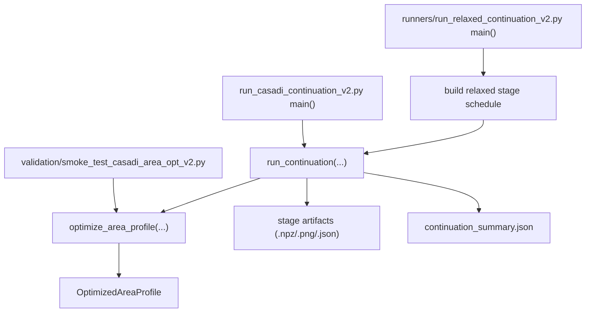
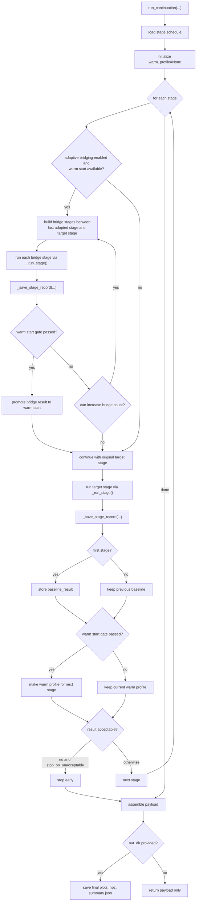
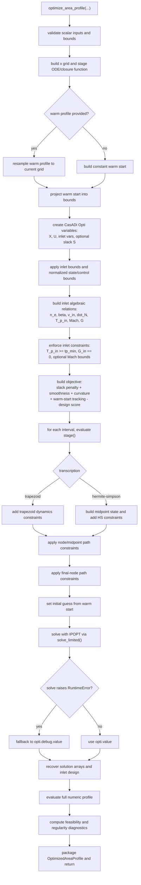
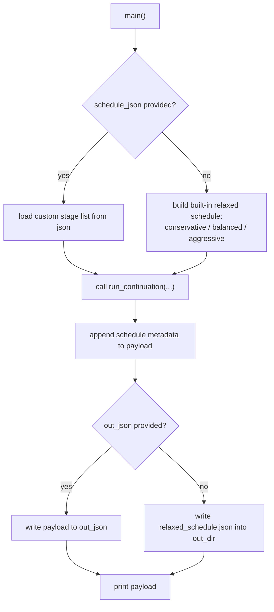

# v6_casadi_v2 Flowchart

This document summarizes the execution flow of the `v6_casadi_v2` workflow.

## 1. Module-Level Flow

## 2. Continuation Driver Flow

Source: `run_casadi_continuation_v2.py`

## 3. Single-Stage NLP Flow

Source: `optimize_area_profile_casadi_v2.py`

## 4. Relaxed Runner Flow

Source: `runners/run_relaxed_continuation_v2.py`

